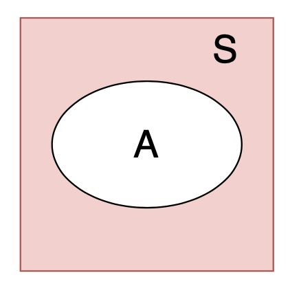
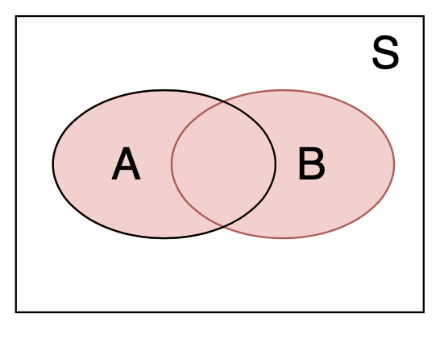
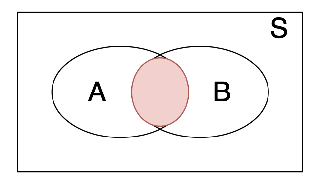
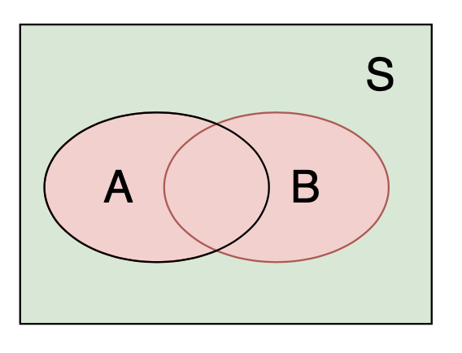
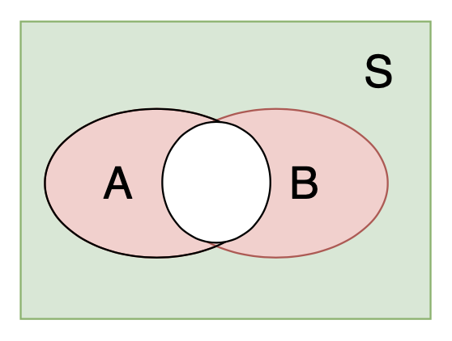
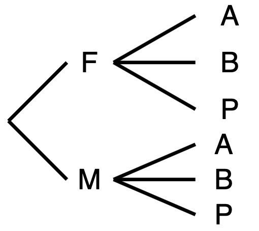

::: {.callout-tip title="本章定位"}
本講義由蘇南誠老師編授。感謝黃怡婷老師提供原始數理統計講義檔案；本章保留原有英文術語與公式，並整理為可連續閱讀的教學形式。
:::

## 學習目標

完成本章後，學生應能：

- 以樣本空間與事件描述隨機實驗
- 運用條件機率、全機率公式與 Bayes 定理
- 辨認離散與連續隨機變數的分配
- 計算期望、變異數、動差與動差生成函數
- 使用 Markov、Chebyshev 與 Jensen 不等式

## 必備的先備知識

集合符號、基本微積分與有限和。

以下依原講義順序整理核心定義、定理、公式與例題。

## Introduction

### Definition of experiment

- Random experiments

  - Outcome cannot be predicted with certainty.

### Sample space

- Outcome (Sample) space

  - Is the collection of all possible outcomes.

  - Is known.

  - Is denoted as $\mathcal{S}$.

### Event

- Event

  - Is a part of the collection of outcomes in $\mathcal{S}$.

  - Is denoted as $A$.

  - $A\subset \mathcal{S}$.

### Frequency and relative frequency

- The probability of an event $A$ is called the chance of $A$ occurring.

- For example, a fair coin is tossed repeatedly $n$ times.

- Count the number of times that event $A$ (Head) occurs.

- The number is called frequency and is denoted as $N(A)$.

- The relative frequency is $N(A)/n$.

  - $n=10$

  - H T H H T T H H T H

  - H: 6/10; T: 4/10

### Features of relative frequency

- As $n$ tends to $\infty$, relative frequency tends to be a fixed value.

- Suppose this fixed value is $p$.

- $p$ is considered as the future performance of outcomes (event $A$) of the experiment.

- Tossing coin experiment $n$ times

  - $S=\{H, T\}$

  - $N(S) = N(H) + N(T) = n$

  - $N(S)/n =1$

### Algebra of sets

- Null or empty set

  - $\emptyset$

- Subset

  - $A\subset B$

- Intersection

  - $A\cap B$

- Union

  - $A\cup B$

- Complement

  - $A^{C}$ or $A^{'}$

### Venn Diagrams

+:------------------------------------:+:------------------------------------:+
|  |  |
+--------------------------------------+--------------------------------------+
|                                         |
+-----------------------------------------------------------------------------+

### Properties for set operations

- Commutative law $$\begin{aligned}
  A \cup B &= B \cup A\\
  A \cap B &= B \cap A
  \end{aligned}$$

- Associative law $$\begin{aligned}
  (A \cup B) \cup C &= A \cup (B \cup C)\\
  (A \cap B) \cap C &= A \cap (B \cap C)
  \end{aligned}$$

### Properties for set operations

- Distributive law $$\begin{aligned}
  A \cap (B \cup C) &= (A \cap B) \cup (A \cap C)\\
  A \cup (B \cap C) &= (A \cup B) \cap (A \cup C)\\
  \end{aligned}$$

- De Morgan's law $$\begin{aligned}
  (A \cup B)^{'} &= A^{'} \cap B^{'}\\
  (A \cap B) ^{'} &= A^{'} \cup B^{'}\\
  \end{aligned}$$

### Venn Diagrams

  -------------------------------------- --------------------------------------
      
  -------------------------------------- --------------------------------------

### More than 2 sets

- Let $A_1,A_2,\ldots, A_n$ be any sets.

- Define

  - $A_1 \cup A_2 \cup \cdots \cup A_n$ = $\{x: x\in A_i,~\text{for some }i=1, 2, \ldots, n\}$ = $\cup_{i=1}^n A_i$.

  - $A_1 \cap A_2 \cap \cdots \cap A_n$ = $\{x: x\in A_i,~\text{for all }i=1, 2, \ldots, n\}$ = $\cap_{i=1}^n A_i$.

### Countable sets

- Let $A_1,A_2,\ldots, A_n, \ldots$ be a sequence of sets.

- Define

  - $A_1 \cup A_2 \cup \cdots \cup A_n \cup \cdots$ = $\{x: x\in A_i,~\text{for some }i = 1, 2, \ldots, n, \ldots\}$ = $\cup_{n=1}^\infty A_n$.

  - $A_1 \cap A_2 \cap \cdots \cap A_n \cap \cdots$ = $\{x: x\in A_i,~\text{for all }i=1, 2, \ldots, n, \ldots\}$ = $\cap_{n=1}^\infty A_n$.

### Example 1

- Let $\mathcal{S}$ = {1, 2, 3, $\ldots$}.

- Let $A_n = \{1, 3, \ldots, 2n-1\}$ and $B_n$ = {$n, n+1, \ldots,$} for $n=1, 2, 3, \ldots$.

- Find $\cup_{n=1}^\infty A_n$, $\cap_{n=1}^\infty A_n$, $\cup_{n=1}^\infty B_n$, $\cap_{n=1}^\infty B_n$.

### Example 2

- Let $\mathcal{C}$ = (0, 5).

- Let $C_n$ = $(1-n^{-1}, 2+n^{-1})$ and $D_n$ = $(n^{-1}, 3-n^{-1})$, $n = 1, 2, 3, \ldots$.

- Find $\cup_{n=1}^\infty C_n$, $\cap_{n=1}^\infty C_n$, $\cup_{n=1}^\infty D_n$, $\cap_{n=1}^\infty D_n$.

### Monotone (nondecreasing) sets

- Let $A_1,A_2,\ldots, A_n, \ldots$ be a sequence of nondecreasing sets, i.e., $$A_n \subset A_{n+1}, n = 1, 2, 3, \ldots$$

- Define $$\lim_{n\rightarrow \infty} A_n = \cup_{n=1}^\infty A_n.$$

### Monotone (nonincreasing) sets

- Let $A_1,A_2,\ldots, A_n, \ldots$ be a sequence of nonincreasing sets, i.e., $$A_n \supset A_{n+1}, n = 1, 2, 3, \ldots$$

- Define $$\lim_{n\rightarrow \infty} A_n = \cap_{n=1}^\infty A_n.$$

### Set functions

- Set function

  - Is a function that map sets into real numbers.

### Example 3

- Let ${\mathcal{S}}$ = $R$ be a set of real numbers.

- Consider a subset $A\in \mathcal{S}$.

- Let $Q(A)$ be a set function of $A$ and be equal to = {the number of points in $A$ that correspond to positive integers}.

- If $A = \{x: 0< x< 5\}$, find $Q(A)$.

- If $A = \{x: -2< x< -1\}$, find $Q(A)$.

- If $A = \{x: -\infty < x< 6\}$, find $Q(A)$.

### Example 4

- Let ${\mathcal{S}}$ = $R^2$ be a set of real numbers.

- Consider a subset $A\in \mathcal{S}$.

- Let $Q(A)$ be a set function of $A$ and be equal to = {the area of $A$} if $A$ has a finite area; otherwise, be undefined.

- If $A = \{(x, y): x^2 + y^2 \le 1\}$, find $Q(A)$.

- If $A = \{(0, 0), (1, 1), (0, 1)\}$, find $Q(A)$.

- If $A = \{(x, y): 0\le x, 0\le y, x+y\le 1\}$, find $Q(A)$.

### Common set functions

- Suppose $\mathcal{S}$ be a set of real number.

  - $Q(A) = \int_A f(x) dx$

  - $Q(A) = \int\int_A g(x, y) dxdy$

- Suppose $\mathcal{C}$ be a set of integers.

  - $Q(A) = \sum_{x\in A} f(x)$

  - $Q(A) = \sum\sum_{(x, y) \in A} g(x, y)$

### Example 5

- Suppose $\mathcal{S}$ be a set of all nonnegative integers.

- Let $A$ be a subset of $\mathcal{S}$.

- Define

  - $Q(A) = \sum_{n\in A} \left( \frac{2}{3}\right)^n$

- Find $Q($$)$.

- If $A = \{1, 2, 3\}$, find $Q(A)$.

- If $B = \{1, 3, 5, \ldots\}$ is the set of all odd positive integers, find $Q(B)$.

### Example 6

- Suppose $\mathcal{S}$ be the interval of positive real numbers, i.e., $\mathcal{S}$ = $(0, \infty)$.

- Let $A$ be a subset of $\mathcal{S}$.

- Define

  - $Q(A) = \int_A e^{-x}dx$, provided the integral exists.

- Find $Q((1, 3))$.

- Find $Q((5, \infty))$.

- Find $Q((1, 3) \cup [3, 5))$.

- Find $Q(\mathcal{S})$.

### Example 7

- Let ${\mathcal{S}}$ = $R^n$.

- Let $A = \{(x_1, x_2, \ldots, x_n): 0\le x_1\le x_2, 0\le x_i\le 1, \text{for }i = 1, 2, \ldots, n\}$.

- Let $B = \{(x_1, x_2, \ldots, x_n): 0\le x_1\le x_2< \cdots \le x_n \le 1\}$.

- Find $Q(A)$ and $Q(B)$.

## Probability set function

### Recall frequency

- The probability of an event $A$ equals $p$.

- Denote as $P[A]$.

- $P[A]$ is a set function that associates $A$ with the relative frequency.

### Definition of Probability

::: {#def-ch1-1}
- Let $\mathcal{S}$ be a sample space.

- Let $\mathcal{B}$ be the set of events.

- Let $P$ be a real-valued set function defined on $\mathcal{B}$.

- $P$ is a probability set function if it satisfies

  - $P[A]\ge 0$, for all $A\in \mathcal{B}$.

  - $P[$$] = 1$

  - If $\{A_n\}$ is a sequence of events in $\mathcal{B}$ and $A_m\cap A_n =\emptyset$ for all $m\ne n$, then $$P[A_1\cup A_2 \cup A_3 \cup \cdots ] = \sum_{i=1}^{\infty} P[A_i]$$
:::

### Special terminology

- Mutually exclusive events

  - $A_i \cap A_j = \emptyset$, $\forall i\ne j$ .

  - $A_1, \cdots, A_k$ are disjoint sets.

  - The union is referred to as a disjoint union.

- Exhaustive events, if

  - $A_i \cap A_j = \emptyset$, $\forall i\ne j$ .

  - $\cup_{n=1}^{\infty} A_n = \mathcal{S}$.

### Special terminology

- Mutually exclusive and exhaustive events

  - $A_i \cap A_j = \emptyset$, $\forall i\ne j$.

  - $A_1, \cdots, A_k$ are disjoint sets.

  - $A_1\cup A_2 \cup \cdots A_k =S$.

- It is a partition of ${\mathcal{S}}$.

### Theorem

::: {#thm-ch1-1}
For each event $A \in {\mathcal{B}}$, $$P[A]=1-P[A^{'}]$$
:::

### Theorem

::: {#thm-ch1-2}
$$P[\emptyset]=0$$
:::

### Theorem

::: {#thm-ch1-3}
If events $A$ and $B$ are such that $A\subset B$, then $$P[A]\le P[B].$$
:::

### Theorem

::: {#thm-ch1-4}
For each event $A \in {\mathcal{B}}$, $$P[A]\le 1.$$
:::

### Theorem

::: {#thm-ch1-5}
If $A$ and $B$ are any two events in ${\mathcal{S}}$, then $$P[A\cup B]= P[A]+P[B]-P[A\cap B].$$
:::

### Theorem

::: {#thm-ch1-6}
If $A$, $B$ and $C$ are any three events, then $$\begin{aligned}
P[A\cup B\cup C]=& P[A]+P[B]+P[C]-P[A\cap B]-P[A\cap C]\\
&-P[B\cap C]+P[A\cap B\cap C].
\end{aligned}$$
:::

### Example 8

- Consider one red die and one white die.

- Let the outcome be the ordered pair.

- Assume these two dice is repeatedly cast under the same condition.

- The cast of this pair of dice is a random experiment.

- This is a random experiment.

- Find the sample space ${\mathcal{S}}$.

### Example 8 (continued)

- Assume the probability set function assigns a probability of 1/36 to each of the 36 points in ${\mathcal{S}}$.

- If $C_1 = \{(1, 1), (2, 1), (3, 1), (4, 1), (5, 1)\}$ and $C_2 = \{(1, 2), (2, 2), (3,2), (4, 2), (5, 2)\}$.

- Find $P[C_1]$, $P[C_2]$, $P[C_1\cup C_2]$ and $P[C_1\cap C_2]$.

### Inclusion exclusion formula

- Consider a sequence of events $\{C_n, n = 1, 2, \}$.

- Let $p_1 = P[C_1] + P[C_2] + P[C_3]$.

- Let $p_2 = P[C_1 \cap C_2] + P[C_1 \cap C_3] + P[C_2 \cap C_3]$.

- Let $p_3 = P[C_1 \cap C_2 \cap C_3]$.

- Then $$P[C_1 \cup C_2 \cup \cdots \cup C_k] = p_1 - p_2 + p_3 - \cdots + (-1)^{n+1} p_n.$$

### Bonferroni's inequality

- Consider two events $C_1$ and $C_2$.

- We have $$P[C_1\cap C_2]\ge P[C_1] + P[C_2] -1$$

### Boole's inequality

::: {#thm-ch1-7}
- Let $\{C_n\}$ be an arbitrary sequence of events.

- Then $$P\left[ \cup_{n=1}^{\infty} C_n \right]\ \le \sum_{n=1}^{\infty} P[C_n].$$
:::

### Equally likely principle

- Let $x_i$, $i=1, \cdots, m$, be all possible outcomes of an experiment.

- Suppose $m$ is the total number of ways that the random experiment can terminate.

- If each of $e_i$ has the same probability of occurring, $m$ outcomes are equally likely.

- We have $$P[e_i]=\frac{1}{m},~i=1,2,\cdots, m.$$

- Let $A\in {\mathcal{S}}$ and define $$P[A] = \sum_{x_i\in A} \frac{1}{m} = \frac{\#(A)}{m}.$$

### Example 9

- Suppose $A$ includes $h$ possible number of outcomes.

- Define $$P[A]=\frac{h}{m}=\frac{N(A)}{N(S)}$$ where

  - $N(A)$ = $h$ = the number of ways $A$ can occur.

  - $N(S)$ = $m$ = the number of ways $S$ can occur.

### Example 10

- Toss a fair coin twice

- Possible outcomes: $TT, HT, TH, HH$

- Assume $$P[TT]=P[HT]=P[TH]=P[HH]=\frac{1}{4}$$

- Consider $A$ = {at least one $H$} $$P[A] = P[HT + TH + HH] = P[HT] + P[TH] + P[HH] =\frac{3}{4}$$

### Counting rule -- Multiplication Principle

- Suppose an experiment $E_1$ has $n_1$ outcomes.

- Each of possible outcomes in $E_1$, an experiment has $n_2$ outcomes

- The composite experiment $E_1E_2$ consisting of performing $E_1$ and then $E_2$ has $n_1n_2$ possible outcomes.

### Example 11

- Let $E_1$ denote the selection of a rat from a cage containing one female ($F$) and one male ($M$) rate.

- Let $E_2$ denote the administering of either drug $A$, drug $B$ or a placebo $P$ to the selected rate.

- The outcome of the composite experiment is $$(F, A), (F, B), (F,P), (M, A), (M, B), (M,P)$$

::: center

:::

### More on multiplication Principle

- Suppose experiment $E_i$ has $n_i$ outcomes, $i=1, 2, \cdots, m$.

- The composite experiment $E_1E_2\cdots E_m$ has $n_1n_2\cdots n_m$ possible outcomes.

### Example 12 — Dinner choices

- Choices of dinner

  - $E_1$: soup or tomato juice

  - $E_2$: steak or shrimp

  - $E_3$: French fried potatoes, mashed potatoes or a baked potatoes

  - $E_4$: corn or pea

  - $E_5$: jelly, tossed salad, cottage cheese or coleslaw

  - $E_6$: cake, cookies, pudding, brownie, vanilla ice cream, chocolate ice cream or orange sherbet

  - $E_7$: coffee, tea, milk or punch

- How many different dinner selections are possible?

### Counting methods

- Permutation

- Combination

- Sampling with replacement

- Sampling without replacement

- Ordered sample

- Unordered sample

### Common counting rules

- Let $A$ be a set with $n$ elements.

- A permutation of $n$ objects equals $n!$.

- Suppose $k$-tuples whose components are elements of $A$, then there are $n^k$ such $k$-tuples whose components are elements of $A$.

- Suppose $k<n$ and we are interest in $k$-tuples whose elements are distinct. Then, the number of $k$ permutations taken from $A$ equals $$P_{k}^n = \frac{n!}{(n-k)!}.$$

### Common counting rules

- Let $A$ be a set with $n$ elements.

- Suppose $k<n$ and we are interest in $k$-tuples whose elements are distinct.

- Suppose the order is not important.

- Then, the number of $k$ permutations taken from $A$ equals $$C_{k}^n = {n\choose k} = \frac{n!}{k!(n-k)!}.$$

### Remark

- $C_r^n = {n\choose r}$ is called binomial coefficients.

- The binomial expansion $$(a+b)^n =\sum_{r=1}^n  {n\choose r} b^ra^{n-r}$$

### Definition

::: {#def-ch1-2}
Each of the $$C_k^n = {n\choose k} =\frac{n!}{k!(n-k)!}$$ permutations of $n$ objects, $k$ of one type and $n-r$ of another type, is called a distinguishable permutation.
:::

### Remark

- Suppose there are $n$ objects.

- $n_1$ are similar, $n_2$ are similar, $\cdots$, $n_s$ are similar.

- $n=\sum_{i=1}^s n_i$, $0\le n_i\le n$.

- The number of distinguishable permutations of the $n$ objects is $${n\choose n_1, n_2, \cdots, n_s} =\frac{n!}{n_1!n_2!\cdots n_s!}$$

- It is called multinomial coefficients.

### Monotone (nondecreasing) sets

- Let $A_1,A_2,\ldots, A_n, \ldots$ be a sequence of nondecreasing sets, i.e., $$A_n \subset A_{n+1}, n = 1, 2, 3, \ldots$$

- Define $$\lim_{n\rightarrow \infty} A_n = \cup_{n=1}^\infty A_n.$$

### Monotone (nonincreasing) sets

- Let $A_1,A_2,\ldots, A_n, \ldots$ be a sequence of nonincreasing sets, i.e., $$A_n \supset A_{n+1}, n = 1, 2, 3, \ldots$$

- Define $$\lim_{n\rightarrow \infty} A_n = \cap_{n=1}^\infty A_n.$$

### Properties of probability

::: {#thm-ch1-8}
- Let $\{C_n\}$ be a nondecreasing sequence of events.

- Then $$\lim_{n\rightarrow\infty} P[C_n] = P\left[\lim_{n\rightarrow\infty} C_n\right] =
  P\left[ \cup_{n=1}^{\infty} C_n \right].$$
:::

### Properties of probability

::: {#thm-ch1-9}
- Let $\{C_n\}$ be a nonincreasing sequence of events.

- Then $$\lim_{n\rightarrow\infty} P[C_n] = P\left[\lim_{n\rightarrow\infty} C_n\right] =
  P\left[ \cap_{n=1}^{\infty} C_n \right].$$
:::

## Conditional probability and independent

### Example 13

::: center
                 Early (E)   Late (L)   Totals
  ------------ ----------- ---------- --------
  Red (R)                5          8       13
  Yellow (Y)             3          4        7
  Totals                 8         12       20
:::

- $P[R|E]=\frac{5}{8}=\frac{N(R\cap E)}{N(E)} = \frac{N(R\cap E)/20}{N(E)/20} = \frac{P[R\cap E]}{P[E]}$

### Definition

::: {#def-ch1-3}
The conditional probability of an event $A$, given that event $B$ has occurred, is defined by $$P[A|B]=\frac{P[A\cap B]}{P[B]}$$ provided that $P[B]>0$.
:::

### Example 14

- A hand of 5 cards is to be dealt at random without replacement from an ordinary deck of 52 playing cards.

- Let $C_1$ denote the event of at least 4 spades in the hand.

- Let $C_2$ denote the event of an all-spade hand.

- Find $P[C_2|C_1]$.

### Properties

- $P[A|B]\ge 0$

- $P[B|B]=1$

- $P[A\cap B] = P[B]\times P[A|B]$ (Multiplication rule)

### Properties

- If $A_1, A_2, \cdots$ are mutually exclusive events, then $$P[\cup_{n=1}^{\infty} A_n|B] = \sum_{n=1}^\infty P[A_n|B]$$

### Example 15

- A bowl contains eight chips.

- Three of the chips are red and the remaining five are blue.

- Two chips are to be drawn successively, at random without replacement.

- Let $A$ denote the event of the first draw results in a red chip.

- Let $B$ denote the event of the second draw results in a blue chip.

- Find $P[A\cap B]$.

### Example 16

- Consider an ordinary deck of playing cards.

- Cards are to be drawn successively at random without replacement.

- Compute the probability that the third spade appears in the first six cards drawn.

Define $$\begin{aligned}
A &= \text{the event of two spades in the first five cards}\\
B &= \text{the event of a spade on the sixth draw}\\
\end{aligned}$$

### Remark

- The probability that three events $A$, $B$ and $C$, all occur is given by the multiplication rule, $$P[A\cap B\cap C] = P[A]P[B|A]P[C|A\cap B]$$

### Example 17

- Four cards to be dealt successively at random and without replacement from an ordinary deck of playing cards.

- What is the probability of receiving, in order, a spade, a heart, a diamond, and a club?

### Law of total probability

- Let $\{C_i, i=1, 2, \ldots, k\}$ be a partition of ${\mathcal{S}}$.

- Let $C$ be an event.

- Then $$P[C] = \sum_{i = 1}^k P[C_i]\times P[C|C_i]$$

### Bayes' theorem

- Let $\{C_i, i=1, 2, \ldots, k\}$ be a partition of ${\mathcal{S}}$.

- Let $C$ be an event.

- Suppose $P[C]>0$.

- Then $$P[C_j|C] = \frac{P[C_j]\times P[C|C_j]}{\sum_{i = 1}^k P[C_i]\times P[C|C_i]}.$$

### Example 18

- The bowl $A_1$ contains three red and seven blue chips.

- The bowl $A_2$ contains eight red and two blue chips.

- All chips are identical in size and shape.

- A die is cast and bowl $A_1$ is selected if five or six spots show on the side that is up; otherwise, bowl $A_2$ is selected.

- Assign $P[A_1] = 2/6$ and $P[A_2] = 4/6$.

- The selected bowl is handed to another person and one chip is taken at random.

- Let $B$ denote an event of a red chip is taken.

- Find $P[A_1|B]$ and $P[A_2|B]$.

### Bayesian inference terminology

- The prior probability -- the probability of $P[A_i]$.

- The posterior probability -- the probability of $P[A_i|B]$.

### Example 19

- Three plants, $A_1$, $A_2$ and $A_3$, produce respectively, 10%, 50% and 40% of a company's output.

- The percent of defective for $A_1$, $A_2$ and $A_3$ is 1%, 3% and 4%, respectively.

- All products are sent to a central warehouse.

- Let $B$ denote the event that one item is selected at random and observed to be defective.

- Find $P[A_1|B]$, $P[A_2|B]$ and $P[A_3|B]$.

### Example 20

- Flip a fair coin twice and observe the sequence of heads and tails.

- The sample space is $$S=\{HH, HT, TH, TT\}$$

- Let $$\begin{aligned}
  A &= \text{\{heads on the first flip\}}\\
  B &=  \text{\{tails on the second flip\}}\\
  C &=  \text{\{tails on both flips\}}\\
  \end{aligned}$$

- Find $P[B|A]$

### Definition

::: {#def-ch1-4}
Events $A$ and $B$ are independent if and only if $$P[A\cap B] = P[A]P[B]$$ Otherwise, $A$ and $B$ are called dependent events.
:::

### Remark

- Independent events are also called statistically independent, stochastically independent or independent in a probabilistic sense.

- The definition always holds If $P[A]=0$ or $P[B]=0$.

### Example 21

- A red die and a white die are rolled.

- Let $A$ = {4 on the red die}.

- Let $B$ = {sum of dice is odd}

- Show that $A$ and $B$ are independent events.

### Example 22

- A red die and a white die are rolled.

- Let $A$ = {5 one the red die}.

- Let $B$ = {sum of dice is 11}

- Show that $A$ and $B$ are dependent events.

### Properties

- If $A$ and $B$ are independent events, then the following pairs of events are also independent:

  1.  $A$ and $B^{'}$

  2.  $A^{'}$ and $B$

  3.  $A^{'}$ and $B^{'}$

### Example 23

- An urn contains four balls numbered 1, 2, 3, and 4.

- One ball is to be drawn at random from the urn.

- Let $A=\{1, 2\}$, $B=\{1,3\}$ and $C=\{1, 4\}$.

- Show that $A$ and $B$, $A$ and $C$, $B$ and $C$ are independent events, but not $A$, $B$ and $C$.

### Definition

::: {#def-ch1-5}
Events $A$, $B$ and $C$ are mutually independent if and only if the following two conditions hold:

1.  $A$, $B$ and $C$ are pairwise independent; that is, $$P[A\cap B]=P[A]P[B], P[A\cap C]=P[A]P[C], P[B\cap C]=P[B]P[C]$$

2.  $P[A\cap B\cap C]=P[A]P[B]P[C]$
:::

### Properties

- If $A$, $B$ and $C$ are mutually independent events, then the following pairs of events are also independent:

  1.  $A$ and $B\cap C$

  2.  $A$ and $B\cup C$

  3.  $A^{'}$ and $B\cap C^{'}$

- $A^{'}$, $B^{'}$ and $C^{'}$ are mutually independent.

### Remark

- Many experiments consist of a sequence of $n$ trials that are mutually independent.

- If the outcomes of the trials are not related to each other, then events, such that each is associated with a different trials, should be independent in the probability sense.

- If $A_i$ is associated with the $i$th trials, $i=1, 2, \ldots, n$, then $$P[A_1\cap A_2\cap \cdots \cap A_n]=P[A_1]P[A_2]\cdots P[A_n]$$

### Example 24

- A compute system is built so that if component $K_1$ fails, it is bypassed and $K_2$ is used.

- If $K_2$ fails, then $K_3$ is used.

- Suppose that the probability that $K_1$ fails is 0.01, that $K_2$ fails is 0.03, and that $K_3$ fails is 0.08.

- Assume that the failures are mutually independent events.

- Find $P[\text{Failure of the system}]$.

## Random variables

### Definition

::: {#def-ch1-6}
- Consider a random experiment with a sample space ${\mathcal{S}}$.

- A function $X$ assigns one and only one real number $X(c)=x$ to each element $c\in {\mathcal{S}}$.

- $X$ is called a random variable.
:::

- The space or range of $X$ is the set of real numbers ${\mathcal{D}} = \{x: x = X(c), c\in {\mathcal{S}}\}$.

### Types of random variables

- Discrete random variables -- ${\mathcal{D}}$ is a countable set.

- Continuous random variables -- ${\mathcal{D}}$ is an interval of real numbers.

### Distribution of a random variable

- Given a random variable $X$, its range ${\mathcal{D}}$ becomes the sample space of interest.

- Besides inducing the sample space ${\mathcal{D}}$, $X$ also induces a probability.

- We call the distribution of $X$.

### Discrete distribution

- Let $X$ be a discrete random variable with a finite space ${\mathcal{D}} = \{d_1,\ldots, d_m\}$.

- Define $$p_X(d_i) = P[\{c: X(c) = d_i\}], i = 1, 2, \ldots, m.$$ which is called the probability mass function (pmf) of $X$.

- The probability of event $D$ is $$P_X(D) = \sum_{d_i\in D} p_X(d_i), D\subset {\mathcal{D}}.$$

### Example 25

- Let $X$ be the sum of the upfaces on a roll of a pair of fair 6-sided dice, each with the numbers 1 through 6 on it.

- The sample space is ${\mathcal{S}} = \{(i,j) : 1 ≤ i,j ≤ 6\}$.

- Find the pmf of $X$.

### Example 25 (continued)

- Let $B_1$ denote the event of 7 and 11.

- Let $B_2$ denote the event of 2, 3 and 12.

- Find $P_X[B_1]$ and $P_X[B_2]$.

### Continuous distribution

- Let $X$ be a continuous random variable with an interval of real numbers as the space ${\mathcal{D}}$.

- For the continuous random variables, the simple events of interest are intervals.

- Determine a nonnegative function $f_X(x)$ such that for any interval of real numbers $(a,b) \in {\mathcal{D}}$, the induced probability distribution of $X$, $P_X(\cdot)$, is defined as $$P_X[(a, b)] = P[\{c\in {\mathcal{S}}: a < X(c) < b\}] = \int_a^b f_X(x) dx.$$ which is the probability that $X$ falls between $a$ and $b$ is the area under the curve $y = f_X(x)$ between $a$ and $b$.

- The function $f_X$ is formally defined as the probability density function (pdf) of $X$.

### Example 26

- Let $X$ denote the outcome when a point is selected at random from an interval $[0,1]$.

- If the experiment is performed in a fair manner.

- Assume $$P_X[(a, b)] = b - a, 0 < a < b <1.$$ which is the length of the interval.

- The pdf of $X$ is $$f_X(x) = \left\{\begin{array}{cc}
  1 & 0<x<1\\
  0 & \text{elsewhere}
  \end{array}\right ..$$

- Find $P\left[\left\{X<\frac{1}{8}\right\} \cup \left\{X>\frac{7}{8}\right\}\right]$.

### Example 26 (continued)

- For any point $a$, $0<a<1$.

- Choose $n_0$ such that $0<a-n_0^{-1}<a<a+n_0^{-1}<1$.

- We have $$P[X=a] \le P\left[a - \frac{1}{n} < X < a+\frac{1}{n}\right] = \frac{2}{n}, \forall n\ge n_0.$$

- Since $2/n\rightarrow 0$ as $n\rightarrow \infty$ and $a$ is arbitrary, we conclude that $P(X = a) = 0$ for all $a \in (0, 1)$.

### Cumulative distribution function

- Let $X$ be a random variable.

- Define $$\begin{aligned}
  F_X(x) &= P_X[ (-\infty, x)] = P[X\le x] \\
  &= P[\{c\in {\mathcal{S}}: X(c) \le x\}],~-\infty<x<\infty.
  \end{aligned}$$ the cumulative distribution function of $X$.

- Use cdf as an abbreviate.

### Example 27

- Suppose a fair die with the numbers 1 through 6 on it is rolled.

- Let $X$ be the upface of the roll.

- Then the space of $X$ is 1,2,\...,6 and its pmf is $$p_X(i)=1/6, i=1,2,...,6.$$

- Find cdf of $X$.

### Example 28

- Let $X$ denote the outcome when a point is selected at random from an interval $[0,1]$.

- If the experiment is performed in a fair manner.

- Assume $$P_X[(a, b)] = b - a, 0 < a < b <1.$$ which is the length of the interval.

- The pdf of $X$ is $$f_X(x) = \left\{\begin{array}{cc}
  1 & 0<x<1\\
  0 & \text{elsewhere}
  \end{array}\right ..$$

- Find cdf of $X$.

### Example 28 (continued)

- $F_X(x)$ and $f_X(x)$ are related, i.e., $$F_X(x) = \int_{-\infty}^{x} f_X(t) dt, ~\forall x\in R$$ and $$\frac{d}{dx} F_X(x) = f_X(x), \forall x\in R,~\text{except for }x=0\text{ and }x=1.$$

### Remark

- $X$ and $Y$ are equal in distribution and write $X \stackrel{D}{=} Y$ if and only if $F_X(x) = F_Y(x)$, for all $x \in R$.

### Example 29

- Let $X$ denote the outcome when a point is selected at random from an interval $[0,1]$.

- Define the random variable $Y$ as $Y = 1-X$.

- $Y\ne X$.

- The space of $Y$ is the interval (0,1), the same as $X$.

- The cdf of $Y$ is $$F_Y(y) = \left\{\begin{array}{cc}
  0 & y<1\\
  P[Y\le y] =  1 - (1 - y) = y & 0\le y<1\\
  1 & y\ge 1
  \end{array}
  \right . .$$

- $Y$ has the same cdf as $X$, i.e., $X \stackrel{D}{=} Y$, but $Y\ne X$.

### Properties of cdf

::: {#thm-ch1-10}
- Let $X$ be a random variable with cumulative distribution function $F(x)$.

- Then

  - For all $a$ and $b$, if $a<b$, then $F(a)\le F(b)$ ($F$ is nondecreasing).

  - $\lim_{x\rightarrow -\infty} F(x) = 0$

  - $\lim_{x\rightarrow \infty} F(x) = 1$

  - $\lim_{x\rightarrow x_0-} F(x) = F(x_0)$ ($F$ is right continuous).
:::

### Properties of cdf

::: {#thm-ch1-11}
- Let $X$ be a random variable with cumulative distribution function $F(x)$.

- Then, for $a<b$, $$P[a< X \le b] = F_X(b) - F_X(a).$$
:::

### Example 30

- Let $X$ be the lifetime in years of a mechanical part.

- Assume that $X$ has the cdf $$F_X(x) = \left\{\begin{array}{cc}
  0 & x<0\\
  1-e^{-x} & 0\le x
  \end{array}
  \right ..$$

- Find the pdf of $X$ and $P[1<X\le 3]$.

### Properties of cdf

::: {#thm-ch1-12}
- Let $X$ be a random variable with cumulative distribution function $F(x)$.

- Then, $$P[X=x] = F_X(x) - F_X(x-),$$ for all $x\in R$, where $F_X(x-) = \lim_{z\rightarrow x-} F_X(z).$
:::

### Example 31

- Let $X$ be the lifetime in years of a mechanical part.

- Assume that $X$ has the cdf $$F_X(x) = \left\{\begin{array}{cc}
  0 & x<0\\
  1-e^{-x} & 0\le x
  \end{array}
  \right ..$$

- Find the pdf of $X$ and $P[a<X\le 3]$.

### Properties of pdf or pmf

- The total probability associated with a random variable $X$ of the discrete type with pmf $p_X (x)$ or of the continuous type with pdf $f_X (x)$ is 1.

- It must be true that $$\begin{array}{ccc}
  \sum_{x\in {\mathcal{D}}} p_X(x) = 1 & \text{and} & \int_{\mathcal{D}} f_X(x)dx = 1,
  \end{array}$$ where ${\mathcal{D}}$ is the space of X.

### Example 32

- Let $X$ has the pmf $$f_X(x) = \left\{\begin{array}{cc}
  cx & x = 1, 2, \ldots, 10\\
  0 & \text{elsewhere},
  \end{array}
  \right .$$ for an appropriate constant $c$.

- Find $c$.

### Example 33

- Let $X$ has the pdf $$f_X(x) = \left\{\begin{array}{cc}
  cx^3 & 0<x<2\\
  0 & \text{elsewhere},
  \end{array}
  \right .$$ for an appropriate constant $c$.

- Find $c$.

## Discrete random variables

### Discrete random variables

::: {#def-ch1-7}
A random variable is a discrete random variable if its space is either finite or countable.
:::

### Example 34

- Toss a fair coin twice.

- Let $X$ be the number of heads.

### Example 35

- Toss a four-sided die twice.

- Let $X$ be the sum of the dots on the two tosses.

### Probability mass function

::: {#def-ch1-8}
- Let $X$ be a discrete random variable with space ${\mathcal{D}}$.

- The probability mass function (pmf) of $X$ given by $$p_X(x) = P[X=x], \text{for }x\in {\mathcal{D}}.$$
:::

### Properties of Probability mass function

1.  $p_X(x)>0$, $x\in {\mathcal{D}}$.

2.  $\sum_{x\in {\mathcal{D}}} p_X(x)=1$.

3.  $P[X\in A]=\sum_{x\in A} p_X(x)$, where $A\subset {\mathcal{D}}$.

### Support

- Usually define $p_X(x)=0$ if $x\not\in S$.

- The domain of $p_X(x)$ is the set of $R$.

- To distinguish, the **support** of $X$ is the set of outcomes with positive probabilities.

### Hypergeometric distribution

- Consider a collection of $N=N_1+N_2$ similar objects.

  - $N_1$ objects belong to the first class (red chip).

  - $N_2$ objects belong to the second class (blue chip).

- $n$ objects are randomly selected from $N$ objects.

- Let $X$ be the number of objects drawing from the first class.

- Find the pmf of $X$.

### Example 36 — Hypergeometric distribution

- There are 50 fishes in a small pond.

- 10 of which have been tagged.

- Suppose 7 fishes are caught randomly without replacement.

- Find the probability that exactly 2 tagged fishes are caught.

### Transformation

- $X$ has a pmf $f(x)$.

- Let $Y=u(X)$ for a given function $u(\cdot)$.

- Find the pmf of $Y$

### Example 37

- Consider a sequence of independent flips of a coin, each resulting in a head ($H$) or a tail ($T$).

- Let $X$ be the flip number on which the first head appear.

- Let $Y$ be the number of flips before the first head, i.e., $Y=X-1$.

- Find the pmf of $Y$.

### Example 38

- Let $X$ have the pmf $$p_X(x) = \left\{
  \begin{array}{ll}
  \frac{3!}{x!(3-x)!}\left(\frac{2}{3}\right)^x \left(\frac{1}{3}\right)^{3-x}, x= 0, 1, 2, 3\\
  0 & \text{elsewhere}
  \end{array}\right ..$$

- Let $Y=X^2$.

- Find the pmf of $Y$.

### Example 39

- Consider a sequence of independent flops of a coin, each resulting in a head ($H$) or a tail ($T$).

- Let $X$ be the flip number on which the first head appear.

- If the first head appears on an odd number of flips, we pay the house one dollar, while if it appears on an even number of flips, we win one dollar from the house.

- Let Y denote our net gain.

- The space of $Y$ is -1, 1

- Find the pmf of $Y$.

### Example 40

- Consider a sequence of independent flops of a coin, each resulting in a head ($H$) or a tail ($T$).

- Let $X$ be the flip number on which the first head appear.

- Let $Z = (X-2)^2$.

- Find the pmf of $Z$.

## Continuous random variables

### Continuous random variables

::: {#def-ch1-9}
A random variable is a continuous random variable if the cdf $F_X(x)$ is a continuous function for all $x\in R$.
:::

### Probability density function

- Most continuous random variables are absolutely continuous; that is, $$F_X(x) = \int_{-\infty}^x f_X(t) dt,$$ for some function $f_X (t)$.

- The function $f_X (t)$ is called a probability density function (pdf) of X.

- If $f_X (t)$ is also continuous, then the Fundamental Theorem of Calculus implies that $$\frac{d}{dx} F_X(x) = f_X (x).$$

### Support

- The support of a continuous random variable X consists of all points $x$ such that $f_X(x) > 0$.

- Denote the support of $X$ by $S$.

### Properties of pdf

- The pdf $f(x)$ of $X$ of the continuous type with space $S$.

- $S$ is an interval or union of intervals.

- $f(x)$ satisfies

  - $f(x)\ge 0$, $x\in S$.

  - $\int_S f(x) dx=1$.

  - If $(a, b)\subseteq S$, then $$P[a<X<b]=\int_a^b f(x)dx.$$

### Uniform distribution

- $X$ has a uniform distribution if $$f(x)  = \frac{1}{b-a}, a\le x\le b$$ and 0 elsewhere.

- Denote $U(a,b)$.

### Example 41

- Suppose a point is selected at random in the interior of a circle of radius 1.

- Let $X$ be the distance of the selected point from the origin.

- The sample space for the experiment is $${\mathcal{S}} = \{(w, y) : w^2 + y^2 < 1\}.$$

- Assume subsets of ${\mathcal{S}}$ which have equal area are equilikely.

- Hence, the probability of the selected point lying in a set $A \subset {\mathcal{S}}$ is proportional to the area of A; i.e., $$P[A] = \frac{\text{area of A}}{\pi}$$

- Find cdf and pdf of $X$.

### Example 42

- Let the random variable be the time in seconds between incoming telephone calls at a busy switchboard.

- Suppose that a reasonable probability model for $X$ is given by the pdf $$f_X(x) = \left \{\begin{array}{ll}
  \frac{1}{4}e^{-x/4} & 0<x<\infty\\
  0 & \text{elsewhere}
  \end{array}\right ..$$

- Find cdf of $X$.

- Find the probability that the time between successive phone calls exceeds 4 seconds.

### Quantiles

::: {#def-ch1-10}
- Let $0 < p < 1$.

- The quantile of order $p$ of the distribution of a random variable $X$ is a value $\xi_p$ such that $P(X < \xi_p) \le p$ and $P(X \le \xi_p) \ge p$.

- It is also known as the (100$p$)th percentile of $X$.
:::

### Quartiles

::: {#def-ch1-11}
- The quantile of order $0.25$, $0.5, 0.75$ of the distribution of a random variable $X$ is called the first quartile ($q_1$), median and the third quartile ($q_3$).

- The difference $IQ = q_3 -q_1$ is called the interquartile range of $X$.
:::

### Note

- Quantiles need not be unique even for continuous random variables with pdfs.

- Any point in the interval (2,3) serves as a median for the following pdf: $$f_X(x) = \left \{\begin{array}{ll}
  3(1-x)(x-2) & 1<x<2\\
  3(3-x)(x-4) & 3<x<4\\
  0 & \text{elsewhere}
  \end{array}\right ..$$

### Note

- A quantile, say $\xi_p$, is in the support of an absolutely continuous random variable $X$ with cdf $F_X (x)$ then $\xi_p$ is the unique solution to the equation: $$\xi_p = F_X^{-1}(p),$$ where $F_X^{-1} (u)$ is the inverse function of $F_X (x)$.

### Distribution function technique

- Let $X$ be a random variable of the continuous type.

- Let $Y=u(X)$, where $u(\cdot)$ is a known function.

- Then the pdf of $Y$ can be derived from $$G(y)=P[Y\le y] = P[u(X)\le y]$$

### Example 43 — Log gamma distribution

- Let $X$ have a gamma distribution with pdf $$f(x)=\frac{1}{\Gamma(\alpha) \theta^\alpha} x^{\alpha-1} e^{-x/\theta}, 0<x<\infty,$$ where $\alpha>0$ and $\theta>0$.

- Let $Y=\ln(X)$.

- Find the pdf of $Y$.

### Theorem

::: {#thm-ch1-13}
- Let $X$ be a random variable of the continuous type with pdf $f(x)$ with support $S_X$.

- Let $Y=g(X)$, where $g(\cdot)$ is a one-to-one differentiable function on $S_X$.

- Assume the inverse function $g$ by $x= g^{-1}(y)$ and let $$J = \frac{dx}{dy} = \frac{dg^{-1}(y)}{dy} (\text{Jacobian})$$

- Then the pdf of $Y$ is given by $$f_Y(y) = f_X(g^{-1}(y))|\frac{dx}{dy}|, \text{for }y\in S_Y,$$ where $S_Y$ is the support of $Y$ and $S_Y = \{y=g(x): x\in S_X\}$.
:::

### Example 44

- Let $X$ have a gamma distribution with pdf $$f(x)=\frac{1}{\Gamma(\alpha) \theta^\alpha} x^{\alpha-1} e^{-x/\theta}, 0<x<\infty,$$ where $\alpha>0$ and $\theta>0$.

- Let $Y=\ln(X)$.

- Find the pdf of $Y$.

### Example 45 — Log gamma distribution

- Let $X$ have pdf $$f(x)=3(1-x)^2, 0<x<1.$$

- Let $Y=(1-X)^3$.

- Find the pdf of $Y$.

### Example 46 — Mixture type of distribution

- Let $X$ have cdf $$F(x) = \left\{
  \begin{array}{ll}
  0 & x<0\\
  \frac{x+1}{2} & 0\le x<1\\
  1 & 1\le x
  \end{array}
  \right ..$$

- Find $P[-3<X \le \frac{1}{2}]$ and $P[X=0]$.

## Expectation of a random variable

### Expectation -- Continuous

::: {#def-ch1-12}
- Let $X$ be a random variable.

- If $X$ with a continuous random variable with pdf $f(x)$ and $$\int_{-\infty}^{\infty} |x| f(x) dx < \infty$$ then the expectation of $X$ is $$E[X] = \int_{-\infty}^{\infty} x f(x) dx.$$
:::

### Expectation -- Discrete

::: {#def-ch1-13}
- Let $X$ be a random variable.

- If $X$ with a pmf $p(x)$ and $$\sum_{x\in S} |x|p(x)$$ then the expectation of $X$ is $$E[X]=\sum_{x\in S} x p(x).$$
:::

### Note

- The expectation E(X) is called the mathematical expectation of X, the expected value of X, or the mean of X.

- When the mean designation is used, $E(X)$ is denoted by $\mu$; i.e, $\mu$ = $E(X)$.

### Example 47

- Let $X$ have a pmf $$f(x)=\frac{1}{3}, x\in S_X,$$ where $S_X = \{-1, 0, 1\}.$

- Find $E[X]$.

### Example 48

- Let $X$ have a pdf $$f(x)=\left\{
  \begin{array}{ll}
  4x^3 & 0<x<1\\
  0 & \text{elsewhere}
  \end{array}
  \right ..$$

- Find $E[X]$.

### Expectation of a function of random variable (continuous)

::: {#thm-ch1-14}
- Let $X$ be a random variable and let $Y = g(X)$ for some function $g$.

- If $X$ with a continuous random variable with pdf $f_X(x)$ and $$\int_{-\infty}^{\infty} |g(x)| f_X(x) dx < \infty$$ then the expectation of $X$ is $$E[Y] = \int_{-\infty}^{\infty} g(x) f(x) dx.$$
:::

### Expectation of a function of random variable (discrete)

::: {#thm-ch1-15}
- Let $X$ be a random variable and let $Y = g(X)$ for some function $g$.

- If $X$ with a pmf $p(x)$ and $$\sum_{x\in S_X} |g(x)|p(x)$$ then the expectation of $X$ is $$E[Y]=\sum_{x\in S_X} g(x) p(x).$$
:::

### Example 49

- Consider a sequence of independent flips of a coin, each resulting in a head (H) or a tail (T).

- Let $X$ was the flip number on which the first head appeared.

- Let $Y$ be the number of flips before the first head.

- Let $Z = e^{-Y}$.

- Find $E[Z]$.

### Example 50

- Let $X$ be a continuous random variable with the pdf $f(x) = 2x$ which has support on the interval (0, 1).

- Let $Y=1/(1+X)$.

- Find $E[Y]$.

### Theorem

::: {#thm-ch1-16}
When the expectation exists, it satisfies the following properties:

- If $c$ is a constant, then $E[c]=c$.

- If $c$ is a constant and $u(\cdot)$ is a function, then $$E[cu(X)]=cE[u(X)].$$

- If $c_1$ and $c_2$ are constants and $u_1$ and $u_2$ are functions, then $$E[c_1u_1(X)+c_2u_2(X)]=c_1E[u_1(X)]+c_2E[u_2(X)].$$
:::

### Comment

- If $c_1$, $\cdots$ and $c_k$ are constants and $u_1$, $u_2$, $\cdots$ and $u_k$ are functions, then $$E\left[\sum_{i=1}^kc_iu_i(X)\right]=\sum_{i=1}^kc_iE[u_i(X)].$$

### Example 51

- Let $X$ have the pdf $$f(x) = \left\{\begin{array}{ll}
  2(1-x) & 0<x<1\\
  0 & \text{elsewhere}
  \end{array}
  \right ..$$

- Find $E[X]$, $E[X^2]$ and $E[6X+3X^2]$.

### Example 52

- Let $X$ have the pmf $$f(x) = \left\{\begin{array}{ll}
  \frac{x}{6} & x = 1, 2, 3\\
  0 & \text{elsewhere}
  \end{array}
  \right ..$$

- Find $E[6X^3+X]$.

### Example 53

- Let us divide, at random, a horizontal line segment of length 5 into two parts.

- If $X$ is the length of the left-hand part, it is reasonable to assume $X$ has the pdf $$f(x) = \left\{\begin{array}{ll}
  \frac{1}{5} & 0<x<5\\
  0 & \text{elsewhere}
  \end{array}
  \right ..$$

- Find $E[X(5-X)]$.

## Some special expectations

### Settings

- Let $X$ be a discrete random variable.

- Let the support of $X$ be denoted as $S_X=\{u_1, u_2, \cdots, u_k\}$.

- Assume $$P[X=u_i]=f(u_i)=p_i, i=1, 2, \cdots, k$$ and $$\sum_{i=1}^k p_i=1.$$

### Definition of mean

::: {#def-ch1-14}
- Let $X$ be a random variable whose expectation exists.

- The mean value $\mu$ of $X$ is defined to be $\mu=E(X)$.
:::

### Definition of variance

::: {#def-ch1-15}
- Let $X$ be a random variable with finite mean $\mu$ and such that $E[(X-\mu)^2]<\infty$.

- The variance of $X$ is defined to be $E[(X-\mu)^2]$.

- It is usually denoted by $\sigma^2$ or by Var($X$).
:::

### Example 54

- Consider a discrete random variable $X$ has a support $S_X=\{1, 2, 3\}$.

- Let $f(1)=\frac{3}{6}$, $f(2)=\frac{2}{6}$, $f(3)=\frac{1}{6}$.

- Find $E[X]$ and $\operatorname{Var}(X)$.

### Comment

- Show that $$\operatorname{Var}(X)=E[X^2]-\mu^2,$$

- The standard deviation of $X$ is the positive square root of variance and is denoted as $\sigma$.

### Example 55

- Let $a$ and $b$ be constants.

- Let $Y=aX+b$.

- Find $E[Y]$ and $\operatorname{Var}(Y)$.

### Example 56

- Suppose the random variable $X$ has a uniform distribution with pdf $$f_X(x) = 1/(2a), -a < x < a,$$ zero elsewhere.

- Find $\mu$ and $\sigma^2$.

### Example 57

- Let $X$ has the pdf $$f(x) = \left\{\begin{array}{ll}
  \frac{1}{2}(x+1) & -1<x<1\\
  0 & \text{elsewhere}
  \end{array}
  \right ..$$

- Find $\mu$ and $\sigma^2$.

### Example 58

- Let $X$ has the pdf $$f(x) = \left\{\begin{array}{ll}
  \frac{1}{x^2} & 1<x<\infty\\
  0 & \text{elsewhere}
  \end{array}
  \right ..$$

- Find $\mu$.

### Moment

- The $r$th moment is defined as $$E[X^r] = \sum_{x\in S} x^{r} f(x).$$

- The $r$th moment about $b$ is defined as $$E[(X-b)^r] = \sum_{x\in S} (x-b)^{r} f(x).$$

- The $r$th factorial moment is defined as $$E[(X)_r]=E[X(X-1)\cdots (X-r+1)].$$

### Example 59 — Hypergeometric distribution

- Let $X$ have a hypergeometric distribution where $n$ objects are selected from $N=N_1+N_2$.

- Find $\operatorname{Var}(X)$.

### Moment generating function

::: {#def-ch1-16}
- Let $X$ be a random variable.

- If there is a $h>0$ such that $$E[e^{tX}]=\sum_{x\in S}e^{tx}f(x)$$ exists and is finite for $-h<t<h$, then the function $$M(t)=E[e^{tX}]$$ is called the moment-generating function (mgf) of $X$.
:::

### Comments

- If $t=0$, $M(0)=1$.

- If $S=\{b_1, b_2, \cdots\}$, the mgf is $$M(t)=e^{tb_1}f(b_1) +e^{tb_2}f(b_2)+e^{tb_3}f(b_3)+\cdots,$$

- The coefficient of $e^{tb_i}$ is $$f(b_i)=P[X=b_i]$$

### Comments

- Consider two random variables had two pmfs $f(x)$ and $g(y)$.

- Suppose the same space $S=\{b_1, b_2, \cdots, \}$ is defined.

- If $$\begin{aligned}
  e^{tb_1}f(b_1) &+e^{tb_2}f(b_2)+e^{tb_3}f(b_3)+\cdots\\
  &=e^{tb_1}g(b_1) +e^{tb_2}g(b_2)+e^{tb_3}g(b_3)+\cdots,
  \end{aligned}$$ for all $t$, $-h<t<h$, then $$f(b_i)=g(b_i), \forall i$$

### Example 60

- Suppose we have a fair spinner with the numbers 1, 2, and 3 on it.

- Let $X$ be the number of spins until the first 3 occurs.

- Assuming that the spins are independent, the pmf of $X$ is $$p(x) = \frac{1}{3}\left(\frac{2}{3}\right)^{x-1}, x= 1, 2, 3, \ldots.$$

- Find the mgf of $X$.

### Equivalence

::: {#thm-ch1-17}
- Let $X$ and $Y$ be random variables with moment generating functions $M_X(\cdot)$ and $M_Y(\cdot)$, respectively, existing in open intervals about 0.

- Then $F_X (z) = F_Y (z)$ for all $z\in R$ if and only if $M_X(t) = M_Y (t)$ for all $t \in (-h,h)$ for some $h > 0$.
:::

### Example 61

- Suppose $X$ has the mgf $$M(t)=e^t\left(\frac{1}{10}\right)+e^{2t}\left(\frac{2}{10}\right)+e^{3t}\left(\frac{3}{10}\right)+e^{4t}\left(\frac{4}{10}\right), ~-\infty<t<\infty$$

- Find the pmf of $X$.

### Example 62

- Show that $M^{'}(0)=\mu$ and $M^{''}(0)-[M^{'}(0)]^2=\sigma^2$.

### Note

- If $m$ is a positive integer and $M^{(m)}(t)$ denotes the $m$th derivative of $M(t)$.

- Then $M^{(m)}(0)=E[X^m]$.

## Important inequalities

### Existence of moments

- Let $X$ be a random variable and let $m$ be a positive integer.

- Suppose $E[X^m]$ exists.

- If $k$ is a positive integer and $k \le m$, then $E[X^k]$ exists.

### Markov's Inequality

::: {#thm-ch1-18}
- Let $u(X)$ be a nonnegative function of the random variable $X$.

- If $E[u(X)]<\infty$. random variable and let m be a positive integer.

- For every positive constant $c$, $$P[u(X)\ge c]\le \frac{E[u(X)]}{c}.$$
:::

### Chebyshev's Inequality

::: {#thm-ch1-19}
- Let $X$ be a random variable with finite variance $\sigma^2$.

- For every positive constant $k$, $$P[|X-\mu|\ge k\sigma]\le \frac{1}{k^2}.$$
:::

### Example 63

- Let $X$ has the pdf $$f(x) = \left\{\begin{array}{ll}
  \frac{1}{2\sqrt{3}} & -\sqrt{3}<x<\sqrt{3}\\
  0 & \text{elsewhere}
  \end{array}
  \right ..$$

- Find $P[|X-\mu|\ge k\sigma]$ and the upper bound.

### Example 64

- Let the random variable $X$ of the discrete type have probabilities 1/8, 6/8, 1/8 at the points $x=-1,0,1$, respectively.

- Find $P[|X-\mu|\ge k\sigma]$ and the upper bound.

### Convex function

::: {#def-ch1-17}
- A function $\phi$ defined on an interval $(a, b)$, $-\infty< a < b <\infty$, is said to be a convex function if for all $x, y$ in $(a, b)$ and for all $0 < \gamma < 1$, $$\phi(\gamma x + (1 - \gamma)y) \le \gamma \phi(x) + (1 - \gamma) \phi(y).$$ We say $\phi$ is strictly convex if the above inequality is strict.
:::

### Properties -- Convex function

::: {#thm-ch1-20}
- If $\phi$ is differentiable on $(a, b)$, then

  - $\phi$ is convex if and only if $\phi^{'}(x)\le \phi^{'}(y)$, for all $a<x<y<b$.

  - $\phi$ is strictly convex if and only if $\phi^{'}(x) < \phi^{'}(y)$, for all $a<x<y<b$.

- If $\phi$ is twice differentiable on $(a, b)$, then

  - $\phi$ is convex if and only if $\phi^{''}(x)\ge 0$, for all $a<x<b$.

  - $\phi$ is strictly convex if and only if $\phi^{''}(x) >0$, for all $a<x<b$.
:::

### Jensen's Inequality

::: {#thm-ch1-21}
- If $\phi$ is convex on an open interval $I$ and $X$ is a random variable whose support is contained in $I$ and has finite expectation, then $$\phi(E[X]) \le E[\phi(X)]$$

- If $\phi$ is strictly convex, then the inequality is strict unless $X$ is a constant random variable.
:::

### Example 65

- Let $X$ be a nondegenerate random variable with mean $\mu$ and a finite second moment.

- Show that $(E[X])^2\le E[X^2]$.

### Example 66

- Let $\{a_1, . . . , a_n\}$ be a set of positive numbers.

- Create a distribution for a random variable $X$ by placing weight $1/n$ on each of the numbers $a_1, . . . , a_n$.

- The arithmetic mean (AM) equals $$E[X] = \frac{1}{n}\sum_{i=1}^n a_i.$$

- The geometric mean (GM) equals $(a_1a_2\cdots a_n)^{1/n}$.

- The harmonic mean (HM) equals $$\frac{1}{\frac{1}{n}\sum_{i=1}^n \frac{1}{a_i}}$$

- Show that $HM\le GM\le AM$.

## 本章摘要

本章建立機率模型、隨機變數、分配與期望的共同語言，並以基本不等式連結後續的收斂與推論理論。

## 常見錯誤

- 把事件與隨機變數混為一談
- 使用密度值代替區間機率
- 套用條件機率時忘記分母事件
- 引用不等式時沒有檢查非負性或凸性條件

## 章末練習

1. 從本章選出三個關鍵定義，分別寫出數學形式、成立條件及一個例子。
2. 選擇一個主要定理或方法，重做推導並標記每一步使用的假設。
3. 從原講義例題挑選一題，完整寫出解題目標、方法選擇、計算與結果解釋。
4. 設計一個會違反本章方法條件的反例，說明錯誤會出現在哪一步。

::: {.callout-note title="待逐章補強"}
建議後續為本章補入：中文概念導讀、完整解答、課堂練習難度標記，以及與下一章的銜接說明。
:::
