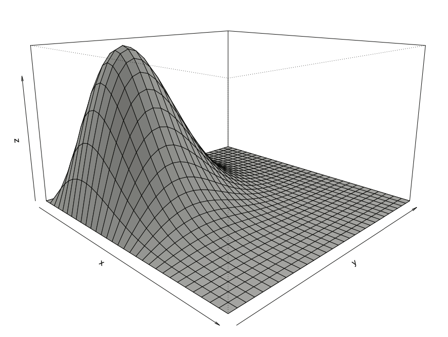
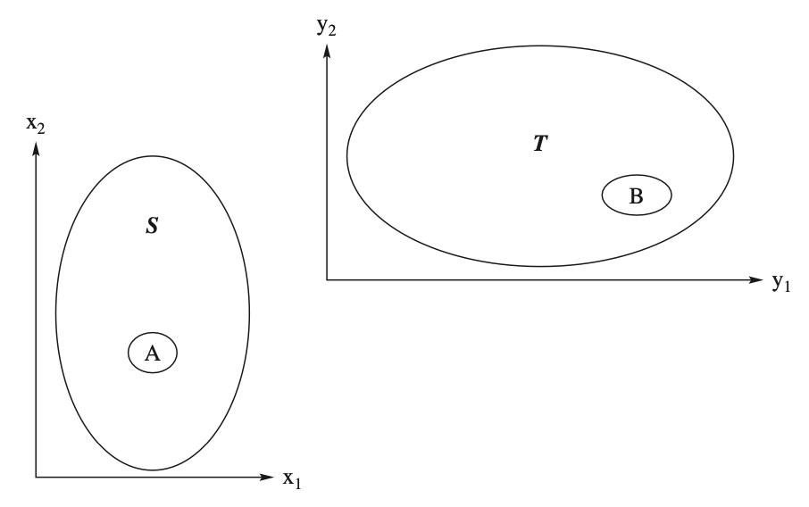
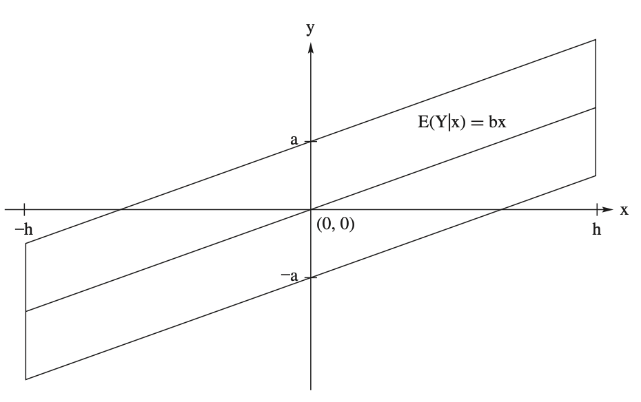

::: {.callout-tip title="本章定位"}
本講義由蘇南誠老師編授。感謝黃怡婷老師提供原始數理統計講義檔案；本章保留原有英文術語與公式，並整理為可連續閱讀的教學形式。
:::

## 學習目標

完成本章後，學生應能：

- 由聯合分配求邊際與條件分配
- 處理二維與多維隨機變數轉換
- 計算共變異數、相關係數與共變異矩陣
- 判斷隨機變數的獨立性
- 推導隨機變數線性組合的分配

## 必備的先備知識

第 1 章的分配函數、期望與單變量變數轉換。

以下依原講義順序整理核心定義、定理、公式與例題。

## Distributions of two random variables

### Definition

::: {#def-ch2-1}
- Consider a random experiment with a sample space ${\mathcal{C}}$.

- Define consider two random variables $X_1$ and $X_2$.

- Assign to each element $c$ of ${\mathcal{C}}$ one and only one ordered pair of numbers $X_1(c) = x_1$, $X_2(c) = x_2$.

- Then,

  - $(X_1,X_2)$ is a random vector.

  - The space of $(X_1,X_2)$ is the set of ordered pairs $${\mathcal{D}} = \{(x_1, x_2) : x_1 = X_1(c), x_2 = X_2(c), c \in {\mathcal{C}}\}.$$
:::

### Cumulative distribution function (cdf)

- Let $A\subset {\mathcal{D}}$.

- Denote the probability of the event $A$ as $P_{X_1, X_2}[A]$.

- $P_{X_1, X_2}[A]$ is uniquely determined by the cumulative distribution function (cdf), which is given by $$F_{X_1,X_2}(x_1,x_2)=P[\{X_1 \le x_1\} \cap \{X_2 \le x_2\}],$$ for all $(x_1, x_2)\in R^2$.

### Properties of cdf

- For all $a_1<b_1$ and $a_2<b_2$, show that $$\begin{aligned}
  \lefteqn{P[a_1 < X_1 \le b_1,a_2 <X_2 \le b_2] }\\
  & = F_{X_1,X_2}(b_1,b_2) -
  F_{X_1,X_2}(a_1,b_2) - F_{X_1,X_2}(b_1,a_2) + F_{X_1,X_2}(a_1,a_2)
  \end{aligned}$$

### Discrete random vector

::: {#def-ch2-2}
- Suppose ${\mathcal{D}}$ is finite or countable.

- Let $S$ denote the two-dimensional space of $X_1$ and $X_2$.

- The joint probability mass function of $X_1$ and $X_2$. $$p_{X_1, X_2}(x_1,x_2)=P[X_1=x_1, X_2=x_2]$$ for all $(x_1, x_2)\in {\mathcal{D}}$.
:::

### Conditions for joint pmf

- $0\le p_{X_1, X_2}(x_1,x_2)\le 1$.

- $\sum\sum_{(x_1, x_2)\in {\mathcal{D}}} p_{X_1, X_2}(x_1,x_2)=1$.

- $P[(X,Y)\in A]=\sum\sum_{(x_1,x_2)\in A} p_{X_1, X_2}(x_1,x_2)$.

### Example 1

- Roll a pair of fair dice.

- Let $X$ denote the smaller and $Y$ the larger outcome on the dice.

- Find the joint pmf.

### Note

- The support of a discrete random vector $(X_1, X_2)$ is defined as the space that $$\{(x_1, x_2)| p_{X_1, X_2}(x_1,x_2)>0 \}.$$

- The definition of a pmf is extended to a convenient set by using zero elsewhere.

### Continuous random vector

::: {#def-ch2-3}
- A random vector $(X_1, X_2)$ with space ${\mathcal{D}}$ is of the continuous type if its cdf $F_{X_1,X_2}(x_1,x_2)$ is continuous.

- $F_{X_1,X_2}(x_1,x_2)$ can be expressed as $$F_{X_1,X_2}(x_1,x_2) = \int_{-\infty}^{x_1}\int_{-\infty}^{x_2}
  f_{X_1,X_2}(w_1,w_2)dw_1dw_2,$$ for all $(x_1, x_2)\in {\mathcal{D}}$.

- The integrand is called the joint probability density function (pdf) of $(X_1, X_2)$.
:::

### Note

- We have $$\frac{\partial^2 F_{X_1,X_2}(x_1,x_2)}{\partial x_1\partial x_2} = f_{X_1,X_2}(x_1,x_2)$$ except possibly on events that have probability zero.

### Conditions for joint pdf

- $0\le f_{X_1, X_2}(x_1,x_2)$.

- $\int\int_{(x_1, x_2)\in {\mathcal{D}}} f_{X_1, X_2}(x_1,x_2)dx_1dx_2=1$.

- For an event $A$, $$P[(X,Y)\in A]=\int\int_{(x_1,x_2)\in A} f_{X_1, X_2}(x_1,x_2)dx_1dx_2.$$

### Example 2

- Consider a continuous random vector $(X, Y)$ which is uniformly distributed over the unit circle in $R^2$.

- Since the area of the unit circle is $\pi$, the joint pdf is $$f(x,y) = \left\{\begin{array}{ll}
  \frac{1}{\pi} & -1<y<1, -\sqrt{1-y^2}<x<\sqrt{1-y^2}\\
  0 & \text{elsewhere}
  \end{array}\right..$$

- Let $A$ be the interior of the circle with radius 1/2.

- Let $B$ be the ring formed by the concentric circles with the respective radii of $1/2$ and $\sqrt{2}/2$.

- Find $P[A]$ and $P[B]$.

### Example 3

- Suppose an electrical component has two batteries.

- Let $X$ and $Y$ denote the lifetimes in standard units of the respective batteries.

- Assume the joint pdf is $$f(x,y) = \left\{\begin{array}{ll}
  4xye^{-(x^2+y^2)} & x>0, y>0\\
  0 & \text{elsewhere}
  \end{array}\right..$$

- Find $P[X>\frac{\sqrt{2}}{2}, Y>\frac{\sqrt{2}}{2}]$.\[$f(x,y)$ has a maximum at $(\frac{\sqrt{2}}{2}, \frac{\sqrt{2}}{2})$.\]

- Let $B = \{(x,y): |x-2|<0.3, |y-2|<0.3\}$. Find $P[B]$.

### Example 4 — Joint pdf

### Note

- The support of a continuous random vector $(X_1, X_2)$ is defined as the space that $$\{(x_1, x_2)| f_{X_1, X_2}(x_1,x_2)>0 \}.$$

- The support is denoted as ${\mathcal{S}}$.

- The definition of a pdf is extended to $R^2$ by using zero elsewhere.

### Special event

- Let ($X_1$, $X_2$) be a random vector.

- Consider the event $\{X_1\le x_1\}$.

- We have $$\{X_1\le x_1\} = \{X_1\le x_1\} \cap \{-\infty<X_2<\infty\}$$

- The probability of this event is $$F_{X_1}(x_1) = P[X_1\le x_1, -\infty<X_2<\infty]$$ for all $x_1\in R$.

### Marginal pmf

- Let ($X_1$, $X_2$) be a discrete random vector.

- Find the probability of $\{X_1\le x_1\}$ and the pmf of $X_1$.

### Example 5

- Let the joint pmf of $X$ and $Y$ be defined by $$f(x,y)=\frac{x+y}{21}, x=1, 2, 3; y=1, 2.$$

- Find $f_X(x)$ and $f_Y(y)$.

### Marginal pdf

- Let ($X_1$, $X_2$) be a continuous random vector.

- Find the probability of $\{X_1\le x_1\}$ and the pdf of $X_1$.

### Example 6

- Suppose an electrical component has two batteries.

- Let $X$ and $Y$ denote the lifetimes in standard units of the respective batteries.

- Assume the joint pdf is $$f(x,y) = \left\{\begin{array}{ll}
  4xye^{-(x^2+y^2)} & x>0, y>0\\
  0 & \text{elsewhere}
  \end{array}\right..$$

- Find the marginal pdf of $X$ and the find the medium of $X$.

### Example 7

- Let $X$ and $Y$ have the joint pdf$$f(x,y) = \left\{\begin{array}{ll}
  x+y & 0<x<1, 0<y<1\\
  0 & \text{elsewhere}
  \end{array}\right..$$

- Find the marginal pdf of $X$ and $Y$, respectively.

- Find $P[X+Y\le 1]$.

### Expectation -- Discrete type

- Let $X_1$ and $X_2$ be random variables of the discrete type with the joint pmf $f(x_1, x_2)$ on the space $S$.

- If $u(X_1, X_2)$ is a function of $X_1$ and $X_2$, then $$E[u(X_1, X_2)] = \sum\sum_{(x_1,x_2)\in S} u(x_1, x_2) f(x_1, x_2),$$ if it exists, is called the mathematical expectation of $u(X_1, X_2)$.

### Remark

- If $$\sum\sum_{(x_1,x_2)\in S} |u(x_1, x_2)| f(x_1, x_2),$$ converges, then $E[u(X_1, X_2)]$ exists.

### Expectation -- Continuous type

- Let $X_1$ and $X_2$ be random variables of the discrete type with the joint pdf $f(x_1, x_2)$ on the space $S$.

- If $u(X_1, X_2)$ is a function of $X_1$ and $X_2$, then $$E[u(X_1, X_2)] = \int\int_{(x_1,x_2)\in S} u(x_1, x_2) f(x_1, x_2) dx_1dx_2,$$ if it exists, is called the mathematical expectation of $u(X_1, X_2)$.

### Remark

- If $$\int\int_{(x_1,x_2)\in S} |u(x_1, x_2)| f(x_1, x_2)dx_1dx_2<\infty,$$ converges, then $E[u(X_1, X_2)]$ exists.

### Expectation

::: {#thm-ch2-1}
- Let $(X_1, X_2)$ be a random vector.

- Let $Y_1 = g_1(X_1, X_2)$ and $Y_2 = g_2(X_1,X_2)$ be random variables whose expectations exist.

- For all real numbers $k_1$ and $k_2$, we have $$E[k_1Y_1 + k_2Y_2] = k_1E[Y_1] + k_2E[Y_2].$$
:::

### Example 8

- Let $X$ and $Y$ have the joint pdf$$f(x,y) = \left\{\begin{array}{ll}
  8xy & 0<x<y\\
  0 & \text{elsewhere}
  \end{array}\right..$$

- Let $Z = X/Y$.

- Find $E[Z]$.

### Moment generating function

::: {#def-ch2-4}
- Let ${\boldsymbol X} = (X_1,X_2)^{'}$ be a random vector.

- If $E[e^{t_1X_1+t_2X_2}]$ exists for $|t_1| < h_1$ and $|t_2| < h_2$, where $h_1$ and $h_2$ are positive.

- It is denoted by $M_{X_1,X_2}(t_1,t_2)$ and is called the moment generating function (mgf) of ${\boldsymbol X}$.
:::

### Note

- Let ${\boldsymbol t} = (t_1,t_2)^{'}$.

- Then we can write the mgf of ${\boldsymbol X}$ as $$M_{X_1,X_2} (t_1, t_2) = E[e^{{\boldsymbol t}^{'}{\boldsymbol X}}].$$

- The mgfs of $X_1$ and $X_2$ are immediately seen to be $M_{X_1,X_2} (t_1, 0)$ and $M_{X_1,X_2} (0, t_2)$.

### Example 9

- Let $X$ and $Y$ have the joint pdf$$f(x,y) = \left\{\begin{array}{ll}
  e^{-y} & 0<x<y<\infty\\
  0 & \text{elsewhere}
  \end{array}\right..$$

- Find $M(t_1, t_2)$, $M(t_1,0)$ and $M(0, t_2)$.

### Expected value

::: {#def-ch2-5}
- Let ${\boldsymbol X} = (X_1,X_2)^{'}$ be a random vector.

- Then the expected value of ${\boldsymbol X}$ exists if the expectations of $X_1$ and $X_2$ exist.

- If it exists, then the expected value is given by $$E[{\boldsymbol X}] = \begin{bmatrix}
  E[X_1]\\E[X_2]
  \end{bmatrix}$$
:::

## Transformations: Bivariate random variables

### Transformations -- Discrete

- Let $p_{X_1,X_2}(x_1,x_2)$ be the joint pmf of two discrete-type random variables $X_1$ and $X_2$ with the support ${\mathcal{S}}$.

- Let $y_1 = u_1(x_1,x_2)$ and $y_2 = u_2(x_1,x_2)$ define a one-to-one transformation that maps ${\mathcal{S}}$ onto ${\mathcal{T}}$ .

- The joint pmf of the two new random variables $Y_1 = u_1(X_1,X_2)$ and $Y_2 = u_2(X_1,X_2)$ is given by $$\begin{align*}
  p_{Y_1, Y_2}(y_1, y_2) = \left\{
  \begin{array}{ll}
  p_{X_1, X_2}(\omega_1(y_1, y_2), \omega_2(y_1, y_2)),&~(y_1, y_2)\in {\mathcal{T}}\\
  0 & \text{elsewhere},
  \end{array}\right .
  \end{align*}$$ where $x_1 = \omega_1(y_1, y_2)$, $x_2=\omega_2(y_1, y_2)$ is the single-valued inverse of $y_1 = u_1(x_1,x_2)$ , $y_2 = u_2(x_1,x_2)$.

### Example 10

- Consider an experiment in which a person chooses at random a point $(X_1,X_2)$ from the unit square ${\mathcal{S}} = {(x_1,x_2): 0 < x_1 < 1, 0 < x_2 < 1}$.

- Suppose that our interest is not in $X_1$ or in $X_2$, but in $Z = X_1 +X_2$.

- Find the pdf of $Z$.

### Continuous transformation

- Let $(X_1, X_2)$ have a jointly continuous distribution with pdf $f_{X_1,X_2} (x_1, x_2)$ and support set ${\mathcal{S}}$.

- Consider the transformed random vector $(Y_1, Y_2) = T (X_1, X_2)$ where $T$ is a one-to-one continuous transformation.

- Let $T = T({\mathcal{S}})$ denote the support of $(Y_1,Y_2)$.

- Rewrite the transformation in terms of its components as $$(Y_1, Y_2) = T (X_1, X_2) = (u_1(X_1, X_2), u2(X_1, X_2)),$$ where the functions $y_1 = u_1(x_1, x_2)$ and $y_2 = u_2(x_1, x_2)$ define $T$.

### Continuous transformation

- Since the transformation is one-to-one, the inverse transformation $T^{-1}$ exists.

- Write $x_1 = w_1(y_1, y_2)$, $x_2 = w_2(y_1, y_2)$.

- Define the Jacobian of the transformation which is the determinant of order 2 given by $$J = \left | \begin{array}{cc}
  \frac{\partial x_1}{\partial y_1} &
  \frac{\partial x_1}{\partial y_2}\\
  \frac{\partial x_2}{\partial y_1} &
  \frac{\partial x_2}{\partial y_2}\\
  \end{array}\right |$$

### Continuous transformation

::: columns
- Let $B$ be any region in ${T}$.

- Let $A = T^{-1}(B)$.

- Because the transformation $T$ is one-to-one, $$\begin{aligned}
  \lefteqn{P[(X_1,X_2) \in A]}\\
   &= P[T(X_1,X_2) \in T(A)] \\
   &= P[(Y_1,Y_2) \in B].
  \end{aligned}$$

:::

### Continuous transformation

- Based on the change-in-variable technique, we have $$\begin{aligned}
  P[(X_1,X_2)\in A] & = \int\int_A f_{X_1, X_2}(x_1, x_2) dx_1 dx_2\\
  &=\int\int_{T(A)} f_{X_1, X_2}(T^{-1}(y_1, y_2)) |J|dy_1 dy_2\\
  &=\int\int_B f_{X_1, X_2}(w_1(y_1,y_2), w_2(y_1, y_2)) dy_1 dy_2\\
  \end{aligned}$$

- The pdf of $(Y_1, Y_2)$ is $$f_{Y_1, Y_2}(y_1, y_2) =
  \left\{
  \begin{array}{ll}
  f_{X_1, X_2}(w_1(y_1,y_2), w_2(y_1, y_2)) |J|, & (y_1, y_2) \in T\\
  0 & \text{elsewhere}
  \end{array}\right .$$

### Example 11

- Consider an experiment in which a person chooses at random a point $(X_1,X_2)$ from the unit square ${\mathcal{S}} = \{(x_1,x_2) : 0 < x_1 < 1, 0 < x_2 < 1\}$.

- Find the joint pdf of $Y_1 = X_1+X_2$ and $Y_2 = X_1-X_2$.

### Example 12

- Let $X_1$ and $X_2$ have the joint pdf $$f_{X_1, X_2}(x_1, x_2) =
  \left\{
  \begin{array}{ll}
  \frac{1}{4}\exp\left(-\frac{x_1+x_2}{2}\right) & 0<x_1, x_2<\infty\\
  0 & \text{elsewhere}
  \end{array}\right .$$

- Find the pdf of $Y_1 = \frac{1}{2}(X_1-X_2)$.

### Example 13

- Let $X_1$ and $X_2$ have the joint pdf $$f_{X_1, X_2}(x_1, x_2) =
  \left\{
  \begin{array}{ll}
  10x_1x_2^2, & 0<x_1<x_2<1\\
  0 & \text{elsewhere}
  \end{array}\right .$$

- Find the pdf of $Y_1 = X_1/X_2$.

### Example 14

- Let $X_1$ and $X_2$ have the joint pdf $$f_{X_1, X_2}(x_1, x_2) =
  \left\{
  \begin{array}{ll}
  \frac{1}{4}\exp\left(-\frac{x_1+x_2}{2}\right), & 0<x_1, x_2<\infty\\
  0 & \text{elsewhere}
  \end{array}\right .$$

- Use the mgf to find the pdf of $Y_1 = \frac{1}{2}(X_1-X_2)$.

## Conditional Distributions and Expectations

### Conditional distribution for discrete r.v.

- Let $X_1$ and $X_2$ denote random variables of the discrete type.

- Let the joint pmf be denoted as $p_{X_1,X_2}(x_1,x_2)$ that is positive on the support set ${\mathcal{S}}$ and is zero elsewhere.

- Let $p_{X_1}(x_1)$ and $p_{X_2}(x_2)$ denote, respectively, the marginal probability mass functions of $X_1$ and $X_2$.

- Let $x_1$ be a point in the support of $X_1$, i.e., $p_{X_1} (x_1) > 0$.

- Using the definition of conditional probability, we have $$\begin{aligned}
  p_{X_2|X_1}(x_2|x_1) =P[X_2=x_2|X_1=x_2] =& \frac{P[X_1=x_1, X_2=x_2]}{P[X_1=x_1]} \\=& \frac{p_{X_1, X_2}(x_1, x_2)}{p_{X_1}(x_1)}
  \end{aligned}$$ for all $x_1\in {\mathcal{S}}_{X_2}$.

### Properties

- $\sum_{x_2} p_{X_2|X_1}(x_2|x_1) =1$.

- $p_{X_2|X_1}(x_2|x_1)>0$ for all $x_2\in {\mathcal{S}}_{X_2}$.

- $p_{X_2|X_1}(x_2|x_1)$ is called the conditional pmf of the discrete type of random variable.

### Conditional distribution for continuous r.v.

- Let $X_1$ and $X_2$ denote random variables of the continuous type.

- Let the joint pdf be denoted as $f_{X_1,X_2}(x_1,x_2)$ that is positive on the support set ${\mathcal{S}}$ and is zero elsewhere.

- Let $f_{X_1}(x_1)$ and $f_{X_2}(x_2)$ denote, respectively, the conditional probability density functions of $X_1$ and $X_2$.

- When $f_{X_1} (x_1) > 0$, we define $$\begin{aligned}
  f_{X_2|X_1}(x_2|x_1) =& \frac{f_{X_1, X_2}(x_1, x_2)}{f_{X_1}(x_1)}.
  \end{aligned}$$

### Properties

- $\int_{-\infty}^{\infty} f_{X_2|X_1}(x_2|x_1) dx_2=1$.

- $f_{X_2|X_1}(x_2|x_1)>0$ for all $x_2\in {\mathcal{S}}_{X_2}$.

- $f_{X_2|X_1}(x_2|x_1)$ is called the conditional pdf of the continuous type of random variable.

### Conditional probability of continuous r.v.

- If the random variables are of the continuous type, the conditional probability that $a < X_2 < b$, given that $X_1 = x_1$, is $$\begin{align*}
  P[a<X_2<b|X_1=x_1] = \int_{a}^{b} f_{X_2|X_1}(x_2|x_1)dx_2
  \end{align*}$$

### Conditional expectation of r.v.

- If $u(X_2)$ is a function of $X_2$, the conditional expectation of $u(X_2)$, given that $X_1 = x_1$, if it exists, is given by $$\begin{align*}
  E[u(X_2)|X_1=x_1] = \left\{
  \begin{array}{ll}
  \sum_{x_2} u(x_2) p_{X_2|X_1}(x_2|x_1), &\text{Discrete}\\
  \int_{x_2} u(x_2) f_{X_2|X_1}(x_2|x_1) dx_2, &\text{Continuous}
  \end{array}\right .
  \end{align*}$$

- The conditional variance of $X_2$, given that $X_1 = x_1$, if it exists, is given by $$\begin{align*}
  \operatorname{Var}(X_2|x_1) =& E[(X_2 - E[X_2|x_1])^2|X_1=x_1] \\=& E[X_2^2|x_1] - (E[X_2|x_1])^2
  \end{align*}$$

### Example 15

- Let $X_1$ and $X_2$ have the joint pdf $$f_{X_1, X_2}(x_1, x_2) =
  \left\{
  \begin{array}{ll}
  2, & 0<x_1<x_2<1\\
  0 & \text{elsewhere}
  \end{array}\right .$$

- Find $f_{X_1}(x_1)$ and $f_{X_2}(x_2)$.

### Example 16

- Let $X_1$ and $X_2$ have the joint pdf $$f_{X_1, X_2}(x_1, x_2) =
  \left\{
  \begin{array}{ll}
  2, & 0<x_1<x_2<1\\
  0 & \text{elsewhere}
  \end{array}\right .$$

- Find $f_{X_1|X_2}(x_1|x_2)$ and $f_{X_2|X_1}(x_2|x_1)$.

### Exampe

- Let $X_1$ and $X_2$ have the joint pdf $$f_{X_1, X_2}(x_1, x_2) =
  \left\{
  \begin{array}{ll}
  2, & 0<x_1<x_2<1\\
  0 & \text{elsewhere}
  \end{array}\right .$$

- Find $E[X_1|x_2]$ and $\operatorname{Var}(X_1|x_2)$.

### Example 17

- Let $X_1$ and $X_2$ have the joint pdf $$f_{X_1, X_2}(x_1, x_2) =
  \left\{
  \begin{array}{ll}
  2, & 0<x_1<x_2<1\\
  0 & \text{elsewhere}
  \end{array}\right .$$

- Find $P[0<X_1<\frac{1}{2}|X_2 =\frac{3}{4}]$ and $P[0<X_1<\frac{1}{2}]$

### Conditional variance and variance

::: {#thm-ch2-2}
- Let $(X_1,X_2)$ be a random vector such that the variance of $X_2$ is finite.

- We have

  - $E[E[X_2|X_1]] = E[X_2]$.

  - $\operatorname{Var}(E[X_2|X_1]) \le \operatorname{Var}(X_2)$.
:::

## Independent random variables

### Independence

::: {#def-ch2-6}
- Let the random variables $X_1$ and $X_2$ have the joint pdf $f(x_1,x_2)$ \[joint pmf $p(x_1,x_2)$\].

- Let the marginal pdfs \[pmfs\] $f_1(x_1) [p_1(x_1)]$ and $f_2(x_2) [p_2(x_2)]$.

- $X_1$ and $X_2$ are said to be independent if, and only if, $$f(x_1, x_2) \equiv f_1(x_1)f_2(x_2) [p(x_1, x_2) \equiv p_1(x_1)p_2(x_2)].$$

- Random variables that are not independent are said to be dependent.
:::

### Remark

- The product of two positive functions $f_1(x_1)f_2(x_2)$ means a function that is positive on the product space.

- There may be certain points $(x_1,x_2) \in {\mathcal{S}}$ at which $f(x_1,x_2) \ne f_1(x_1)f_2(x_2)$. However, if $A$ is the set of points $(x_1,x_2)$ at which the equality does not hold, then $P(A) = 0$.

### Example 18

- Suppose an urn contains 10 blue, 8 red, and 7 yellow balls that are the same except for color.

- Suppose 4 balls are drawn without replacement.

- Let $X$ and $Y$ be the number of red and blue balls drawn.

- Are $X$ and $Y$ independent?

### Example 19

- Let $X_1$ and $X_2$ have the joint pdf $$f_{X_1, X_2}(x_1, x_2) =
  \left\{
  \begin{array}{ll}
  x_1+x_2, & 0<x_1, x_2<1\\
  0 & \text{elsewhere}
  \end{array}\right .$$

- Are $X$ and $Y$ independent?

### Independence

::: {#thm-ch2-3}
- Let the random variables $X_1$ and $X_2$ have supports ${\mathcal{S}}_1$ and ${\mathcal{S}}_2$, respectively, and have the joint pdf $f(x_1,x_2)$.

- Then $X_1$ and $X_2$ are independent if and only if $f(x_1,x_2)$ can be written as a product of a nonnegative function of $x_1$ and a nonnegative function of $x_2$.

- That is, $$f(x_1,x_2) ≡ g(x_1)h(x_2),$$ where $g(x_1) > 0$, $x_1\in {\mathcal{S}}_1$, zero elsewhere, and $h(x_2) > 0$, $x_2\in {\mathcal{S}}_2$, zero elsewhere.
:::

### Example 20

- Let $X_1$ and $X_2$ have the joint pdf $$f_{X_1, X_2}(x_1, x_2) =
  \left\{
  \begin{array}{ll}
  4xe^{-x^2}ye^{-y^2}, & x>0, y>0\\
  0 & \text{elsewhere}
  \end{array}\right .$$

- Are $X_1$ and $X_2$ independent?

### Example 21

- Let $X_1$ and $X_2$ have the joint pdf $$f_{X_1, X_2}(x_1, x_2) =
  \left\{
  \begin{array}{ll}
  8x_1x_2 & 0<x_1<x_2<1\\
  0 & \text{elsewhere}
  \end{array}\right .$$

- Are $X$ and $Y$ independent?

### Independence

::: {#thm-ch2-4}
- Let $X_1$ and $X_2$ have the joint cdf $F(x_1,x_2)$.

- Let $X_1$ and $X_2$ have the marginal cdfs $F_1(x_1)$ and $F_2(x_2)$.

- Then $X_1$ and $X_2$ are independent if and only if $$F(x_1,x_2) = F_1(x_1) F_2(x_2)$$ for all $(x_1, x_2) \in R^{2}$.
:::

### Independence

::: {#thm-ch2-5}
- $X_1$ and $X_2$ are independent if and only if $$P[a<X_1\le b, c<X_2\le d] = P[a<X_1\le b]P[c<X_2\le d]$$ for every $a<b$ and $c<d$, where $a, b, c, d$ are constants.
:::

### Example 22

- Let $X_1$ and $X_2$ have the joint pdf $$f_{X_1, X_2}(x_1, x_2) =
  \left\{
  \begin{array}{ll}
  x_1+x_2 & 0<x_1, x_2<1\\
  0 & \text{elsewhere}
  \end{array}\right .$$

- Find $P[0<X_1\le \frac{1}{2}, 0<X_2\le \frac{1}{2}]$, $P[0<X_1\le \frac{1}{2}]$ and $P[0<X_2\le \frac{1}{2}]$.

- Are $X$ and $Y$ independent?

### Independence

::: {#thm-ch2-6}
- Suppose $X_1$ and $X_2$ are independent.

- Suppose $E[u(X_1)]<\infty$ and $E[\nu(X_2)]<\infty$.

- We have $$E[u(X_1)\nu(X_2)] = E[u(X_1)]E[\nu(X_2)].$$
:::

### Independence

::: {#thm-ch2-7}
- Suppose $M(t_1, t_2)<\infty$.

- Then $X_1$ and $X_2$ are independent if and only if $$M(t_1, t_2) = M(t_1, 0) M(0, t_2).$$
:::

### Example 23

- Let $X_1$ and $X_2$ have the joint pdf $$f_{X_1, X_2}(x_1, x_2) =
  \left\{
  \begin{array}{ll}
  e^{-x_2} & 0<x_1<x_2<\infty\\
  0 & \text{elsewhere}
  \end{array}\right .$$

- Find $M(t_1, t_2)$.

- Show that $M(t_1, t_2) \ne M(t_1, 0) M(0, t_2).$

## The correlation coefficient

### Covariance

::: {#def-ch2-7}
- Let $(X, Y)$ have a joint distribution.

- Denote the means of $X$ and $Y$ by $\mu_1$ and $\mu_2$ and their respective variances by $\sigma_1^2$ and $\sigma_2^2$.

- The covariance of $(X, Y)$ is denoted by cov($X$, $Y$) and is defined by the expectation $$\operatorname{cov}(X, Y) = E[(X - \mu_1)(Y - \mu_2)].$$
:::

### Note

- The covariance of $X$ and $Y$ can also be expressed as $$\operatorname{cov}(X, Y) = E[XY] - \mu_1\mu_2.$$

### Correlation coefficient

::: {#def-ch2-8}
- If each of $\sigma_1$ and $\sigma_2$ is positive, then the correlation coefficient between $X$ and $Y$ is defined by $$\rho = \frac{\operatorname{cov}(X, Y)}{\sigma_1\sigma_2}.$$
:::

### Note

- The expected value of the product of two random variables is equal to the product of their expectations plus their covariance; $$E[XY] = \mu_1\mu_2 + \operatorname{Cov}(X, Y) = \mu_1\mu_2 + \rho\sigma_1\sigma_2.$$

### Example 24

- A fair coin is flipped three times.

- $X_1$ is the number of heads on the first two flips while $X_2$ is the number of heads on all three flips.

- Find the correlation coefficient of $(X_1,X_2)$.

### Example 25

- Let $X_1$ and $X_2$ have the joint pdf $$f_{X_1, X_2}(x_1, x_2) =
  \left\{
  \begin{array}{ll}
  x_1 + x_2, & 0<x_1, x_2<1\\
  0, & \text{elsewhere}
  \end{array}\right .$$

- Find the correlation coefficient of $(X_1,X_2)$.

### Correlation coefficient[^1]

::: {#thm-ch2-8}
- For all jointly distributed random variables $(X,Y)$ whose correlation coefficient $\rho$ exists, $-1 \le \rho\le 1$.
:::

### Note

- A quadratic equation is said positive when its discriminant is negative.

- Define the quadratic equation as $y = ax^2+bx+c$.

- The discriminant is $b^2-4ac$.

### Independence

::: {#thm-ch2-9}
- If $X$ and $Y$ are independent random variables, then $$\rho = 0.$$
:::

### Example 26

- Let $X$ and $Y$ be jointly discrete random variables whose distribution has mass 1/4 at each of the four points (-1, 0), (0, -1), (1, 0) and (0, 1).

- Find the correlation coefficient of $(X_1,X_2)$.

- Are $X$ and $Y$ independent?

### Linear function

::: {#thm-ch2-10}
- Suppose $(X, Y)$ have a joint distribution with the variances of $X$ and $Y$ finite and positive.

- Denote the means and variances of $X$ and $Y$ by $\mu_1$, $\mu_2$ and $\sigma_1^2$, $\sigma_2^2$.

- Let $\rho$ be the correlation coefficient between $X$ and $Y$.

- If $E[Y|X]$ is linear in $X$ then $$E[Y|X] = \mu_2 + \rho\frac{\sigma_2}{\sigma_1}(X-\mu_1)$$ and $$E[\operatorname{Var}(Y|X)] = \sigma_2^2 (1-\rho^2).$$
:::

### Example 27

- Let the random variables X and Y have the linear conditional means $E(Y |x) = 4x + 3$ and $E(X|y) = \frac{1}{16} y - 3$.

- Can $\mu_1$, $\mu_2$, $\rho$, $\sigma_1$ and $\sigma_2$ be obtained?

### Example 28

- Let the random variables $X$ and $Y$ have a uniform distribution over the area.

- The joint pdf of $X$ and $Y$ is $$f_{X, Y}(x, y) =
  \left\{
  \begin{array}{ll}
  \frac{1}{4ah} & -a+bx<y<a+bx, -h<x<h\\
  0 & \text{elsewhere}
  \end{array}\right .$$

- Find $\rho$.

### Example 29

- Let the random variables $X$ and $Y$ have the joint pdf $$f_{X, Y}(x, y) =
  \left\{
  \begin{array}{ll}
  e^{-y} & 0<x<y<\infty\\
  0 & \text{elsewhere}
  \end{array}\right .$$

- Find $\rho$.

## Extension to several random variables

### Random vector

::: {#def-ch2-9}
- Consider a random experiment with a sample space ${\mathcal{C}}$.

- Let the random variable $X_i$ assign to each element $c \in {\mathcal{C}}$ one and only one real number $X_i(c) = x_i$, $i = 1,2,...,n$.

- Then,

  - ${\boldsymbol X} = (X_1,X_2, \cdots, X_n)$ is a $n$-dimensional random vector.

  - The space of ${\boldsymbol X}$ is the set of ordered $n$-tuples $${\mathcal{D}} = \{(x_1, x_2, \ldots, x_n) : x_1 = X_1(c), \ldots, x_n = X_n(c), c \in {\mathcal{C}}\}.$$

- Furthermore, let $A$ be a subset of the space ${\mathcal{D}}$. Then $P[(X_1,\cdots,X_n) \in A] = P[C]$, where $C = \{c: c \in {\mathcal{C}}\}$ and $(X_1(c), X_2(c), \cdots, X_n(c)) \in A$.
:::

### Cumulative distribution function (cdf)

- Let $A\subset {\mathcal{D}}$.

- Denote the probability of the event $A$ as $P_{X_1, X_2, \ldots, X_n}[A]$.

- $P_{X_1, X_2, \ldots, X_n}[A]$ is uniquely determined by the cumulative distribution function (cdf), which is given by $$F_{\boldsymbol X}(x_1,x_2, \ldots, x_n)=P[X_1 \le x_1, \ldots, X_n \le x_n],$$ for all $(x_1, x_2,\ldots, x_n)\in R^n$.

### Cumulative distribution function (cdf)

- Discrete random vector $$F_{\boldsymbol X}(x_1,x_2, \ldots, x_n)=\sum\cdots\sum_{\omega_1\le x_1,\ldots,\omega_n\le x_n}p(\omega_1, \ldots, \omega_n)$$

- Continuous random vector $$F_{\boldsymbol X}(x_1,x_2, \ldots, x_n)=\int_{-\infty}^{x_1}\cdots\int_{-\infty}^{x_n}f(\omega_1, \ldots, \omega_n)d\omega\cdots d\omega_n.$$ and $$\frac{\partial^n}{\partial x_1\cdots\partial x_n}F_{\boldsymbol X} ({\boldsymbol x}) = f({\boldsymbol x}).$$

### Example 30

- Let the random variables $X$, $Y$ and $Z$ have the joint pdf defined as $$f(x, y, z) =
  \left\{
  \begin{array}{ll}
  e^{-x+y+z} & 0<x,y, z<\infty\\
  0 & \text{elsewhere}
  \end{array}\right .$$

- Find the distribution funtion of $X$, $Y$ and $Z$.

### Expectation for discrete random vector

- Let ${\boldsymbol X} = (X_1, X_2, \ldots, X_n)$ be a random vector.

- Let $Y = u(X_1, X_2, \ldots, X_n)$ for some function $u$.

- Then $$\begin{aligned}
  \lefteqn{E[u(X_1, X_2, \ldots, X_n)]}\\
  & = \sum\cdots\sum_{(x_1,\ldots, x_n)\in {\mathcal{D}}} u(x_1, \ldots, x_n) f(x_1, \ldots, x_n),
  \end{aligned}$$ if it exists, is called the mathematical expectation of $u(X_1, \ldots, X_n)$.

### Expectation for continuous random vector

- Let ${\boldsymbol X} = (X_1, X_2, \ldots, X_n)$ be a random vector.

- Let $Y = u(X_1, X_2, \ldots, X_n)$ for some function $u$.

- Then $$\begin{aligned}
  &\lefteqn{E[u(X_1, \ldots, X_n)]}  \\
  &= \int\cdots\int_{(x_1,\ldots, x_n)\in {\mathcal{D}}} u(x_1, \ldots, x_n) f(x_1, \ldots, x_n) dx_1\cdots dx_n,
  \end{aligned}$$ if it exists, is called the mathematical expectation of $u(X_1, \ldots, X_n)$.

### Marginal pmf

- Let ($X_1$, $\ldots$, $X_n$) be a random vector.

- Find the pmf of $X_1$.

### Note

- Take any group of $k < n$ of these random variables and find the joint pmf of them.

- This joint pmf is called the marginal pmf of this particular group of $k$ variables.

### Marginal pdf

- Let ($X_1$, $\ldots$, $X_n$) be a random vector.

- Find the probability of $\{X_1\le x_1\}$ and the pdf of $X_1$.

### Note

- Take any group of $k < n$ of these random variables and find the joint pdf of them.

- This joint pdf is called the marginal pdf of this particular group of $k$ variables.

### Conditional distribution for discrete type

- Let $x_1$ be a point in the support of $X_1$, i.e., $p_{X_1} (x_1) > 0$.

- Using the definition of conditional probability, we have $$\begin{aligned}
  p_{X_2, \ldots, X_n|X_1}(x_2, \cdots, x_n|x_1) =&P[X_2=x_2, \cdots, X_n=x_n|X_1=x_1]  \\=& \frac{p_{\boldsymbol X}(x_1, x_2, \cdots, x_n)}{p_{X_1}(x_1)}.
  \end{aligned}$$

### Conditional distribution for continuous type

- When $f_{X_1} (x_1) > 0$, we define $$\begin{aligned}
  f_{X_2, \ldots, X_n|X_1}(x_2, \cdots, x_n|x_1) =& \frac{f_{X_1, X_2}(x_1, x_2, \cdots, x_n)}{f_{X_1}(x_1)}.
  \end{aligned}$$

- The joint conditional pdf of any $n - 1$ random variables, say $X_1,\cdots,X_{i-1},X_{i+1},\cdots,X_n$, given $X_i = x_i$, is defined as the joint pdf of $X_1,\cdots,X_n$ divided by the marginal pdf $f_{X_i}(x_i)$, provided that $f_{X_i}(x_i) > 0$.

### Conditional expectation of a discrete random vector

- If $u(X_2, \cdots, X_n)$ is a function of $X_2$, $\ldots$, $X_n$, the conditional expectation of $u(X_2, \cdots, X_n)$, given that $X_1 = x_1$, if it exists, is given by

$$\begin{align*}
\lefteqn{E[u(X_2, \cdots, X_n)|X_1=x_1] }\\
&=
\sum\cdots\sum_{x_2, \cdots, x_n} u(x_2, \cdots, x_n) p_{X_2, \ldots, X_n|X_1}(x_2, \cdots, x_n|x_1),
\end{align*}$$

### Conditional expectation of a continuous random vector

- If $u(X_2, \cdots, X_n)$ is a function of $X_2$, $\ldots$, $X_n$, the conditional expectation of $u(X_2, \cdots, X_n)$, given that $X_1 = x_1$, if it exists, is given by

$$\begin{align*}
\lefteqn{E[u(X_2, \cdots, X_n)|X_1=x_1] }\\
&= 
\int\cdots\int_{x_2, \cdots, x_n} u(x_2, \cdots, x_n) f_{X_2\ldots, X_n|X_1}(x_2, \cdots, x_n|x_1) dx_2\cdots dx_n,
\end{align*}$$

### Independence

::: {#def-ch2-10}
- Let the random variables $X_1, \cdots, X_n$ have the joint pdf $f(x_1,\cdots, x_n)$ \[joint pmf $p(x_1,\cdots, x_n)$\].

- Let the marginal pdfs \[pmfs\] $f_1(x_1) [p_1(x_1)]$, $\cdots$, $f_n(x_n) [p_n(x_n)]$.

- $X_1, \cdots, X_n$ are said to be mutually independent if, and only if, $$f(x_1,\cdots, x_n) \equiv f_1(x_1)\cdots f_n(x_n) [p(x_1, \cdots, x_n) \equiv p_1(x_1)\cdots p_n(x_n)].$$

- Random variables that are not independent are said to be dependent.
:::

### Independence

::: {#thm-ch2-11}
- Suppose $X_1, \cdots, X_n$ are independent.

- Suppose $E[u(X_i)]<\infty$, $i=1,2, \ldots, n$.

- We have $$E[u(X_1)\cdots u(X_n)] = E[u(X_1)]\cdots E[u(X_n)] = \prod_{i=1}^n E[u(X_i)]$$
:::

### Moment generating function

::: {#def-ch2-11}
- Let ${\boldsymbol X} = (X_1,X_2, \cdots, X_n)$ be a random vector.

- If $E[e^{\sum_{i=1}^nt_iX_i}]$ exists for $|t_i| < h_i$, $i=1,\ldots, n$ where $h_i>0$, $i=1,\ldots, n$.

- It is denoted by $M_{\boldsymbol X}(t_1,\cdots, t_n)$ and is called the moment generating function (mgf) of ${\boldsymbol X}$.
:::

### Independence

::: {#thm-ch2-12}
- Suppose $X_1, X_2, \cdots, X_n$ are $n$ mutually independent random variables.

- Suppose, for all $i = 1,2,\cdots,n$, $X_i$ has mgf $M_i(t)$, for $|t| < h_i$, where $h_i > 0$.

- Let $T = \sum_{i=1}^n k_iX_i$, where $k_1,k_2,\ldots, k_n$ are constants.

- Then $T$ has the mgf given by $$M_T(t) = \prod_{i=1}^n M_i(k_it),$$ where $-\min_i (h_i) < t <\min_i{h_i}$.
:::

### Example 31

- Let the random variables $X_1$, $X_2$ and $X_3$ be three mutually independent random variable and let each have the pdf $$f(x) =
  \left\{
  \begin{array}{ll}
  2x & 0<x<1\\
  0 & \text{elsewhere}
  \end{array}\right .$$

- Find the distribution function and pdf of $Y=\max_i X_i$.

### Note

- Unless there is a possible misunderstanding between mutual and pairwise independence, we usually drop the modifier mutual.

- If several random variables are mutually independent and have the same distribution, we say that they are independent and identically distributed, which we abbreviate as iid.

### Independence

::: corollary
- Suppose $X_1, X_2, \cdots, X_n$ are iid random variable with the common mgf $M(t)$, for $|t| < h$, where $h > 0$.

- Let $T = \sum_{i=1}^n X_i$.

- Then $T$ has the mgf given by $$M_T(t) = [M(t)]^n,$$ where $|t| < h$.
:::

### Random matrix

- Let ${\boldsymbol X} = (X_1, \ldots, X_n)^{'}$ be an $n$-dimensional random vector.

- Define $E({\boldsymbol X}) = (E[X_1], \ldots, E[X_n])^{'}$.

- Suppose ${\boldsymbol W}$ is an $m \times n$ matrix of random variables with the $ij$th component $W_{ij}$, $1 \le i \le m$ and $1 \le j \le n$.

- Define the expectation of a random matrix $$E[{\boldsymbol W}] = [E(W_{ij})].$$

### Random matrix

::: {#thm-ch2-13}
- Let ${\boldsymbol W}_1$ and ${\boldsymbol W}_2$ be $m \times n$ matrices of random variables.

- Let ${\boldsymbol A}_1$ and ${\boldsymbol A}_2$ be $k \times m$ matrices of constants.

- Let ${\boldsymbol B}$ be an $n\times l$ matrix of constants.

- Then, we have

  - $E[{\boldsymbol A}_1{\boldsymbol W}_1+{\boldsymbol A}_2{\boldsymbol W}_2] = {\boldsymbol A}_1E[{\boldsymbol W}_1] +{\boldsymbol A}_2E[{\boldsymbol W}_2].$

  - $E[{\boldsymbol A}_1{\boldsymbol W}_1{\boldsymbol B}] = {\boldsymbol A}_1E[{\boldsymbol W}_1]{\boldsymbol B}$
:::

### Random vector

- Let ${\boldsymbol X} = (X_1,\ldots, X_n)^{'}$ be an $n$-dimensional random vector, such that $\sigma_i^2=\sigma_{ii}=\operatorname{Var}(X_i)<\infty$.

- The mean of ${\boldsymbol X}$ is $\boldsymbol{\mu} = E[\boldsymbol{X}]$. and we define its variance-covariance matrix as $$\operatorname{Cov}({\boldsymbol X}) = E[({\boldsymbol X} - {\boldsymbol \mu})({\boldsymbol X} - {\boldsymbol \mu})^{'}] = [\sigma_{ij}]$$ whose the ($i$,$j$)th off diagonal entry is $\operatorname{Cov}(X_i,X_j)$ and the $(i, i)$th diagonal entry is $\sigma_i^2 = \operatorname{Var}(X_i)$.

### Example 32

- Let the random variables $X$ and $Y$ have the joint pdf of $X$ and $Y$ is $$f_{X, Y}(x, y) =
  \left\{
  \begin{array}{ll}
  e^{-y} & 0<x<y<\infty\\
  0 & \text{elsewhere}
  \end{array}\right .$$

- Let ${\boldsymbol Z} = (X, Y)^{'}$.

- Find $E[{\boldsymbol Z}]$ and $\operatorname{Cov}({\boldsymbol Z})$.

### Random vector

::: {#thm-ch2-14}
- Let ${\boldsymbol X} = (X_1,\ldots, X_n)^{'}$ be an $n$-dimensional random vector, such that $\sigma_i^2=\sigma_{ii}=\operatorname{Var}(X_i)<\infty$.

- Let ${\boldsymbol A}$ be an $m \times n$ matrices of constants.

- Then, we have

  - $\operatorname{Cov}({\boldsymbol X}) = E[{\boldsymbol X}{\boldsymbol X}^{'}] - {\boldsymbol \mu} {\boldsymbol \mu}^{'}$

  - $\operatorname{Cov}({\boldsymbol A}{\boldsymbol X}) = {\boldsymbol A}\operatorname{Cov}({\boldsymbol X}) {\boldsymbol A}^{'}$.
:::

### Note

- All variance-covariance matrices are positive semi-definite matrices; that is, $${\boldsymbol a}^{'}\operatorname{Cov}({\boldsymbol X}){\boldsymbol a} \ge 0,$$ for all vectors ${\boldsymbol a} \in R^n$.

- Let ${\boldsymbol X}$ be a random vector.

- Let ${\boldsymbol a}$ be any $n \times 1$ vector of constants.

- Then ${Y}$ = ${\boldsymbol a}^{'} {\boldsymbol X}$ is a random variable and, hence, has nonnegative variance; i.e., $$0\le \operatorname{Var}(Y) = \operatorname{Var}({\boldsymbol a}^{'}\boldsymbol{X}) =
  {\boldsymbol a}^{'}\operatorname{Cov}({\boldsymbol X}){\boldsymbol a}.$$

## Transformations for several random variables

### Continuous transformation

- Let $(X_1, \ldots, X_n)$ have a jointly continuous distribution with pdf $f(x_1, \cdots, x_n)$ and support set ${\mathcal{S}}$.

- Consider a one-to-one transformation that maps ${\mathcal{S}}$ onto ${\mathcal{T}}$.

- Let $y_1 = u_1(x_1, x_2, \ldots, x_n)$, $y_2 = u_2(x_1, x_2, \ldots, x_n)$, $\cdots$ and $y_n = u_n(x_1, x_2, \ldots, x_n)$.

- Let the inverse function be denoted as $$\begin{aligned}
  x_1 =& w_1(y_1, y_2, \ldots, y_n)\\
  x_2 =& w_2(y_1, y_2, \ldots, y_n)\\
  &\vdots\\
  x_n =& w_n(y_1, y_2, \ldots, y_n)
  \end{aligned}.$$

### Continuous transformation

- Define the Jacobian of the transformation as $$J = \left | \begin{array}{cccc}
  \frac{\partial x_1}{\partial y_1} &
  \frac{\partial x_1}{\partial y_2} & \cdots & \frac{\partial x_1}{\partial y_n}\\
  \frac{\partial x_2}{\partial y_1} &
  \frac{\partial x_2}{\partial y_2} & \cdots & \frac{\partial x_2}{\partial y_n}\\
  \vdots & \vdots & \ddots & \vdots\\
  \frac{\partial x_n}{\partial y_1} &
  \frac{\partial x_n}{\partial y_2} & \cdots & \frac{\partial x_n}{\partial y_n}\\
  \end{array}\right |$$

- $J$ can not be identically zero in ${\mathcal{T}}$.

### Continuous transformation

- Based on the change-in-variable technique, we have $$\begin{aligned}
  \lefteqn{\int\int_{A} f(x_1, x_2, \ldots, x_n) dx_1 dx_2\cdots dx_n}\\
  &=\int\int_B f(w_1(y_1,y_2), w_2(y_1, y_2)) |J|dy_1 dy_2\cdots dy_n\\
  \end{aligned}$$

- The pdf of $(Y_1, Y_2, \ldots, Y_n)$ is $$\begin{aligned}
  \lefteqn{f(y_1, y_2, \ldots, y_n)}\\
  & =
  \left\{
  \begin{array}{ll}
  f(w_1(y_1,y_2, \ldots, y_n), \ldots,  w_n(y_1,y_2, \ldots, y_n)) |J|, & {\boldsymbol y} \in {\mathcal{T}}\\
  0 & \text{elsewhere}
  \end{array}\right .
  \end{aligned}$$

### Example 33

- Let $X_1$, $X_2$ and $X_3$ have the joint pdf $$f(x_1, x_2, x_3) =
  \left\{
  \begin{array}{ll}
  48 x_1 x_2 x_3 & 0< x_1<x_2<x_3<1\\
  0 & \text{elsewhere}
  \end{array}\right .$$

- Find the joint pdf of $Y_1$, $Y_2$ and $Y_3$.

- Find the marginal pdf of $Y_1$ and that of $Y_2$.

### Example 34

- Let $X_1$, $X_2$ and $X_3$ be iid with common pdf $$f(x) =
  \left\{
  \begin{array}{ll}
  e^{-x}, & 0<x\\
  0 & \text{elsewhere}
  \end{array}\right .$$

- Let $$\begin{aligned}
  Y_1 &= \frac{X_1}{X_1+X_2+X_3},\\
  Y_2 &= \frac{X_2}{X_1+X_2+X_3},\\
  Y_3 &= X_1+X_2+X_3.
  \end{aligned}$$

- Find the joint pdf of $Y_1$, $Y_2$ and $Y_3$.

- Find the marginal pdf of $Y_1$ and that of $Y_2$.

### Example 35 — Many to one

- Let $X$ have the Cauchy pdf $$f(x) = 
  \left\{
  \begin{array}{ll}
  \frac{1}{\pi(1+x^2)}, & -\infty<x<\infty\\
  0 & \text{elsewhere}
  \end{array}\right .$$

- Let $Y = X^2$.

- Find the pdf of $Y$.

### Continuous transformation

- Let $(X_1, \ldots, X_n)$ have a jointly continuous distribution with pdf $f(x_1, \cdots, x_n)$ and support set ${\mathcal{S}}$.

- Consider the transformation $y_1 = u_1(x_1, x_2, \ldots, x_n)$, $y_2 = u_2(x_1, x_2, \ldots, x_n)$, $\cdots$ and $y_n = u_n(x_1, x_2, \ldots, x_n)$, which maps ${\mathcal{S}}$ to ${\mathcal{T}}$.

- To each point of ${\mathcal{S}}$ there corresponds, of course, only one point in ${\mathcal{T}}$; but to a point in ${\mathcal{T}}$ there may correspond more than one point in ${\mathcal{S}}$.

### Continuous transformation

- Suppose that we can represent ${\mathcal{S}}$ as the union of a finite number, say $k$, of mutually disjoint sets $A_1$, $A_2$, $\ldots$, $A_k$ so that $$y_1 = u_1(x_1,x_2,\ldots,x_n),\ldots,y_n = u_n(x_1,x_2,\ldots,x_n)$$ define a one-to-one transformation of each $A_i$ onto ${\mathcal{T}}$.

- To each point in ${\mathcal{T}}$, there corresponds exactly one point in each of $A_1$, $A_2$, $\ldots$, $A_k$.

- For $i = 1,\ldots, k$, let the inverse function be denoted as $$\begin{aligned}
  x_1 =& w_{1i}(y_1, y_2, \ldots, y_n)\\
  x_2 =& w_{2i}(y_1, y_2, \ldots, y_n)\\
  &\vdots\\
  x_n =& w_{ni}(y_1, y_2, \ldots, y_n)
  \end{aligned}.$$

### Continuous transformation

- Define the Jacobian of the transformation as $$J_i = \left | \begin{array}{cccc}
  \frac{\partial x_{1i}}{\partial y_1} &
  \frac{\partial x_{1i}}{\partial y_2} & \cdots & \frac{\partial x_{1i}}{\partial y_n}\\
  \frac{\partial x_{2i}}{\partial y_1} &
  \frac{\partial x_{2i}}{\partial y_2} & \cdots & \frac{\partial x_{2i}}{\partial y_n}\\
  \vdots & \vdots & \ddots & \vdots\\
  \frac{\partial x_{ni}}{\partial y_1} &
  \frac{\partial x_{ni}}{\partial y_2} & \cdots & \frac{\partial x_{ni}}{\partial y_n}\\
  \end{array}\right |, i = 1, \ldots, k.$$

- $J_i$, $i=1, \ldots, k$, can not be identically zero in ${\mathcal{T}}$.

- The pdf of $(Y_1, Y_2, \ldots, Y_n)$ is $$\begin{aligned}
  \lefteqn{f(y_1, y_2, \ldots, y_n)}\\
  & =
  \sum_{i=1}^kf(w_{1i}(y_1,y_2, \ldots, y_n), \ldots,  w_{ni}(y_1,y_2, \ldots, y_n)) |J_i|
  \end{aligned}$$ provided ${\boldsymbol y} \in {\mathcal{T}}$.

### Example 36

- Let $X_1$ and $X_2$ have the joint pdf $$f_{X_1, X_2}(x_1, x_2) =
  \left\{
  \begin{array}{ll}
  \frac{1}{\pi}, & 0<x_1^2+x_2^2<1\\
  0 & \text{elsewhere}
  \end{array}\right .$$

- Let $Y_1 = X_1^2 + X_2^2$ and $Y_2 = X_1^2/(X_1^2 + X_2^2)$

- Find the joint pdf of $Y_1$ and $Y_2$ .

- Find the marginal pdf of $Y_1$ and that of $Y_2$.

### Example 37

- Let $X_1$, $X_2$, $X_3$, $X_4$ be independent random variables with com- mon pdf $$f(x) =
  \left\{
  \begin{array}{ll}
  e^{-x} & 0<x\\
  0 & \text{elsewhere}
  \end{array}\right .$$

- Find the distribution function of $Y = \sum_{i=1}^4X_i$ using the mgf technique.

## Linear combinations random variables

### Linear combination

- Let ${\boldsymbol X} = (X_1, \ldots, X_n)^{'}$ and ${\boldsymbol Y} = (Y_1, \ldots, Y_m)^{'}$ denote two random vectors.

- Consider two linear combinations of these variables as $$\begin{aligned}
  T & = \sum_{i=1}^n a_iX_i\\
  W & = \sum_{i=1}^m b_iY_i
  \end{aligned}$$ for specified constants $a_i$ and $b_i$, $i = 1, 2, \ldots, n$.

- Supoose $E[X_i] = \mu_{X_i}$, $i=1, 2, \ldots, n$ and $E[Y_i] = \mu_{Y_i}$, $i=1, 2, \ldots, m$.

### Mean and variance of $T$

::: {#thm-ch2-15}
- $E[T] = \sum_{i=1}^n a_i \mu_{X_i}$ and $E[W] = \sum_{i=1}^n b_i \mu_{Y_i}$.

- $\operatorname{Var}(T) = \sum_{i=1}^n a_i^2\operatorname{Var}(X_i) + 2\sum_{i<j} a_i a_j \operatorname{Cov}(X_i, X_j)$.

- $Cov(T, W) = \sum_{i=1}^n\sum_{j=1}^ma_ib_j\operatorname{Cov}(X_i, Y_j)$.
:::

### Random sample

::: {#def-ch2-12}
- If the random variables $X_1, X_2, \ldots, X_n$ are independent and identically distributed.

- Each $X_i$ has the same distribution.

- These random variables constitute a random sample of size $n$ from that common distribution.

- Abbreviate independent and identically distributed by iid.
:::

### Example 38

- Let $X_i$, $i=1, 2, \ldots, n$, be a random sample with mean $\mu$ and variance $\sigma^2$.

- Define the sample variance as $$S^2 = \frac{1}{n-1}\sum_{i=1}^n (X_i-\bar{X})^2$$

- Show $E[S^2]=\sigma^2$.

[^1]: Hint: Define $h(v) = E\left\{[(X-\mu_1) + v (Y-\mu_2)]^2\right\}$

## 本章摘要

本章把單變量分配推廣到隨機向量，核心工具是邊際化、條件化、Jacobian 與共變異結構。

## 常見錯誤

- 將零相關直接解讀為獨立
- Jacobian 使用方向錯誤
- 只求聯合密度而未確認轉換後支持集
- 忽略條件分配中的正規化常數

## 章末練習

1. 從本章選出三個關鍵定義，分別寫出數學形式、成立條件及一個例子。
2. 選擇一個主要定理或方法，重做推導並標記每一步使用的假設。
3. 從原講義例題挑選一題，完整寫出解題目標、方法選擇、計算與結果解釋。
4. 設計一個會違反本章方法條件的反例，說明錯誤會出現在哪一步。

::: {.callout-note title="待逐章補強"}
建議後續為本章補入：中文概念導讀、完整解答、課堂練習難度標記，以及與下一章的銜接說明。
:::
