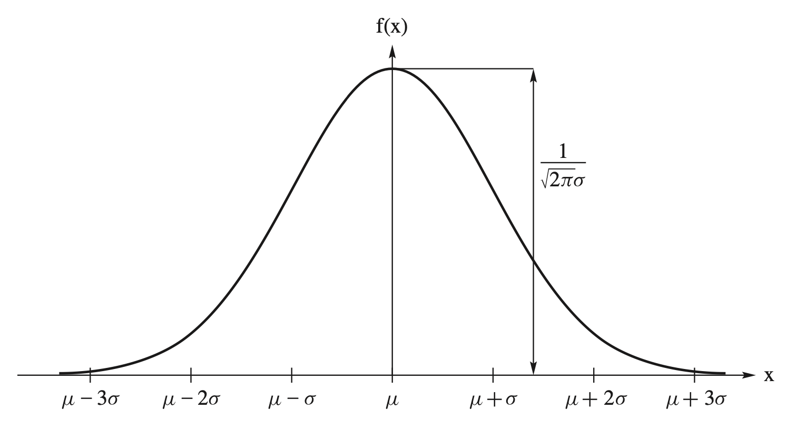
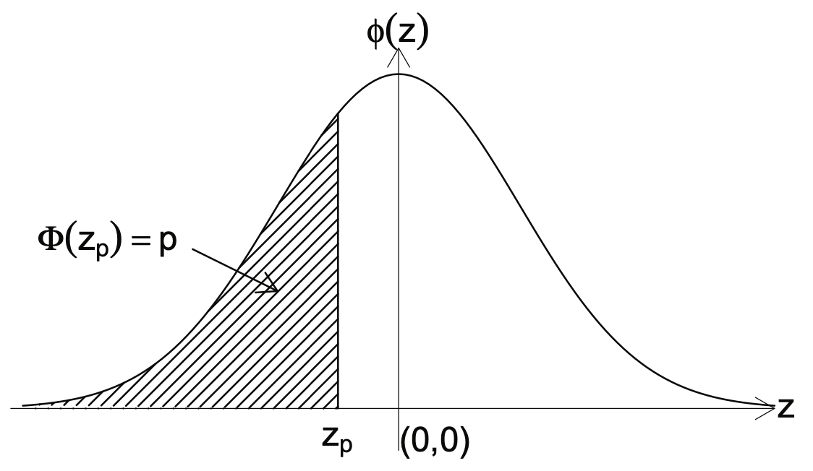
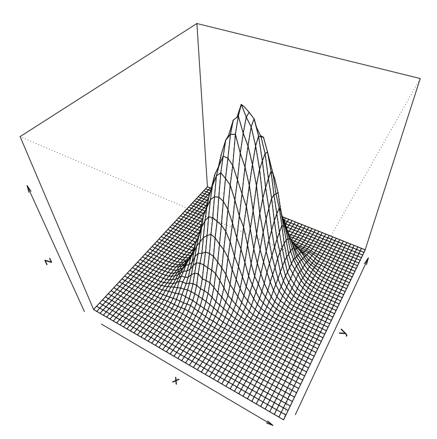

::: {.callout-tip title="本章定位"}
本講義由蘇南誠老師編授。感謝黃怡婷老師提供原始數理統計講義檔案；本章保留原有英文術語與公式，並整理為可連續閱讀的教學形式。
:::

## 學習目標

完成本章後，學生應能：

- 辨認二項、Poisson 與相關離散分配
- 掌握 Gamma、卡方與 Beta 分配
- 運用常態與多變量常態分配
- 說明 t 與 F 分配的生成方式
- 比較各分配的參數、支持集、期望與變異數

## 必備的先備知識

第 1 至 2 章的機率質量函數、密度函數與變數轉換。

以下依原講義順序整理核心定義、定理、公式與例題。

## Binomial and related distributions

### Bernoulli experiment distribution

- A Bernoulli experiment is a random experiment.

- The outcome only has two mutually exclusive and exhaustive ways, say, success and failure.

### Bernoulli distribution

- Let $X$ denote a random variable associated with a Bernoulli experiment.

- Define $$\begin{array}{ccc}
  X(\text{success})=1 & \text{and} & X(\text{failure})=0
  \end{array}$$

- The pmf of $X$ is $$f(x)=p^x(1-p)^{1-x},~x=0, 1.$$

### Moment of Bernoulli distribution

- The expected value of $X$ is $$\mu=p.$$

- The variance of $X$ is $$\sigma^2 = pq.$$

### Binomial distribution

- A sequence of $n$ Bernoulli trials occurs.

  - A Bernoulli experiment is performed several independent times.

  - The probability of success remains the same from trial to trial.

- Let $X$ denote the number of successes in $n$ Bernoulli trials.

- The pmf of $X$ is $$f(x) = {n\choose x} p^x (1-p)^{n-x},~x= 0, 1, 2, \cdots, n.$$

### Moment generating function

- Show that the mgf of a binomial distribution is $$M(t) = [(1-p) + pe^t]^n.$$

### Example 1

- Let $Y$ be equal to the number of successes throughout $n$ independent repetitions of a random experiment with probability $p$ of success.

- Find the upper bound of $P[|\frac{Y}{n}-p|\ge \epsilon]$.

### Example 2

- Let the independent random variables $X_1$, $X_2$ and $X_3$ have the same cdf $F(x)$.

- Let $Y$ be the middle value of $X_1$, $X_2$ and $X_3$.

- Find $F_Y(y)$.

### Negative binomial distribution

- A sequence of Bernoulli trials occurs

  - A Bernoulli experiment is performed several independent times.

  - The probability of success remains the same from trial to trial.

- Let $X$ denote the number of trials where the $r$th success is observed.

- The pmf of $X$ is $$f(x) = {x-1\choose r-1} p^r (1-p)^{x-r},~x= r, r+1, r+2, \cdots.$$

### Recall

- Let $h(x)=(1-x)^{-r}$.

- Based on Maclaurin's series expansion, we have $$(1-x)^{-r} = \sum_{k=0}^{\infty}\frac{h^{(k)}(0)}{x!}x^{k}= \sum_{k=0}^{\infty}{r+k-1\choose r-1} 
  x^{k},~-1<x<1.$$

### Probability of mass function

- Show that $$\sum_{x=r}^{\infty}{x-1\choose r-1} p^r (1-p)^{x-r}=1$$

### Moment generating function

- Show that $$M(t) = E[e^{tX}] = \frac{(pe^{t})^r}{[1-(1-p)e^t]^r},~(1-p)e^t<1.$$

### Moment of Negative binomial distribution

- The expected value of $X$ is $$\mu=\frac{r}{p}.$$

- The variance of $X$ is $$\sigma^2 = \frac{rq}{p}.$$

### Geometric distribution

- Let $X$ denote the number of trials where the $r=1$th success is observed.

- The pmf of $X$ is $$f(x) = p (1-p)^{x-1},~x= 1, 2, 3, \cdots.$$

### Recall

- For a geometric series, the sum equals $$\sum_{k=0}^{\infty}ax^{k}= \sum_{k=1}^{\infty}ax^{k-1}
  =\frac{a}{1-x},~-1<x<1.$$

### Probability of mass function of a geometric distribution

- Show that $$\sum_{x=1}^{\infty}p (1-p)^{x-1}=1$$

### Distribution function of a geometric distribution

- Find$P[X>k]$ and $P[X\le k]$.

### Additive properties

::: {#thm-ch3-1}
- Let $X_1, X_2, \ldots, X_m$ be independent random variables such that $X_i\sim Bin(n_i, p)$, for $i=1, 2, \ldots, m$.

- The distribution of $Y=\sum_{i=1}^m X_i$ is a $Bin(\sum_{i=1}^m n_i, p)$ distribution.
:::

### Settings for multinomial distribution

- Let a random experiment be repeated $n$ independent times.

- On each repetition, there is one and only one outcome from one of $k$ categories.

- Call the categories $C_1, C_2, \ldots , C_k$.

- For $i=1,\ldots, k$, let $p_i$ be the probability that the outcome is an element of $C_i$.

- Assume that $p_i$ remains constant throughout the $n$ independent repetitions.

### PMF of multinomial distribution

- Define the random variable $X_i$ to be equal to the number of outcomes that are elements of $C_i$, $i = 1, 2,\ldots, k$, where $X_k = n -\sum_{i=1}^{k-1} X_i$.

- The joint pmf of $(X_1, \ldots, X_{k-1})$ is $$P[X_1=x_1, X_2=x_2, \ldots, X_{k-1}=x_{k-1}] = \frac{n!}{x_1!\cdots x_{k-1}!x_k!}p_1^{x_1}\cdots p_k^{x_k},$$ for $0\le x_i\le n$, $i=1, \ldots, k$, $\sum_{i=1}^k x_i=n$ and $\sum_{i=1}^k p_i=1$.

### Moment generating function

- Show that $$M(t_1,\ldots, t_{k-1}) = E[e^{\boldsymbol{t}^{'}\boldsymbol{X}}] = \left(\sum_{i=1}^{k-1}p_ie^{t_i}+p_k\right)^n.$$

### Example 3

- Suppose $(X_1, X_2, X_3)$ has a multinomial distribution $(n, p_1, p_2, p_3)$.

- Find the marginal pmf of $X_i$.

- Find the conditional pmf of $X_1$ given $X_2$.

### Example 4

- Suppose $(X_1, X_2, X_3)$ has a multinomial distribution $(n, p_1, p_2, p_3)$.

- Find the correlation coefficient of $X_1$ and $X_2$.

### Example 5 — Binomial distribution

- Suppose we have a lot of $N$ items of which $D$ are defective.

- Let $X$ denote the number of defective items in a sample of size $n$.

- If the sampling is done with replacement and the items are chosen at random, then $X$ has a binomial distribution with parameters $n$ and $D/N$.

  - Mean $E[X] = n(D/N)$

  - Variance $\operatorname{Var}(X) = n(D/N)[(N - D)/N]$

### Example 6 — Hypergeometric distribution

- Suppose we have $N$ items of which $D$ are defective.

- Let $X$ denote the number of defective items in a sample of size $n$.

- If the sampling is done without replacement and the items are chosen at random, then $X$ has a hypergeometric distribution with pmf $$p(x) = \frac{{N-D \choose n-x}{D\choose x}}{{N\choose n}}, x=0, 1, \ldots, n.$$

### Example 7 — Hypergeometric distribution

- Show that $$E[X] = n\frac{D}{N}$$

### Example 8 — Hypergeometric distribution

- Show that $$\operatorname{Var}(X) = n\frac{D}{N}\frac{N-D}{N}\frac{N-n}{N-1}$$

## The Poisson distribution

### Motivation

- Suppose the number of cell phone calls passing through a relay tower between 9 and 10 A.M is counted.

- Suppose the number of flaws in 100 feet of wire is counted.

- Suppose the number of customers that arrive at a ticket window between 12 noon and 2 P.M is counted.

### Definition

- Let $X_t$ denote the number of occurrences of such a process over the interval $(0, t]$.

- The range of $X_t$ is the set of nonnegative integers {0, 1, 2, $\ldots$}.

- Let $g(x, t)$ denote the probability of $x$ changes in each interval of length $t$, i.e. $$g(x,t) = P[X_t = x]$$

### Definition

- An approximate Poisson process with parameter $\lambda>0$ if the following conditions are satisfied:

  1.  The number of occurrences in nonoverlapping subintervals are independent.

  2.  The probability of exactly one occurrence in a sufficiently short subinterval of length $h$ is approximately $\lambda h$. $$g(1, h) = \lambda h + o(h)$$

  3.  The probability of two or more occurrences in a sufficiently short subinterval is essentially zero. $$\sum_{t=2}^{\infty} g(t, h) = o(h).$$

### Note

- $o(h)$ notation means that $o(h)/h \rightarrow 0$ as $h \rightarrow 0$.

- For instance, $h^2 = o(h)$ and $o(h) + o(h) = o(h)$.

### Proof I

- Show $g(0, t) = e^{-\lambda t}$.

### Proof II

- Show $g(x, t) = \frac{(\lambda t)^x e^{-\lambda t}}{x!}, x = 1, 2 , 3, \ldots$.

### Recall

$$\small
\begin{aligned}
\lim_{n\rightarrow\infty} \frac{n(n-1)\cdots(n-x+1)}{n^x}&=\lim_{n\rightarrow\infty}\left[(1)\left(1-\frac{1}{n}\right)\cdots\left(1-\frac{x-1}{n}\right)\right]=1\\
\lim_{n\rightarrow\infty}\left(1-\frac{\lambda}{n}\right)^n&=e^{-\lambda}\\
\lim_{n\rightarrow\infty}\left(1-\frac{\lambda}{n}\right)^x&=1
\end{aligned}$$

### Poisson distribution

- $X$ has a Poisson distribution if its pmf is of the form $$f(x) = \frac{\lambda^x e^{-\lambda}}{x!},~x=0, 1, 2, \cdots$$

- Show $\sum_{x=0}^\infty f(x)=1$.

### Moment

- Show that $E[X]=\lambda$ and $\operatorname{Var}(X)=\lambda$.

### Moment generating function

- Show that $$M(t)=e^{\lambda(e^t-1)}, ~t\in R.$$

### Additive properties

::: {#thm-ch3-2}
- Let $X_1, X_2, \ldots, X_n$ be independent random variables such that $X_i\sim Poisson(m_i)$, for $i=1, 2, \ldots, n$.

- The distribution of $Y=\sum_{i=1}^n X_i$ is a $Poisson(\sum_{i=1}^n m_i)$ distribution.
:::

## $\Gamma$, $\chi^2$ and $\beta$ distributions

### Recall

- Poisson distribution with mean $\lambda$

  - Record the number of occurrence in a given interval.

- Exponential distribution

  - Denote the waiting time $W$ between the occurrences.

### Derivation of the exponential distribution function

- The cdf of the waiting time is $$\begin{aligned}
  F(w)=P[W\le w]&=1-P[W>w]\\&=1-P[\text{no occurrence in }[0, w]] \\&=1-e^{-\lambda w}
  \end{aligned}$$ for $w>0$.

### The pdf of an exponential distribution

- The pdf of the waiting time is $$\begin{aligned}
  f(w)=\lambda e^{-\lambda w}
  \end{aligned}$$ for $w>0$.

### An alternative representation of pdf

- The pdf of the waiting time is $$\begin{aligned}
  f(w)=\frac{1}{\theta} e^{-w/\theta}
  \end{aligned}$$ for $w>0$.

### Mgf of exponential distribution

- The mgf of the exponential distribution is $$M(t) = \frac{1}{1-\theta t}, t<\frac{1}{\theta}.$$

### Special moments of exponential distribution

- The expected value is $\mu=\theta$.

- The variance is $\sigma^2=\theta^2$.

### Remark

- The exponential distribution has a forgetfulness properties, i.e., $$P[X>x+y|X>x]=P[X>y].$$

### Derivation of the Gamma distribution function

- Let $W$ denote the waiting time till the $\alpha$th occurrence.

- The cdf of $W$ is $$\begin{aligned}
  F(w)=P[W\le w]&=1-P[W>w]\\&=1-P[\text{fewer than }\alpha\text{ occurrences in }[0, w]] \\&
  =1-\sum_{k=0}^{\alpha-1}\frac{(\lambda w)^ke^{-\lambda w}}{k!}
  \end{aligned}$$ for $w>0$.

### The pdf of gamma distribution

- The pdf of $W$ is $$\begin{aligned}
  f(w)=\frac{\lambda^\alpha}{(\alpha-1)!}w^{\alpha-1}e^{-\lambda w}
  \end{aligned}$$ for $w>0$.

### The gamma function

- The gamma function is defined by $$\Gamma(t)=\int_0^{\infty}y^{t-1}e^{-y}dy, t>0.$$ for $w>0$.

- When $t=n$ is a positive integer, then $\Gamma(n)=(n-1)!$.

### The gamma distribution

- The gamma distribution is defined as $$f(x) = \frac{1}{\Gamma(\alpha)\theta^\alpha}x^{\alpha-1}e^{-x/\theta}, 0\le x<\infty.$$

### The gamma distribution

- Show that $$\int_0^\infty f(x) dx= \int_0^{\infty} \frac{1}{\Gamma(\alpha)\theta^\alpha}x^{\alpha-1}e^{-x/\theta}dx=1.$$

### Mgf of the gamma distribution

- Show that $$M(t)=\frac{1}{(1-\theta t)^\alpha},~t<\frac{1}{\theta}.$$

### Special moments of the gamma distribution

- Show that $\mu=\alpha\theta$ and $\sigma^2=\alpha\theta^2$.

### Chi-square distribution

- Let $X$ have a gamma distribution with $\theta=2$ and $\alpha=r/2$, where $r$ is a positive integer.

- The pdf of $X$ is $$f(x)=\frac{1}{\Gamma(r/2)2^{r/2}}x^{r/2-1}e^{-x/2},$$ for $0<x<\infty.$

### Properties of the chi-square distribution

- The mgf is $$M(t)=(1-2t)^{-r/2}, t<\frac{1}{2}.$$

- $E[X]=r$ and $\sigma^2=2r$.

### Percentiles

- Let $\alpha$ be a positive probability (usually less than 0.05).

- $X\sim \chi^2(r)$.

- Then $\chi_\alpha^2(r)$ is a number such that $$P[X\ge \chi_\alpha^2(r)]=\alpha.$$

- $\chi_{1-\alpha}^2(r)$ is the 100($1-\alpha$)th percentile.

- The 100$\alpha$ percentile is the number such that $$P[X\le \chi_{1-\alpha}^2(r)]=1-\alpha.$$

### Example 9

- Let $X$ have a gamma distribution with $\alpha = r/2$, where $r$ is a positive integer, and $\beta > 0$.

- Define the random variable $Y = 2\beta X$.

- Find the distribution of $Y$.

### Beta distribution

- Let $X_1$ and $X_2$ be two independent random variables that have $\Gamma$ distributions with parameters $\alpha$ and $\beta$.

- Let $Y_1 = X_1+X_2$ and $Y_2=X_1/(X_1+X_2)$.

- Find the distribution of $Y_2$.

### Special moments of beta distribution

- $E[Y_2] = \frac{\alpha}{\alpha+\beta}$

- $\operatorname{Var}(Y_2) = \frac{\alpha\beta}{(\alpha+\beta+1)(\alpha+\beta)^2}$

### Example 10 — Dirichlet Distribution

- Let $X_1, X_2, \ldots, X_{k+1}$ be independent random variables that have $\Gamma$ distributions with parameters $\alpha_i$ and $\beta=1$, $i=1, 2, \ldots, k+1$.

- Let $Y_i = X_i/(X_1+X_2+\cdots+X_{k+1})$, $i= 1, 2, \ldots, k$.

- Find the joint distribution of $Y_i$, $i= 1, 2, \ldots, k$.

## The normal distribution

### Normal distribution

- Let $X$ have a normal distribution.

- The pdf of $X$ is given by $$f(x) = \frac{1}{\sigma\sqrt{2\pi}}\exp\left[ -\frac{(x-\mu)^2}{2\sigma^2}\right], -\infty<x<\infty,$$ where

  - $-\infty<\mu<\infty$

  - $0<\sigma<\infty$

- $X\sim N(\mu,\sigma^2)$.

### Pdf of normal distribution

### Derivation

- Show that $$\int_{-\infty}^{\infty}f(x) dx=1.$$

### Mgf of normal distribution

- Show that $$M(t)=\exp\left(\mu t+\frac{\sigma^2 t^2}{2}\right)$$

### Special moments of normal distribution

- Show that $E[X]=\mu$ and $\operatorname{Var}(X)=\sigma^2$.

### Standard normal distribution

- Let $Z\sim N(0,1)$.

- $Z$ has a standard normal distribution.

- The cdf of $Z$ is $$\Phi(z)=P[Z\le z]=\int_{-\infty}^z\frac{1}{\sqrt{2\pi}}e^{-w^2/2}dw.$$

- Table values are provided.

### Properties

- Show that $\Phi(z)=1-\Phi(-z)$.

### Example 11

- Find

  - $P[Z\le 1.24]$

  - $P[1.24\le Z\le 2.37]$

  - $P[-2.37\le  Z\le -1.24]$

### Example 12

- Find $a$ and $b$ such that

  - $P[Z\le a]=0.9147$ and

  - $P[Z\ge b]=0.0526$.

### Percentiles

- Let $\alpha$ be a positive probability (usually less than 0.05).

- $Z\sim N(0,1)$.

- Then $z_\alpha$ is a number such that $$P[X\ge z_\alpha]=\alpha.$$

- $z_\alpha$ is the 100($1-\alpha$)th percentile.

- The 100$\alpha$ percentile is the number such that $$P[X\le z_\alpha]=1-\alpha.$$

### Standard normal pdf

### Example 13

- Show that $z_{1-\alpha}=-z_{\alpha}.$

### Theorem

::: {#thm-ch3-3}
- If $X\sim N(\mu,\sigma^2)$, then $Z=\frac{X-\mu}{\sigma} \sim N(0,1)$.
:::

### Remark

- Let $X$ is any random variable with $E[X]=\mu$ and $\operatorname{Var}(X)=\sigma^2$.

- Let $Z=\frac{X-\mu}{\sigma}$.

- We have $$\begin{align*}
  \mu_Z&=E[Z]\\
  \sigma_Z^2 &=E\left[\left(\frac{X-\mu}{\sigma}\right)^2\right]
  \end{align*}$$

- $Z$ is often called the standard score associated with $X$

### Theorem

::: {#thm-ch3-4}
- If $X\sim N(\mu,\sigma^2)$, then $V=\left(\frac{X-\mu}{\sigma}\right)^2 \sim \chi^2(1)$.
:::

### Additive properties of normal distribution

::: {#thm-ch3-5}
- Let $X_1, \ldots , X_n$ be independent random variables such that, for $i = 1,\ldots,n$,

- $X_i$ has a $N(\mu_i,\sigma_i^2)$ distribution.

- Let $Y =\sum_{i=1}^n a_iX_i$, where $a_1,\ldots, a_n$ are constants.

- Then the distribution of $Y$ is $N( \sum_{i=1}^na_i\mu_i, \sum_{i=1}^na_i^2\sigma_i^2)$
:::

## Multivariate Normal Distribution

### Bivariate normal distribution

- Assume $X\sim N(\mu_X, \sigma_X^2)$.

- The joint pdf of $X$ and $Y$ is $$f(x,y)=\frac{1}{2\pi\sigma_X\sigma_Y\sqrt{1-\rho^2}}\exp\left[-\frac{q(x,y)}{2}\right]$$ where $$\begin{aligned}
  q(x,y) = &\frac{1}{1-\rho^2}\Big[\left(\frac{x-\mu_X}{\sigma_X}\right)^2 
  -2\rho \left(\frac{x-\mu_X}{\sigma_X}\right) \left(\frac{y-\mu_Y}{\sigma_Y}\right)\\
  &+\left(\frac{y-\mu_Y}{\sigma_Y}\right)^2
  \Big]
  \end{aligned}$$

- It is called a bivariate normal pdf.

### Bivariate normal with $\rho=0.5$

### Mgf

- Show that the joint mgf is $$M(t_1, t_2) = \exp\left\{t_1\mu_1+t_2\mu_2 +\frac{1}{2}(t_1^2\sigma_1^2+2t_1t_2\rho\sigma_1\sigma_2+t_2^2\sigma_2^2)\right\}$$

### Theorem

::: {#thm-ch3-6}
If $X$ and $Y$ have a bivariate normal distribution with correlation coefficient $\rho$, then $X$ and $Y$ are independent if and only if $\rho=0$.
:::

### Multivariate normal distribution

- Consider the random vector $\boldsymbol{Z} = (Z_1,\ldots,Z_n)^{'}$ , where $Z_1,\dots,Z_n$ are iid $N(0,1)$.

- Then the joint density of $\boldsymbol{Z}$ is $$f(\boldsymbol{z}) = \left(\frac{1}{2\pi}\right)^{n/2} \exp\left\{-\frac{1}{2}\boldsymbol{z}^{'}\boldsymbol{z}\right\}$$ for $\boldsymbol{z}\in R^n$.

- $\boldsymbol{Z}$ has a multivariate normal distribution with mean vector $\boldsymbol{0}$ and covariance matrix $\boldsymbol{I}_n$.

- We abbreviate this by saying that $\boldsymbol{Z}$ has an $N_n(\boldsymbol{0}, \boldsymbol{I}_n)$ distribution

### Moments

- We have $$\begin{aligned}
  E[\boldsymbol{Z}] & = \boldsymbol{0}\\
  \operatorname{Var}[\boldsymbol{Z}] & = \boldsymbol{I}_n\\
  \end{aligned}$$

### Moment generating function

- We have $$\begin{aligned}
  M(\boldsymbol{t}) & = \exp\left\{\frac{1}{2}{\boldsymbol t}^{'}\boldsymbol{t}\right\}
  \end{aligned}$$

### Spectral Decomposition of Covariance matrix

- Suppose $\boldsymbol{\Sigma}$ is a $n\times n$, symmetric, and positive semi-definite matrix.

- $\boldsymbol{\Sigma}$ can be decomposed as $$\boldsymbol{\Sigma} = \boldsymbol{\Gamma}^{'} \boldsymbol{\Lambda}\boldsymbol{\Gamma},$$ where

  - $\boldsymbol{\Lambda}$ is the diagonal matrix $\boldsymbol{\Lambda} = diag(\lambda_1, \ldots, \lambda_n )$,

  - $\lambda_1\ge\lambda_2\ge \cdots\ge \lambda_n\ge 0$ are the eigenvalues of $\boldsymbol{\Sigma}$,

  - the columns of $\boldsymbol{\Gamma}^{'}$, $v_1, v_2,\ldots , v_n$, are the corresponding eigenvectors

### Properties of orthogonal matrix

- $\boldsymbol{\Gamma}$ is an orthogonal matrix.

- $\boldsymbol{\Gamma}^{-1}$ = $\boldsymbol{\Gamma}^{'}$

- Thus, we have $$\boldsymbol{\Gamma}\boldsymbol{\Gamma}^{'} = \boldsymbol{I}$$

### Another representation of $\boldsymbol{\Sigma}$

- $\boldsymbol{\Sigma}$ can be expressed as $$\begin{aligned}
  \boldsymbol{\Sigma} =& \boldsymbol{\Gamma}^{'}\boldsymbol{\Lambda}\boldsymbol{\Gamma}\\
    =& [\boldsymbol{\Gamma}^{'}\boldsymbol{\Lambda}^{1/2}\boldsymbol{\Gamma}]
  [\boldsymbol{\Gamma}^{'}\boldsymbol{\Lambda}^{1/2}\boldsymbol{\Gamma}]\\
  \end{aligned}$$

- Denote $$\boldsymbol{\Sigma} ^{1/2} = [\boldsymbol{\Gamma}^{'}\boldsymbol{\Lambda}^{1/2}\boldsymbol{\Gamma}]$$

- $\boldsymbol{\Sigma}^{1/2}$ is symmetric and positive semi-definite.

- Suppose $\boldsymbol{\Sigma}$ is positive definite; that is, all of its eigenvalues are strictly positive. Then $$(\boldsymbol{\Sigma} ^{1/2})^{-1} = [\boldsymbol{\Gamma}^{'}\boldsymbol{\Lambda}^{-1/2}\boldsymbol{\Gamma}^{'}]$$

### Transformation of multivariate normal distribution

- Suppose $\boldsymbol{Z}$ has an $N_n(\boldsymbol{0}, \boldsymbol{I}_n)$ distribution.

- Let $\boldsymbol{\Sigma}$ be a positive semi-definite, symmetric matrix and let $\boldsymbol{\mu}$ be an $n \times 1$ vector of constants.

- Define $$\boldsymbol{X} = \boldsymbol{\Sigma}^{1/2}\boldsymbol{Z} + \boldsymbol{\mu}$$

### Moments

- We have $$\begin{aligned}
  E[\boldsymbol{X}] & = \boldsymbol{\mu}\\
  \operatorname{Var}[\boldsymbol{X}] & = \boldsymbol{\Sigma}
  \end{aligned}$$

### Moment generating function

- We have $$\begin{aligned}
  M(\boldsymbol{t}) & = 
  \exp\left\{\boldsymbol{t}^{'} \boldsymbol{\mu} + \frac{1}{2}{\boldsymbol t}^{'}\boldsymbol{\Sigma}\boldsymbol{t}\right\}
  \end{aligned}$$

### Multivariate normal distribution

::: {#def-ch3-1}
- $\boldsymbol{X}$ has a multivariate normal distribution if its mgf is $$\begin{aligned}
  M(\boldsymbol{t}) & = 
  \exp\left\{\boldsymbol{t}^{'} \boldsymbol{\mu} + \frac{1}{2}{\boldsymbol t}^{'}\boldsymbol{\Sigma}\boldsymbol{t}\right\}
  \end{aligned}$$ for all $\boldsymbol{t}\in R^n$.

- We say $\boldsymbol{X}$ has a $N_m(\boldsymbol{\mu}, \boldsymbol{\Sigma})$.
:::

### Multivariate normal density function

- We have $$\boldsymbol{Z} = \boldsymbol{\Sigma}^{-1/2}(\boldsymbol{X}  - \boldsymbol{\mu} )$$

- The Jacobian equals $|\boldsymbol{\Sigma}^{-1/2}| = |\boldsymbol{\Sigma}|^{-1/2}$

- Then the joint density of $\boldsymbol{X}$ is $$f(\boldsymbol{x}) = \frac{1}{(2\pi)^{n/2} |\boldsymbol{\Sigma}|^{1/2}} 
  \exp\left\{-\frac{1}{2}(\boldsymbol{x} - \boldsymbol{\mu})^{'}\boldsymbol{\Sigma}^{-1}(\boldsymbol{x} - \boldsymbol{\mu})\right\}$$ for $\boldsymbol{x}\in R^n$.

### Distribution of quadratic term

::: {#thm-ch3-7}
- $\boldsymbol{X}$ has a $N_n(\boldsymbol{\mu}, \boldsymbol{\Sigma})$, where $\boldsymbol{\Sigma}$ is positive definite.

- Then $Y=(\boldsymbol{X} - \boldsymbol{\mu} )^{'}\boldsymbol{\Sigma}^{-1} (\boldsymbol{X}  - \boldsymbol{\mu} )$ has a $\chi_n^2$ distribution.
:::

### Distribution of linear combination

::: {#thm-ch3-8}
- $\boldsymbol{X}$ has a $N_n(\boldsymbol{\mu}, \boldsymbol{\Sigma})$, where $\boldsymbol{\Sigma}$ is positive definite.

- Let $\boldsymbol{Y}=\boldsymbol{A}\boldsymbol{X} +  \boldsymbol{b}$, where $\boldsymbol{A}$ is an $m\times n$ matrix and $\boldsymbol{b}\in R^m$.

- Then $\boldsymbol{Y}$ has a $N_m(\boldsymbol{A}\boldsymbol{\mu} +  \boldsymbol{b}, \boldsymbol{A}\boldsymbol{\Sigma}\boldsymbol{A}^{'})$ distribution.
:::

### Partition

- Let $$\boldsymbol{X} = \begin{bmatrix}
  \boldsymbol{X}_1 \\ \boldsymbol{X}_2
  \end{bmatrix}$$ where $\boldsymbol{X}_1$ is a subvector of dimension $m<n$ and $\boldsymbol{X}_2$ is a subvector of dimension $p = n - m$.

- Let $$\boldsymbol{\mu} = \begin{bmatrix}
  \boldsymbol{\mu}_1 \\ \boldsymbol{\mu}_2
  \end{bmatrix}$$ and $$\boldsymbol{\Sigma} = \begin{bmatrix}
  \boldsymbol{\Sigma}_{11} & \boldsymbol{\Sigma}_{12}  \\ \boldsymbol{\Sigma}_{21} & \boldsymbol{\Sigma}_{22} 
  \end{bmatrix}$$

### Distribution of $\boldsymbol{X}_1$

- Let $$\boldsymbol{A} = \begin{bmatrix}
  \boldsymbol{I}_m \vdots \boldsymbol{O}_{m\times p}
  \end{bmatrix}$$ where $\boldsymbol{O}_{m\times p}$ an $m\times p$ matrix of zeroes.

- Then $\boldsymbol{X}_1 = \boldsymbol{A} \boldsymbol{X}$

::: corollary
- Suppose $\boldsymbol{X}$ has a $N_n(\boldsymbol{\mu}, \boldsymbol{\Sigma})$ distribution.

- Let $$\boldsymbol{X} = \begin{bmatrix}
  \boldsymbol{X}_1 \\ \boldsymbol{X}_2
  \end{bmatrix}$$

- Then $\boldsymbol{X}_1$ has a $N_n(\boldsymbol{\mu}_1, \boldsymbol{\Sigma}_{11})$ distribution.
:::

### Independent partition

::: {#thm-ch3-9}
- Suppose $\boldsymbol{X}$ has a $N_n(\boldsymbol{\mu}, \boldsymbol{\Sigma})$ distribution.

- Let $$\boldsymbol{X} = \begin{bmatrix}
  \boldsymbol{X}_1 \\ \boldsymbol{X}_2
  \end{bmatrix}$$

- $\boldsymbol{X}_1$ and $\boldsymbol{X}_2$ are independent if and only if $\boldsymbol{\Sigma}_{12}= \boldsymbol{0}$.
:::

### Conditional distribution

::: {#thm-ch3-10}
- Suppose $\boldsymbol{X}$ has a $N_n(\boldsymbol{\mu}, \boldsymbol{\Sigma})$ distribution.

- Let $$\boldsymbol{X} = \begin{bmatrix}
  \boldsymbol{X}_1 \\ \boldsymbol{X}_2
  \end{bmatrix}$$

- Assume $\boldsymbol{\Sigma}$ is positive definite.

- Then the conditional distribution of $\boldsymbol{X}_1$ given $\boldsymbol{X}_2$ is $$N_m(\boldsymbol{\mu}_1 + \boldsymbol{\Sigma}_{12}\boldsymbol{\Sigma}_{22}^{-1}(\boldsymbol{X}_2-\boldsymbol{\mu}_2), \boldsymbol{\Sigma}_{11}-\boldsymbol{\Sigma}_{12}\boldsymbol{\Sigma}_{22}^{-1}\boldsymbol{\Sigma}_{21})$$
:::

### Special case $p=2$

::: {#thm-ch3-11}
- Suppose $\boldsymbol{X}$ has a $N_2(\boldsymbol{\mu}, \boldsymbol{\Sigma})$ distribution.

- Let $$\boldsymbol{X} = \begin{bmatrix}
  X \\ Y
  \end{bmatrix}$$

- Assume $\boldsymbol{\Sigma}$ is positive definite.

- Then the conditional distribution of $Y$ given $X=x$ is $$N({\mu}_2 + \rho\frac{\sigma_2}{\sigma_1}(x-{\mu}_1), \sigma_2^2(1-\rho^2))$$
:::

## F and T Distributions

### Student's $t$ distribution

::: {#thm-ch3-12}
- Let $$T=\frac{Z}{\sqrt{U/r}}$$ where

  - $Z\sim N(0,1)$

  - $U\sim \chi^2_r$

  - $Z$ and $U$ are independent

- Then $T$ has a $t$ distribution with pdf $$f(t) = \frac{\Gamma((r+1)/2)}{\sqrt{\pi r}\Gamma(r/2)}\frac{1}{(1+t^2/r)^{(r+1)/2}}, -\infty<t<\infty.$$
:::

### Moment

- Show that $$\begin{aligned}
  E[T] &= 0\\
  \operatorname{Var}(T) & = \frac{r}{r-2} , r>2
  \end{aligned}$$

### Example 14 — $F$ distribution

- Let $U$ and $V$ be independent chi-square random variables, with $r_1$ and $r_2$ degrees of freedom. $$f(x_1) = \frac{1}{\Gamma(r_1/2) 2^{r_1/2}} x_1^{r_1/2-1} e^{-x_1/2}, 0<x_1<\infty$$ and $$f(x_2) = \frac{1}{\Gamma(r_2/2) 2^{r_2/2}} x_2^{r_2/2-1} e^{-x_2/2}, 0<x_1<\infty$$

- Find the pdf of $F=\frac{U/r_1}{V/r_2}$.

### Moment

- Show that $$\begin{aligned}
  E[F] &= \frac{r_2}{r_2-2}, r_2>2
  \end{aligned}$$

### Student's theorem

- Let $X_1$, $\cdots$, $X_n$ be a random sample from $N(\mu, \sigma^2)$.

- Define $\bar{X} = \frac{1}{n}\sum_{i=1}^n X_i$ and $S^2=\frac{1}{n-1}\sum_{i=1}^n(X_i-\bar{X})^2$.

- Then

  - $\bar{X}\sim N(\mu, \sigma^2/n)$

  - $\frac{(n-1)S^2}{\sigma^2}\sim \chi^2_{n-1}$

  - $\bar{X}$ and $S^2$ are independent.

  - $$T =\frac{\frac{\bar{X}-\mu}{\sigma/\sqrt{n}}}{\sqrt{\frac{(n-1)S^2}{\sigma^2}/(n-1)}}=\frac{\bar{X}-\mu}{S/\sqrt{n}}\sim t_{n-1}$$

## 本章摘要

本章整理統計推論最常出現的分配家族及其生成關係，為抽樣分配、區間估計與檢定奠定基礎。

## 常見錯誤

- 混淆分配的參數化方式
- 忘記標示支持集
- 套用常態近似時未檢查條件
- 將卡方、t、F 的自由度視為一般尺度參數

## 章末練習

1. 從本章選出三個關鍵定義，分別寫出數學形式、成立條件及一個例子。
2. 選擇一個主要定理或方法，重做推導並標記每一步使用的假設。
3. 從原講義例題挑選一題，完整寫出解題目標、方法選擇、計算與結果解釋。
4. 設計一個會違反本章方法條件的反例，說明錯誤會出現在哪一步。

::: {.callout-note title="待逐章補強"}
建議後續為本章補入：中文概念導讀、完整解答、課堂練習難度標記，以及與下一章的銜接說明。
:::
