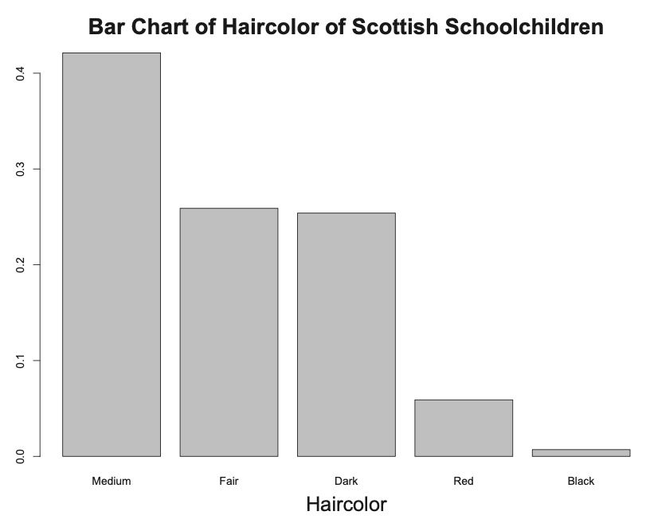
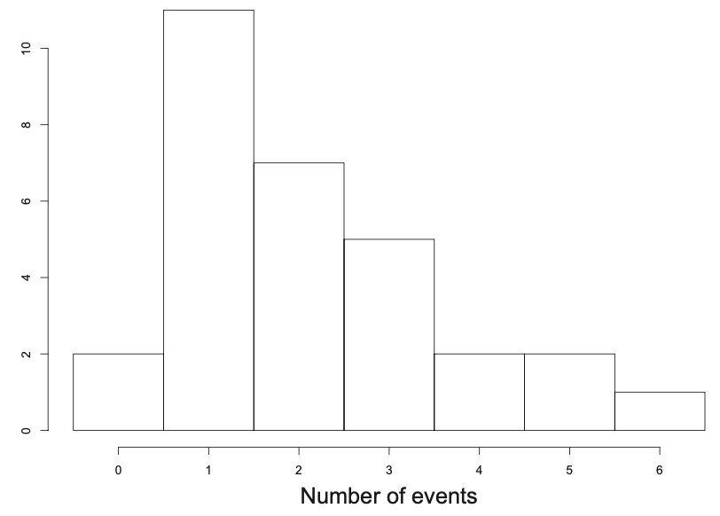
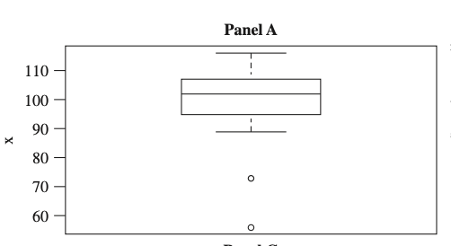
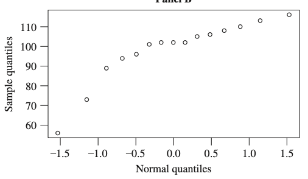

::: {.callout-tip title="本章定位"}
本講義由蘇南誠老師編授。感謝黃怡婷老師提供原始數理統計講義檔案；本章保留原有英文術語與公式，並整理為可連續閱讀的教學形式。
:::

## 學習目標

完成本章後，學生應能：

- 區分母體、樣本、統計量與估計值
- 推導常見統計量的抽樣分配
- 分析次序統計量
- 使用樞紐量建構信賴區間
- 正確解釋信賴水準與區間涵蓋率

## 必備的先備知識

常態、卡方、t、F 分配及聯合分配。

以下依原講義順序整理核心定義、定理、公式與例題。

## Outline

## Sampling and Statistics

### Statistical Inference

- A random variable X of interest, but its pdf $f(x)$ or pmf $p(x)$ is not known.

- $f(x)$ or $p(x)$ can roughly be classified in one of two ways:

  - Pdf $f(x)$ or $p(x)$ is completely unknown.

  - The form of $f(x)$ or $p(x)$ is known down to a parameter $\theta$, where $\theta$ may be a vector.

### Example 1 — Parametric Inference

- $X$ has an exponential distribution, where $\theta$ is unknown.

- $X$ has a binomial distribution $b(n, p)$, where $n$ is known but $p$ is unknown.

### Parameter space

- $X$ has a density or mass function of the form $f(x;\theta)$ or $p(x; \theta)$ , where $\theta\in\Omega$ for a specified set $\Omega$.

- For example, an exponential distribution $\Omega = \{\theta | \theta > 0\}$.

- $\theta$ a parameter of the distribution.

- Because $\theta$ is unknown, we want to estimate it.

### Random sample

- Consider the sample observations that have the same distribution as $X$.

- Denote them as the random variables $X_1, X_2, \ldots, X_n$, where $n$ denotes the sample size.

- Use lower case letters $x_1, x_2, \ldots, x_n$ as the values or realizations of the sample.

- Assume the sample observations $X_1, X_2, \ldots, X_n$ are mutually independent.

- It is called the random sample.

### Statistics

::: {#def-ch4-1}
- Let $X_1, X_2, \ldots, X_n$ denote a sample on a random variable $X$.

- Let $T= T(X_1, X_2, \ldots, X_n)$ be a function of the sample.

- Then $T$ is called a statistic.
:::

### Estimator and Estimate

- Let $X_1, X_2, \ldots, X_n$ denote a random sample on a random variable $X$ with a density or mass function of the form $f(x; \theta)$ or $p(x; \theta)$, where $\theta\in\Omega$ for a specified set $\Omega$.

- Consider a statistic $T$, which is an estimator of $\theta$.

- $T$ is formally called a point estimator of $\theta$.

- Call its realization $t$ an estimate of $\theta$.

### Estimator

::: {#def-ch4-2}
- Let $X_1, X_2, \ldots, X_n$ denote a sample on a random variable $X$ with pdf $f(x; \theta)$, $\theta\in\Omega$.

- Let $T= T(X_1, X_2, \ldots, X_n)$ be a statistic.

- $T$ is an unbiased estimator of $\theta$ if $E(T) = \theta$.
:::

### Nonparametric estimator

- Let $X_1, X_2, \ldots, X_n$ be a random sample on a random variable $X$ with cdf $F(x)$.

- Make no assumptions on the form of the distribution of $X$.

- Often called a nonparametric estimator.

- Discrete -- Bar chart

- Continuous -- Histogram

  ------------------------------------- -------------------------------------
      
  ------------------------------------- -------------------------------------

## Order statistics

### Order statistics

- Let $X_1, X_2, \ldots, X_n$ denote a random sample from a distribution of the continuous type having a pdf $f(x)$ that has support S = (a, b), where -∞ ≤ a \< b ≤ ∞.

- Let $Y_1$ be the smallest of these $X_i$, $Y_2$ the next $X_i$ in order of magnitude, $\ldots$, and $Y_n$ the largest of $X_i$.

- That is, $Y_1 < Y_2 < \cdots < Y_n$ represent $X_1, X_2, \ldots, X_n$ when the latter are arranged in ascending order of magnitude.

- Call $Y_i$, $i = 1, \ldots, n$, the $i$th order statistic of the random sample $X_1, X_2, \ldots, X_n$.

### Joint pdf of order statistics

::: {#thm-ch4-1}
- Let $Y_1 < Y_2 < \cdots < Y_n$ denote the $n$ order statistics based on the random sample $X_1, X_2, \ldots, X_n$ from a continuous distribution with pdf $f(x)$ and support $(a, b)$.

- Then the joint pdf of $Y_i$, $i = 1, \ldots, n$, is given by $$g(y_1, \ldots, y_n) =\left\{
  \begin{array}{ll}
  n!f(y_1)f(y_2)\cdots f(y_n) & a<y_1<\cdots<y_n<b\\
  0 & \text{elsewhere}
  \end{array}
  \right.$$
:::

### Example 2

- Let $X$ denote a random variable of the continuous type with a pdf $f(x)$ that is positive and continuous, with support $S = (a, b)$, $-\infty \le a < b < \infty$.

- Let $m$ denote a unique median.

- Let $X_1, X_2, X_3$ denote a random sample from this distribution.

- Let $Y_1 < Y_2 < Y_3$ denote the order statistics of the sample.

- Find $P[Y_2\le m]$.

### Example 3

- Let $Y_1 < Y_2 < \cdots < Y_n$ denote the $n$ order statistics based on the random sample $X_1, X_2, \ldots, X_n$ from a continuous distribution with pdf $f(x)$ and support $(a, b)$.

- Find the marginal pdf of $Y_k$.

### Example 4

- Let $Y_1 < Y_2 < Y_3 < Y_4$ denote the order statistics of a random sample of size 4 from a distribution having pdf $$f(x) = \left \{
  \begin{array}{ll}
  2x& 0<x<1\\
  0 & \text{elsewhere}
  \end{array}
  \right .$$

- Find the marginal pdf of $Y_3$.

### Example 5

- Let $Y_1 < Y_2 < \cdots < Y_n$ denote the $n$ order statistics based on the random sample $X_1, X_2, \ldots, X_n$ from a continuous distribution with pdf $f(x)$ and support $(a, b)$.

- Find the marginal pdf of $Y_i$ and $Y_j$, $i<j$.

### Special order statistics

- Sample range of the random sample is given by $Y_n- Y_1$.

- Sample midrange is given by $(Y_1 + Y_n)/2$.

- Sample median of the random sample is defined by $$Q2 = \left\{
  \begin{array}{cc}
  Y_{(n+1)/2} & \text{if }n\text{ is odd}\\
  (Y_{n/2} + Y_{(n/2)+1})/2 & \text{if }n\text{ is even}
  \end{array}
  \right .$$

### Example 6

- Let $Y_1 < Y_2 < Y_3$ denote the order statistics of a random sample of size 4 from a distribution having pdf $$f(x) = \left \{
  \begin{array}{ll}
  1 & 0<x<1\\
  0 & \text{elsewhere}
  \end{array}
  \right .$$

- Find the pdf of $Z_1 = Y_3-Y_1$.

### Recall -- Quantiles

- Let $X$ be a random variable with a continuous cdf $F(x)$.

- For $0 < p < 1$, define the $p$th quantile of $X$ to be $\xi_p = F^{-1}(p)$.

### Sample quantiles

- Let $Y_1 < Y_2 < \cdots < Y_n$ denote the $n$ order statistics based on the random sample $X_1, X_2, \ldots, X_n$ from a continuous distribution with pdf $f(x)$.

- Let $k$ be the greatest integer less than or equal to $[p(n + 1)]$.

- Define $Y_k$ as an estimator of the quantile $\xi_p$.

### Reason -- Sample quantiles

- The area under the pdf $f(x)$ to the left of $Y_k$ is $F(Y_k)$.

- Find $E[F(Y_k)] = \frac{k}{n+1}$.

- On the average, there is $k/(n + 1)$ of the total area to the left of $Y_k$.

### Remark

- Some statisticians define sample quantiles slightly differently from what we have.

- For one modification with $1/(n + 1) < p < n/(n + 1)$, if $(n + 1)/p$ is not equal to an integer, then the $p$th quantile of the sample may be defined as follows.

- Write $(n + 1)p= k + r$, where $k = [(n + 1)p]$ and $r$ is a proper fraction, using the weighted average.

- Then the pth quantile of the sample is the weighted average $$(1- r)Y_k + rY_{k+1},$$ which is an estimator of the $p$th quantile.

- As $n$ becomes large, however, all these modified definitions are essentially the same.

### Five-number summary

- A five-number summary of the data consists of the following five sample quan-

  - Minimum ($Y_1$)

  - The first quartile ($Q_1=Y_{.25(n+1)}$)

  - The median ($Q_2$)

  - The third quartile ($Q_3=Y_{.75(n+1)}$)

  - The maximum ($Y_n$)

- Q1, Q2, and Q3 denote the first quartile, median, and third quartile of the sample.

### Box plot

- The five-number summary is the basis for a useful and quick plot of the data.

- This is called a boxplot of the data.

- The box encloses the middle 50% of the data and a line segment is usually used to indicate the median.

- The extreme order statistics, however, are very sensitive to outlying points.

- We make use of the box and whisker plots defined by John Tukey.

- In order to define this plot, we need to define a potential outlier.

- Let $h = 1.5(Q_3- Q_1)$ and define the lower fence (LF) and the upper fence (UF) by $$\begin{array}{ccc}
  LF= Q_1- h & \text{and} & UF= Q_3 + h.
  \end{array}$$

### Example 7

A random sample of size 15 on a random variable $X$.

  ----- ----- ----- ----- ----- ----- ----- -----
   56    70    89    94    96    101   102   102
   102   105   106   108   110   113   116  
  ----- ----- ----- ----- ----- ----- ----- -----

::: columns
- Minimum ($Y_1 = 56$)

- The first quartile ($Q_1=Y_{.25(n+1)} = 94$)

- The median ($Q_2 = 102$)

- The third quartile ($Q_3=Y_{.75(n+1)} = 108$)

- The maximum ($Y_{15} = 116$)

- $h = 1.5 (108-94)$

- $LF = 73$

- $UF = 129$

:::

### Quantile plots

- Consider the location and scale family.

- Suppose $X$ is a random variable with cdf $F((x- a)/b)$, where $F(x)$ is known but $a$ and $b > 0$ may not be.

- Let $Z = (X- a)/b$; then $Z$ has cdf $F(z)$.

- Let $0 < p < 1$ and let $\xi_{X,p}$ be the $p$th quantile of $X$.

- Let $\xi_{Z,p}$ be the $p$th quantile of $Z = (X- a)/b$.

- We have $$p = P[X\le \xi_{X, p}] = P\left[Z\le \frac{\xi_{X,p}-a}{b}\right],$$ and $\xi_{X,p} = b\xi_{Z,p} +a$.

- The quantiles of $X$ are linearly related to the quantiles of $Z$.

### Quantile plots

- Let $X_1, \ldots, X_n$ be a random sample from the distribution of $X$ amd let $Y_1 < \ldots < Y_n$ be the order statistics.

- For $k = 1, \ldots, n$, let $p_k = k/(n + 1)$.

- Then $Y_k$ is an estimator of $\xi_{X,p_k}$.

- Denote the corresponding quantiles of the cdf $F(z)$ by $\xi_{Z,p_k}
  = F^{-1}(p_k)$.

- Let $y_k$ denote the realized value of $Y_k$.

- The plot of $y_k$ versus $\xi_{Z,p_k}$ is called a q-q plot.

- The linearity of such a plot indicates that the cdf of $X$ is of the form $F((x- a)/b)$.

### Example 8

## Confidence intervals

### Confidence intervals

::: {#def-ch4-3}
- Let $X_1, X_2, \ldots, X_n$ be a sample on a random variable $X$, where $X$ has pdf $f(x; \theta)$, $\theta\in\Omega$.

- Let $0 < \alpha < 1$ be specified.

- Let $L= L(X_1, X_2, \ldots, X_n)$ and $U= U(X_1, X_2, \ldots, X_n)$ be two statistics.

- The interval $(L, U)$ is a $(1- \alpha)$`<!-- -->`{=html}100% confidence interval for $\theta$ if $$1-\alpha = P_{\theta}[\theta\in (L, U)]$$

- The probability that the interval includes $\theta$ is $1- \alpha$, which is called the confidence coefficient or the confidence level of the interval.
:::

### Efficiency of confidence intervals

::: {#def-ch4-4}
- A measure of efficiency based on a confidence interval is its expected length.

- Suppose $(L_1, U_1)$ and $(L_2, U_2)$ are two confidence intervals for $\theta$ that have the same confidence coefficient.

- Then we say that $(L_1, U_1)$ is more efficient than $(L_2, U_2)$ if $$E_θ[U_1- L_1] \le E_θ[U_2- L_2], \forall \theta\in\Omega.$$
:::

## 本章摘要

本章從隨機樣本出發，研究統計量的分配，並以樞紐量把抽樣不確定性轉化為信賴區間。

## 常見錯誤

- 把參數視為隨機量來解釋頻率學派信賴區間
- 忘記抽樣分配依賴模型假設
- 混淆統計量與其觀察值
- 建構區間時不等式方向處理錯誤

## 章末練習

1. 從本章選出三個關鍵定義，分別寫出數學形式、成立條件及一個例子。
2. 選擇一個主要定理或方法，重做推導並標記每一步使用的假設。
3. 從原講義例題挑選一題，完整寫出解題目標、方法選擇、計算與結果解釋。
4. 設計一個會違反本章方法條件的反例，說明錯誤會出現在哪一步。

::: {.callout-note title="待逐章補強"}
建議後續為本章補入：中文概念導讀、完整解答、課堂練習難度標記，以及與下一章的銜接說明。
:::
