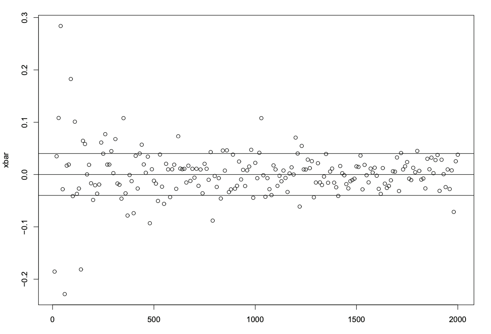
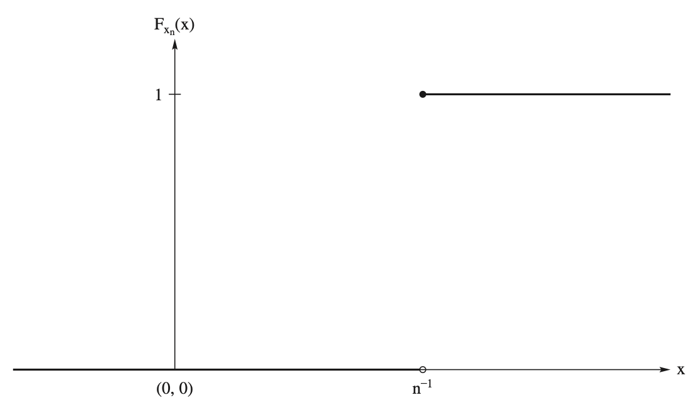
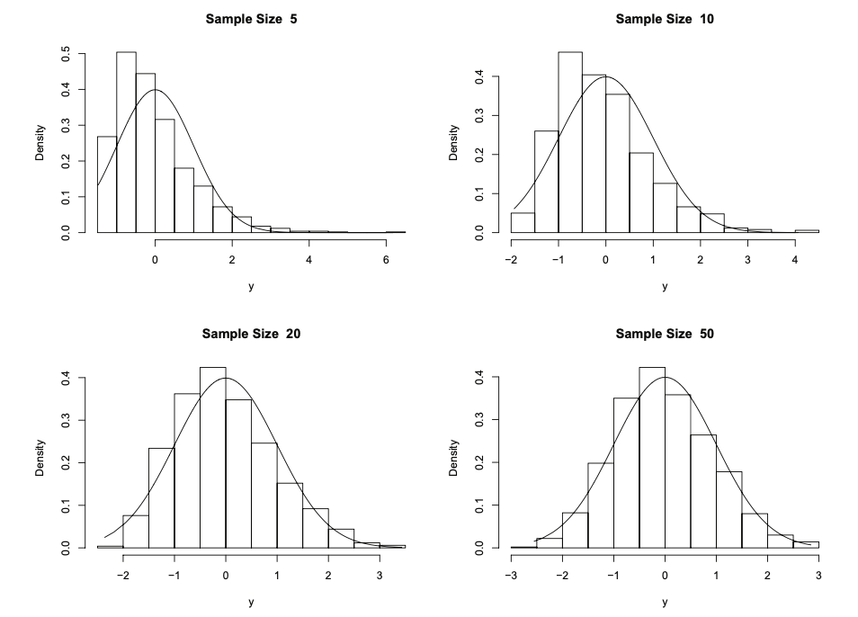

::: {.callout-tip title="本章定位"}
本講義由蘇南誠老師編授。感謝黃怡婷老師提供原始數理統計講義檔案；本章保留原有英文術語與公式，並整理為可連續閱讀的教學形式。
:::

## 學習目標

完成本章後，學生應能：

- 區分機率收斂與分配收斂
- 判斷序列是否有界於機率
- 使用 Slutsky 定理與 Delta method
- 運用動差生成函數推導極限分配
- 以中央極限定理建立近似推論

## 必備的先備知識

期望、變異數、動差生成函數及基本微積分。

以下依原講義順序整理核心定義、定理、公式與例題。

### Random sample

- Consider the sample observations that have the same distribution as $X$.

- Denote them as the random variables $X_1, X_2, \ldots, X_n$, where $n$ denotes the sample size.

- Use lower case letters $x_1, x_2, \ldots, x_n$ as the values or realizations of the sample.

- Assume the sample observations $X_1, X_2, \ldots, X_n$ are mutually independent.

- It is called the random sample.

### Statistics

::: {#def-ch5-1}
- Let $X_1, X_2, \ldots, X_n$ denote a sample on a random variable $X$.

- Let $T= T(X_1, X_2, \ldots, X_n)$ be a function of the sample.

- Then $T$ is called a statistic.
:::

### Pivot random variable

- The pivot is usually a function of an estimator of $\theta$ .

- The distribution of the pivot is known.

- For example,

  - Suppose $X_1, X_2, \ldots , X_n$ is a random sample on a random variable $X$ which has a $N(\mu,\sigma^2)$ distribution.

  - Denote the sample mean by $\bar{X}_n = n^{-1}\sum_{i=1}^n X_i$.

  - Then the pivot random variable of interest is $$Z_n= \frac{\bar{X}_n - \mu}{\sigma/\sqrt{n}} \sim N(0, 1).$$

## Convergence in probability

### Convergence in probability

::: {#def-ch5-2}
- Let $\{X_n\}$ be a sequence of random variables.

- Let $X$ be a random variable defined on a sample space.

- $X_n$ converges in probability to $X$ if, for all $\epsilon>0$, $$\lim_{n\rightarrow \infty} [|X_n - X|\ge \epsilon] = 0,$$ or $$\lim_{n\rightarrow \infty} [|X_n - X| < \epsilon] = 1,$$

- Write $X_n \stackrel{P}{\rightarrow} X$
:::

### Weak Law of Large Numbers

::: {#thm-ch5-1}
- Let $\{X_n\}$ be a sequence of iid random variables having common mean $\mu$ and variance $\sigma^2<\infty$.

- Let $\bar{X}_n = n^{-1}\sum_{i=1}^n X_i$.

- Then $\bar{X}_n \stackrel{P}{\rightarrow} \mu$
:::

### Additive properties

::: {#thm-ch5-2}
- Suppose $X_n \stackrel{P}{\rightarrow} X$ and $Y_n \stackrel{P}{\rightarrow} Y$.

- Then ${X}_n + Y_n \stackrel{P}{\rightarrow} X + Y$
:::

### Constant

::: {#thm-ch5-3}
- Suppose $X_n \stackrel{P}{\rightarrow} X$ and $a$ is a constant.

- Then $a{X}_n \stackrel{P}{\rightarrow} aX$
:::

### Continuity

::: {#thm-ch5-4}
- Suppose $X_n \stackrel{P}{\rightarrow} a$ and the real function $g$ is continuous at $a$.

- Then $g({X}_n) \stackrel{P}{\rightarrow} g(a)$.
:::

### Multiplicative properties

::: {#thm-ch5-5}
- Suppose $X_n \stackrel{P}{\rightarrow} X$ and $Y_n \stackrel{P}{\rightarrow} Y$.

- Then ${X}_n  Y_n \stackrel{P}{\rightarrow} X  Y$.
:::

### Estimator and Estimate

- Let $X_1, X_2, \ldots, X_n$ denote a random sample on a random variable $X$ with a density or mass function of the form $f(x; \theta)$ or $p(x; \theta)$, where $\theta\in\Omega$ for a specified set $\Omega$.

- Consider a statistic $T$, which is an estimator of $\theta$.

- $T$ is formally called a point estimator of $\theta$.

- Call its realization $t$ an estimate of $\theta$.

### Estimator

- Let $X_1, X_2, \ldots, X_n$ denote a sample on a random variable $X$ with pdf $f(x; \theta)$, $\theta\in\Omega$.

- Let $T= T(X_1, X_2, \ldots, X_n)$ be a statistic.

- Suppose $T$ is a point estimator of $\theta$.

### Estimate

- When the sample is drawn, let $x_1, x_2, \ldots , x_n$ denote the observed values of $X_1, X_2, \ldots, X_n$.

- We call these values the realized values of the sample.

- Call the realized statistic $t = t(x_1, x_2, \ldots , x_n)$ a point estimate of $\theta$.

### Properties of estimators

- Unbiasedness

  - $T$ is an unbiased estimator of $\theta$ if $E(T) = \theta$.

- Consistency

### Consistent estimator

::: {#def-ch5-3}
- Let $X$ be a random variable with cdf $F(x,\theta)$, $\theta \in \Omega$.

- Let $X_1, X_2, \ldots, X_n$ be a sample from the distribution of $X$.

- Let $T_n$ denote a statistic.

- We say $T_n$ is a consistent estimator of $\theta$ if $$T_n \stackrel{P}{\rightarrow} \theta.$$
:::

### Example 1 — Realizations of $\bar{X}$ from $N(0,1)$

### Example 2

- Let $X_1, X_2, \ldots, X_n$ be a sample from a distribution with mean $\mu$ and variance $\sigma^2$.

- Assume that $E[X_1^4]<\infty$.

- Show the sample variance is a consistent estimator of $\sigma^2$.

### Example 3

- Let $X_1, X_2, \ldots, X_n$ be a sample from a uniform (0,$\theta)$ distribution.

- Assume $\theta$ is unknown.

- Let $Y_n = \max(X_1, X_2, \ldots, X_n)$.

- Show $Y_n$ is a consistent estimator of $\theta$.

## Convergence in distribution

### Convergence in distribution

::: {#def-ch5-4}
- Let $\{X_n\}$ be a sequence of random variables with distribution fuctions $F_{X_n}$.

- Let $X$ be a random variable with cdf $F(x,\theta)$, $\theta \in \Omega$.

- Let $C(F_X)$ denote the set of all points where $F_X$ is continuous.

- We say $X_n$ converges in distribution to $X$ if $$\lim_{n\rightarrow \infty} F_{X_n}(x) = F_X(x), \forall x\in C(F_X).$$

- Denote $X_n \stackrel{D}{\rightarrow} X$.
:::

### Remark

- This material on convergence in probability and in distribution comes under what statisticians refer to as asymptotic theory.

- We say that the distribution of $X$ is the asymptotic distribution or the limiting distribution of the sequence $\{X_n\}$.

- Instead of saying $X_n \stackrel{D}{\rightarrow} X$, where $X$ has a standard normal distribution, we may write $X_n \stackrel{D}{\rightarrow} N(0,1)$.

### Remark -- Points of continuity

### Remark -- Convergence in probability and in distribution

- Convergence in probability is a way of saying that a sequence of random variables $X_n$ is getting close to another random variable $X$.

- Convergence in distribution is only concerned with the cdfs $F_{X_n}$ and $F_X$.

### Example 4

- Let $X$ be a continuous random variable with a pdf $f_X(x)$ that is symmetric about 0; i.e., $f_X(-x) = f_X(x)$.

- Then $-X$ also has a density function $f_X(x)$.

- $X$ and $-X$ have the sample distributions.

- Define the sequence of random variables $X_n$ as $$X_n = \left\{\begin{array}{ll}
  X & \text{if }n\text{ is odd}\\
  -X & \text{if }n\text{ is even}\\
  \end{array}\right .$$

- $F_{X_n} (x) = F_X(x)$ for all $x$ in the support of $X$, so that $X_n \stackrel{D}{\rightarrow} X$.

- $X_n$ does not get close to $X$. In particular, $X_n \nrightarrow X$ in probability.

### Example 5

- Let $\bar{X}_n$ have the cdf $$F_n(\bar{x}) = \int_{-\infty}^{\bar{x}} \frac{1}{\sqrt{1/n}\sqrt{2\pi}} e^{-nw^2/2}dw.$$

- Let $X$ have the cdf $$F(\bar{x}) = \left\{\begin{array}{ll} 0 & \text{if }\bar{x}<0\\ 1 & \text{if }\bar{x}\ge 0
  \end{array} \right .$$

- Show $\bar{X}_n \stackrel{D}{\rightarrow} X$.

### Example 6

- Let $\bar{X}_n$ have the cdf $$F_n(\bar{x}) = \int_{-\infty}^{\bar{x}} \frac{1}{\sqrt{1/n}\sqrt{2\pi}} e^{-nw^2/2}dw.$$

- Let $X$ have the cdf $$F(\bar{x}) = \left\{\begin{array}{ll} 0 & \text{if }\bar{x}<0\\ 1 & \text{if }\bar{x}\ge 0
  \end{array} \right .$$

- Show $\bar{X}_n \stackrel{D}{\rightarrow} X$.

### Example 7

- Let $\bar{X}_n$ have the pmf $$p_n(x) = \left \{
  \begin{array}{ll} 1 & x = 2 + n^{-1}\\ 0 & \text{elsewhere}
  \end{array}
  \right .$$

- Let $X$ have the cdf $$F(x) = \left\{\begin{array}{ll} 0 & \text{if }x<2\\ 1 & \text{if }x\ge 2
  \end{array} \right .$$

- Show $\bar{X}_n \stackrel{D}{\rightarrow} X$.

### Example 8

- Let $T_n$ have a $t$-distribution with $n$ degrees of freedom, $n = 1, 2, 3, \ldots.$

- Its cdf is $$F_n(x) = \int_{-\infty}^{t} \frac{\Gamma((n+1)/2)}{\sqrt{\pi n}\Gamma(n/2)}
  \frac{1}{(1 + y^2/n)^{(n+1)/2}} dy.$$

- Show $T_n \stackrel{D}{\rightarrow} N(0, 1)$.

### Remark -- Stirling's formula

- In advanced calculus the following approximation is derived: $$\Gamma(k+1) \approx \sqrt{2\pi} j^{k+1/2} e^{-k}.$$

### Example 9

- Let $X_1, X_2, \ldots, X_n$ be a sample from a uniform (0,$\theta)$ distribution.

- Assume $\theta$ is unknown.

- Let $Y_n = \max(X_1, X_2, \ldots, X_n)$.

- Show $Z_n = n(\theta - Y_n)$ converges in distribution to an exponential distribution with mean $\theta$.

### Properties of convergences

::: {#thm-ch5-6}
- If $X_n \stackrel{P}{\rightarrow} X$, then $X_n \stackrel{D}{\rightarrow} X$.
:::

### Properties of convergences

::: {#thm-ch5-7}
- If $X_n \stackrel{D}{\rightarrow} b$, then $X_n \stackrel{p}{\rightarrow} b$.
:::

### Properties of convergences

::: {#thm-ch5-8}
- If $X_n \stackrel{D}{\rightarrow} X$ and $X_n \stackrel{P}{\rightarrow} 0$, then $X_n + Y_n\stackrel{D}{\rightarrow} X$.
:::

### Properties of convergences

::: {#thm-ch5-9}
- If $X_n \stackrel{D}{\rightarrow} X$ and $g$ is a continuous function on the support of $X$, then $g(X_n) \stackrel{D}{\rightarrow} g(X)$.
:::

### Properties of convergences

::: {#thm-ch5-10}
- If $X_n \stackrel{D}{\rightarrow} X$, $A_n \stackrel{P}{\rightarrow} a$ and $B_n \stackrel{P}{\rightarrow} b$, then $A_n + B_n X_n \stackrel{D}{\rightarrow} a + bX$.
:::

### Bounded in probability

::: {#def-ch5-5}
- The sequence of random variables $\{X_n\}$ is bounded in probability if, for all $\epsilon > 0$, there exist a constant $B_{\epsilon} > 0$ and an integer $N_\epsilon$ such that $$n \ge N_\epsilon \Rightarrow P[|X_n|≤B_\epsilon] \ge 1 - \epsilon.$$
:::

### Properties

::: {#thm-ch5-11}
- Let $\{X_n\}$ be a sequence of random variables.

- Let $X$ be a random variable.

- If $X_n \stackrel{D}{\rightarrow} X$, then $X_n$ is bounded in probability.
:::

### Properties

::: {#thm-ch5-12}
- Let $\{X_n\}$ be a sequence of random variables bounded in probability.

- Let $\{Y_n\}$ a sequence of random variables that converges to 0 in probability.

- Then $X_nY_n \stackrel{P}{\rightarrow} 0$.
:::

### Recall Young's Theorem

- Suppose $g(x)$ is differentiable at $x$.

- Write $g(y) = g(x) + g^{'}(x)(y - x) + o(|y - x|)$, where the notation $o$ means $$a = o(b) \text{if and only if }\frac{a}{b} \rightarrow 0\text{,as }b\rightarrow 0\text{.}$$

### Recall 

- Write $o_p(X_n)$, which means $$Y_n =o_p(X_n)\Longleftrightarrow \frac{Y_n}{X_n} \stackrel{P}{\rightarrow} 0, \text{as }n\rightarrow \infty\text{.}$$

- Write $O_p(X_n)$, which means $$Y_n = O_p(X_n) \Longleftrightarrow \frac{Y_n}{X_n} \text{is bounded in probability, as }n\rightarrow \infty\text{.}$$

### Properties

::: {#thm-ch5-13}
- Let $\{Y_n\}$ be a sequence of random variables bounded in probability.

- Suppose $X_n = o_p(Y_n)$.

- Then $X_n \stackrel{P}{\rightarrow} 0$, as $n\rightarrow \infty$.
:::

### $\Delta$ method

::: {#thm-ch5-14}
- Let $\{X_n\}$ be a sequence of random variables such that $$\sqrt{n}(X_n - \theta) \stackrel{D}{\rightarrow} N(0, \sigma^2)$$

- Suppose $g(x)$ is differentiable at $\theta$ and $g^{'}(\theta) \ne 0$.

- Then $$\sqrt{n} (g(X_n) - g(\theta)) \stackrel{D}{\rightarrow} N(0, \sigma^2 (g^{'}(\theta))^2).$$
:::

### Convergence in distribution

::: {#thm-ch5-15}
- Let $\{X_n\}$ be a sequence of random variables with mgf $M_{X_n}(t)$ that exists for $-h < t < h$ for all $n$.

- Let $X$ be a random variable with mgf $M(t)$, which exists for $|t| ≤ h_1 ≤ h$.

- If $\lim_{n\rightarrow\infty} M_{X_n}(t) = M(t)$ for $|t|\le h_1$, then $X_n \stackrel{D}{\rightarrow} X$.
:::

### Example 10

- Let $Y_n$ have a distribution that is $b(n, p)$.

- Suppose $\mu = np$, $\forall n$.

- Show $Y_n \stackrel{D}{\rightarrow} Poisson (\mu)$.

### Example 11

- Let $Z_n \sim \chi_n^2$.

- Let $Y_n = \frac{Z_n - n}{\sqrt{2n}}$.

- Show that $Y_n \stackrel{D}{\rightarrow} N(0, 1)$.

### Example 12 — $\chi^2$ distribution

- Let $Z_n\sim \chi^2(n)$.

- Show that $$Y_n = \frac{Z_n - n}{\sqrt{2n}} \stackrel{D}{\rightarrow} N(0,1).$$

### Histogram plot of 1000 generated values

### Example 13 — More $\chi^2$ distribution

- Let $Z_n\sim \chi^2(n)$.

- We have $$Y_n = \frac{Z_n - n}{\sqrt{2n}} \stackrel{D}{\rightarrow} N(0,1).$$

- Show that $$W_n = \left(\frac{Z_n}{\sqrt{2}n}\right)^{1/2} \stackrel{D}{\rightarrow} N(0, 1).$$

## Central limit theorem

### Central limit theorem

::: {#thm-ch5-16}
- Let $X_1, X_2, \ldots, X_n$ denote the observations of a random sample from a distribution that has mean $\mu$ and positive variance $\sigma^2$.

- Show that $$Y_n = \frac{\sum_{i=1}^n X_i - n\mu}{\sqrt{n}\sigma} = \frac{\sqrt{n}(\bar{X}_n - \mu}{\sigma} \stackrel{D}{\rightarrow} N(0,1).$$
:::

### Example 14

- Let $X_1, X_2, \ldots, X_n$ denote the observations of a random sample from a distribution that has mean $\mu$ and positive variance $\sigma^2$, where $\mu$ and $\sigma^2$ are unknown.

- Let $\bar{X}$ and $S$ denote the sample mean and sample standard deviation.

- Show that $$\frac{\bar{X} - \mu}{S/\sqrt{n}} \stackrel{D}{\rightarrow} N(0,1).$$

### Example 15 — Binomial distribution

- Let $X_1, X_2, \ldots, X_n$ denote the observations of a random sample from a Bernoulli distribution $b(1,p)$.

- Show that $$\frac{\sum_{i=1}^n X_i - np}{\sqrt{np(1-p)}} \stackrel{D}{\rightarrow} N(0,1).$$

### Example 16 — Proportion

- Let $X_1, X_2, \ldots, X_n$ denote the observations of a random sample from a Bernoulli distribution $b(1,p)$.

- Show that $$\frac{\hat{p} - p}{\sqrt{\hat{p}(1-\hat{p})/n}} \stackrel{D}{\rightarrow} N(0,1).$$

## Extensions to multivariate distribution

### Recall

- For a vector $\boldsymbol{v} \in R^p$, recall the Euclidean norm of $\boldsymbol{v}$ is defined to be $$\parallel \boldsymbol{v} \parallel = \sqrt{\sum_{i=1}^p v_i^2}$$

- Properties - $\forall \boldsymbol{v}, \boldsymbol{u} \in R^p$

  - $\parallel \boldsymbol{v} \parallel \ge 0$

  - $\parallel \boldsymbol{v} \parallel = 0$ $\Longleftrightarrow$ $\boldsymbol{v} = \boldsymbol{0}$

  - $a \in R$, $\parallel a\boldsymbol{v} \parallel = |a|\parallel \boldsymbol{v} \parallel$

  - $\parallel \boldsymbol{v} + \boldsymbol{u} \parallel \le \parallel \boldsymbol{v} \parallel +
    \parallel \boldsymbol{u} \parallel$

### Recall

- Consider a standard basis of $R^P$ and denote as $\boldsymbol{e}_1, \ldots, \boldsymbol{e}_p$, where all the components of $\boldsymbol{e}_i$ are 0 except for the ith component, which is 1.

- Write any vector $\boldsymbol{v}^{'} = (v_1, \ldots, v_p)$ as $$\boldsymbol{v} = \sum_{i=1}^p v_i \boldsymbol{e}_i$$

### Properties of vector

::: lemma
- Let $\boldsymbol{v}^{'} = (v_1, \ldots, v_p) \in R^p$.

- Then $$|v_j| \le \parallel \boldsymbol{v} \parallel \le \sum_{i=1}^n |v_i|, \forall j = 1,\ldots,p.$$
:::

### Convergence in probability

::: {#def-ch5-6}
- Let $\{\boldsymbol{X}_n\}$ be a sequence of $p$-dimensional vectors.

- Let $\boldsymbol{X}$ be a $p$-dimensional vectors.

- $\{\boldsymbol{X}_n\}$ and $\boldsymbol{X}$ are defined on the same sample space.

- Then $\boldsymbol{X}_n \stackrel{P}{\rightarrow} \boldsymbol{X}$ if $$\lim_{n\rightarrow\infty} P[\parallel \boldsymbol{X}_n - \boldsymbol{X} \parallel \ge \epsilon] = 0, \forall \epsilon > 0.$$
:::

### Convergence in probability

::: {#thm-ch5-17}
- Let $\{\boldsymbol{X}_n\}$ be a sequence of $p$-dimensional vectors.

- Let $\boldsymbol{X}$ be a random vector, all defined on the same sample space.

- Then $$\boldsymbol{X}_n \stackrel{P}{\rightarrow} \boldsymbol{X} 
  \Longleftrightarrow X_{nj} \stackrel{P}{\rightarrow} X_j \forall j=1,...,p.$$
:::

### Example 17

- Let $\{\boldsymbol{X}_n\}$ be a sequence of iid random vectors with common mean vector $\boldsymbol{\mu}$ and variance-covariance matrix $\boldsymbol{\Sigma}$.

- Denote the vector of means by $$\bar{\boldsymbol{X}}_n = \frac{1}{n} \sum_{i=1}^n \boldsymbol{X}_i$$

- Show $\bar{\boldsymbol{X}}_n \stackrel{P}{\rightarrow} \boldsymbol{\mu}$

### Example 18

- Let $\boldsymbol{X}_i = (X_{i1}, \ldots, X_{ip})^{'}$.

- Define the sample variance-covariance matrix by $$\begin{aligned}
  S_{n, j}^2 = \frac{1}{n-1} \sum_{i=1}^n (X_{ij} - \bar{X}_j)^2, j = 1, 2, \ldots, p,\\
  S_{n, jk} = \frac{1}{n-1} \sum_{i=1}^n (X_{ij} - \bar{X}_j)(X_{ik} - \bar{X}_k), j \ne k = 1, 2, \ldots, p,\\
  \end{aligned}$$

- Assume finite fourth moments.

- Show $\boldsymbol{S} \stackrel{P}{\rightarrow} \boldsymbol{\Sigma}$, where the p × p matrix ${\boldsymbol S}$ is the matrix with the jth diagonal entry $S_{n, j}^2$ and $(j,k)$th entry $S_{n,jk}$.

### Convergence in probability

::: {#def-ch5-7}
- Let $\{\boldsymbol{X}_n\}$ be a sequence of $p$-dimensional vectors.

- Let $\boldsymbol{X}$ be a $p$-dimensional vectors.

- Let $\boldsymbol{X}_n$ and $\boldsymbol{X}$ have distribution functions $F_n(\boldsymbol{x})$ and $F(\boldsymbol{x})$.

- Then $\boldsymbol{X}_n \stackrel{D}{\rightarrow} \boldsymbol{X}$ if $$\lim_{n\rightarrow\infty} F_n(\boldsymbol{x}) =  F(\boldsymbol{x}),$$ for all points ${\boldsymbol x}$ at which $F(\boldsymbol{x})$ is continuous.
:::

### Convergence in distribution

::: {#thm-ch5-18}
- Let $\boldsymbol{X}_n \stackrel{P}{\rightarrow} \boldsymbol{X}$.

- Let $g(\boldsymbol{x})$ be a function that is continuous on the support of $\boldsymbol{X}$.

- Then $g(\boldsymbol{X}_n)$ converges in distribution to $g(X)$.

- Then $$g(\boldsymbol{X}_n) \stackrel{D}{\rightarrow} g(\boldsymbol{X}).$$
:::

### Convergence in distribution

::: {#thm-ch5-19}
- Let $\{\boldsymbol{X}_n\}$ be a sequence of $p$-dimensional vectors.

- Let $\boldsymbol{X}$ be a $p$-dimensional vectors.

- Let $\boldsymbol{X}_n$ and $\boldsymbol{X}$ have distribution functions $F_n(\boldsymbol{x})$ and $F(\boldsymbol{x})$.

- Let $\boldsymbol{X}_n$ and $\boldsymbol{X}$ have moment generating functions $M_n(\boldsymbol{t})$ and $M(\boldsymbol{t})$.

- Then $\boldsymbol{X}_n \stackrel{D}{\rightarrow} \boldsymbol{X}$ if for some $h>0$, $$\lim_{n\rightarrow\infty} M_n(\boldsymbol{t}) =  M(\boldsymbol{t}),$$ for all $\boldsymbol{t}$ such that $\parallel t\parallel < h$.
:::

### Central Limit Theorem

::: {#thm-ch5-20}
- Let $\{\boldsymbol{X}_n\}$ be a sequence of iid random vectors with common mean vector $\boldsymbol{\mu}$ and variance-covariance matrix $\boldsymbol{\Sigma}$, which is positive definite.

- Assume that the common moment generating function $M(\boldsymbol{t})$ exists in an open neighborhood of $\boldsymbol{0}$.

- Let $$\boldsymbol{Y}_n = \frac{1}{\sqrt{n}} \sum_{i=1}^n (\boldsymbol{X}_i - \boldsymbol{\mu}) = \sqrt{n}(\bar{\boldsymbol{X}}- \boldsymbol{\mu}).$$

- Then $\boldsymbol{X}_n \stackrel{D}{\rightarrow} N_p(\boldsymbol{0}, \boldsymbol{\Sigma})$.
:::

### Properties

::: {#thm-ch5-21}
- Let $\{\boldsymbol{X}_n\}$ be a sequence of $p$-dimensional random vectors.

- Suppose $\boldsymbol{X}_n \stackrel{D}{\rightarrow} N_p(\boldsymbol{\mu}, \boldsymbol{\Sigma})$.

- Let $\boldsymbol{A}$ be an $m\times p$ matrix of constants and $\boldsymbol{b}$ be an $m$-dimensional vector of constants.

- Then $\boldsymbol{A}\boldsymbol{X}_n + \boldsymbol{b} \stackrel{D}{\rightarrow} N_p(\boldsymbol{A}\boldsymbol{\mu} + \boldsymbol{b}, \boldsymbol{A}\boldsymbol{\Sigma}\boldsymbol{A}^{'})$.
:::

### $\Delta$ method

::: {#thm-ch5-22}
- Let $\{\boldsymbol{X}_n\}$ be a sequence of $p$-dimensional random vectors.

- Suppose $\sqrt{n}(\boldsymbol{X}_n - \boldsymbol{\mu}_0) \stackrel{D}{\rightarrow} N_p(\boldsymbol{0}, \boldsymbol{\Sigma})$.

- Let $\boldsymbol{g}$ be a transformation $\boldsymbol{g}(\boldsymbol{x}) = (g_1(\boldsymbol{x}), \ldots, g_1(\boldsymbol{x}))^{'}$ such that $1\le k\le p$.

- Assume the $k\times p$ matrix of partial derivatives $$\boldsymbol{B} = \left[\frac{\partial g_i}{\partial \mu_j}\right], i = 1, 2, \ldots, k; j = 1, 2, \ldots, p,$$ are continuous and do not vanish in a neighborhood of $\boldsymbol{\mu}_0$.

- Let $\boldsymbol{B}_0 = \boldsymbol{B}$ at $\boldsymbol{\mu}_0$.

- Then $\sqrt{n} (\boldsymbol{g}(\boldsymbol{X}_n) - \boldsymbol{g}(\boldsymbol{\mu}_0)
  \stackrel{D}{\rightarrow} N_k(\boldsymbol{0}, \boldsymbol{B}_0\boldsymbol{\Sigma}\boldsymbol{B}_0^{'})$.
:::

## 本章摘要

本章說明統計程序在樣本量增加時的行為，並以收斂定理、CLT 與 Delta method 建立漸近近似。

## 常見錯誤

- 混淆不同收斂概念的方向與強弱
- 未檢查 Delta method 的可微條件
- 中央極限定理標準化錯誤
- 把大樣本近似當成有限樣本精確結果

## 章末練習

1. 從本章選出三個關鍵定義，分別寫出數學形式、成立條件及一個例子。
2. 選擇一個主要定理或方法，重做推導並標記每一步使用的假設。
3. 從原講義例題挑選一題，完整寫出解題目標、方法選擇、計算與結果解釋。
4. 設計一個會違反本章方法條件的反例，說明錯誤會出現在哪一步。

::: {.callout-note title="待逐章補強"}
建議後續為本章補入：中文概念導讀、完整解答、課堂練習難度標記，以及與下一章的銜接說明。
:::
